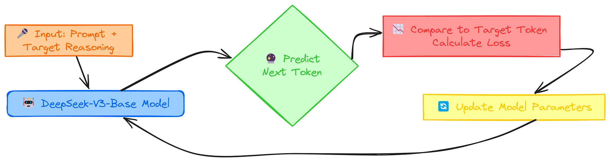

# 第一章 强化学习中的关键概念

强化学习（Reinforcement Learning，RL）是研究智能体（Agent）及智能体如何通过反复试验进行学习的学科。它形式化地阐述了这样一种观点：对智能体的行为进行奖励或惩罚，会增加其在未来重复或放弃该行为的可能性。

## 强化学习能做什么？

强化学习在许多领域有广泛应用，尤其适合解决需要决策和控制的问题。主要应用场景包括：

1. **游戏领域**  
   - 经典游戏（如围棋、国际象棋、扑克等）中的策略学习，如AlphaGo。  
   - 视频游戏中的智能体训练，比如Dota2、Atari游戏。

2. **机器人控制**  
   - 机械臂控制、步态规划、无人机飞行等复杂运动控制任务。  
   - 自主导航和路径规划。

3. **自动驾驶**  
   - 车辆的决策制定和路径规划，处理复杂的交通环境。

4. **推荐系统**  
   - 根据用户反馈动态调整推荐策略，提高用户满意度。

5. **自然语言处理**  
   - 对话系统中的策略优化，如聊天机器人学习更自然的对话策略。  
   - 机器翻译中的序列决策优化。

6. **金融领域**  
   - 投资组合管理、交易策略优化等。

7. **工业控制与优化**  
   - 生产流程优化、能源管理、资源调度等。

8. **医疗领域**  
   - 个性化治疗方案设计、药物剂量调整等。

总结：强化学习适合解决涉及序列决策、动态环境交互、长期回报最大化的问题。

强化学习的主要应用包括：

- 游戏（如围棋、视频游戏策略学习）  
- 机器人控制（机械臂、无人机、自主导航）  
- 自动驾驶车辆的决策和路径规划  
- 推荐系统的动态优化  
- 自然语言处理中的对话策略和机器翻译  
- 金融领域的投资和交易策略  
- 工业生产流程和资源调度优化  
- 医疗领域的个性化治疗和剂量调整

强化学习适合解决需要连续决策和环境交互的复杂问题。

## 基于人类反馈的强化学习

强化学习的一个分支需要单独介绍一下。

基于人类反馈的强化学习（Reinforcement Learning from Human Feedback，简称RLHF）是一种结合人类反馈信号来指导强化学习训练的方法。

传统强化学习依赖环境提供的奖励信号来学习策略，但在很多复杂任务中，设计合适的奖励函数非常困难或不现实。RLHF通过引入人类的评价、偏好或者示范，作为额外的反馈信号，帮助模型更好地理解任务目标和行为价值，从而学习到更符合人类期望的策略。

RLHF的核心流程通常包括：

1. **收集人类反馈**：人类对模型行为进行评分、排序或者直接给出偏好。

2. **训练奖励模型**：用人类反馈训练一个奖励模型，预测行为的“好坏”。

3. **强化学习优化**：用训练好的奖励模型作为奖励函数，指导策略优化。

RLHF在自然语言处理（如对话系统、文本生成）、机器人控制等领域被广泛应用，能显著提升模型的安全性、合规性和用户体验。

基于人类反馈的强化学习（RLHF）是一种利用人类对模型行为的评价或偏好作为奖励信号，来指导强化学习训练的方法。它通过收集人类反馈训练奖励模型，再用该奖励模型优化策略，使得学习的行为更符合人类期望，尤其适用于设计奖励困难或复杂的任务。RLHF广泛应用于对话系统、文本生成和机器人控制等领域，提升模型的表现和安全性。

RLHF现在主要用来对大语言模型进行微调，这也是我们要重点学习的内容。

RLHF微调大语言模型指的是使用基于人类反馈的强化学习（Reinforcement Learning from Human Feedback, RLHF）方法，对已经预训练的大型语言模型（如GPT系列）进行进一步微调优化。

具体来说：

1. **预训练模型**：大语言模型先通过大规模文本数据进行无监督预训练，掌握语言的基本知识和生成能力。

2. **收集人类反馈**：通过人工标注或用户交互，收集模型输出的质量评价，比如对回答的好坏打分或偏好排序。

3. **训练奖励模型**：用这些人类反馈训练一个奖励模型，能够预测给定回答的“好坏”程度。

4. **强化学习微调**：用该奖励模型作为奖励函数，通过强化学习方法（如策略梯度、PPO等）优化语言模型，使其生成的内容更符合人类偏好，比如更准确、更安全、更合适。

这种方法解决了单纯用语言模型最大化似然训练时，模型可能生成不符合人类期望内容的问题，提高了模型的实用性和用户体验。

RLHF微调大语言模型是指利用“基于人类反馈的强化学习”方法，对预训练好的大型语言模型进行进一步优化。具体过程是：

- 先用人类对模型输出的评价（比如好坏评分或偏好排序）训练一个奖励模型。  
- 再用强化学习算法，基于这个奖励模型对语言模型进行微调，使模型生成的内容更符合人类的期望和偏好。  

这种微调方式能显著提升大语言模型的回答质量、安全性和用户体验，是当前提升语言模型实用性的重要技术手段。

## 强化学习中的关键概念和术语

强化学习的主要角色是智能体（Agent）和环境（Environment）。环境是智能体生存并与之交互的世界。在交互的每一步，智能体都会观察（Observation）世界的状态（State），然后决定采取的动作（Action）。环境会随着智能体的动作而变化，但也可能自行变化。

智能体观察到的世界的状态，可能是完整的状态。也可能是部分状态。例如AlphaGo作为智能体，可以观察到完整的世界状态（所有的棋盘信息）。而在一些其他场景中，智能体可能只能获得环境的部分信息，比如机器人只能通过传感器看到局部环境，或者自动驾驶汽车只能感知周围有限范围内的情况，这种情况下环境是部分可观察的，智能体只能基于部分状态做决策。

智能体还会感知来自环境的奖励（Reward）信号，这是一个数值，用来告诉智能体当前世界状态的好坏。智能体的目标是最大化获得的累积奖励，即回报（Return）。强化学习方法是智能体学习行为以实现其目标的方法。

为了更具体地讨论强化学习的作用，我们需要引入一些额外的术语。我们需要讨论

- 状态（State）和观察（Observation）
- 动作空间（Action Space）
- 策略（Policy）
- 轨迹（Trajectory）
- 各种回报（Return）公式
- 强化学习的优化问题
- 价值函数（Value Functions）

### 状态和观察

状态 $s$ 是对世界状态的完整描述。状态中不存在任何隐藏于世界之外的信息。观察 $o$ 是对状态的部分描述，可能会遗漏一些信息。

在深度强化学习中，我们几乎总是用 **实值向量、矩阵或高阶张量** 来表示状态和观察值。例如，视觉观察可以用其像素值的 RGB 矩阵表示；机器人的状态可以用其关节角度和速度表示。

当智能体能够观察到环境的完整状态时，我们称该环境是 **完全可观察的** 。当智能体只能看到部分观察结果时，我们称该环境是 **部分可观察的** 。

所以智能体采取的动作，取决于观察到的 $s$ 或者 $o$ 。

### 动作空间

不同的环境允许不同类型的动作。给定环境中所有有效动作的集合通常称为 **动作空间** 。某些环境，例如 Dota 和围棋，具有 **离散的动作空间** ，其中智能体只能进行有限数量的移动。其他环境，例如智能体在物理世界中控制自动驾驶的汽车，具有 **连续的动作空间** ，例如方向盘的转动角度可以是 0.1 度，0.2 度，...。在连续空间中，动作是实值向量。

这种区别对深度强化学习的方法有着相当深远的影响。一些算法只能在一种情况下直接应用，而对于另一种情况则需要进行大量的重新设计。

### 策略

策略是智能体根据当前状态决定动作的规则。确定性策略用函数 \(\mu\) 表示，即在状态 \(s_t\) 下，智能体选择动作：

$$
a_t = \mu(s_t)
$$

**举例说明**

假设一个简单的迷宫游戏，智能体的任务是在格子迷宫中找到出口。状态 $s_t$ 表示智能体当前所在的格子位置，动作 $a_t$ 表示智能体选择的移动方向（上、下、左、右）。

- **确定性策略示例**：  
  智能体设计了一个规则：  
  “如果当前位置左边有通路，就向左移动；否则向上移动。”  
  这个规则可以写成确定性策略函数 $\mu$，比如：

$$
\mu(s_t) = 
\begin{cases}
\text{向左移动}, & \text{如果左边可通行} \\
\text{向上移动}, & \text{否则}
\end{cases}
$$

在每个状态 $s_t$ ，策略 $\mu$ 都唯一确定一个动作 $a_t$ ，智能体根据这个规则执行动作，逐步找到迷宫出口。

这种确定性策略在环境状态和动作空间较小、规则明确时非常有效。

策略也可以是**随机策略**，用 $\pi$ 表示，表示在状态 $s_t$ 下，动作 $a_t$ 是按照概率分布 $\pi(\cdot | s_t)$ 采样的：

$$
a_t \sim \pi(\cdot | s_t).
$$

**举例说明**

假设一个自动驾驶汽车在十字路口选择行驶方向，状态 $s_t$ 表示当前路口的交通状况（如红绿灯状态、车辆密度等），动作 $a_t$ 是选择“左转”、“直行”或“右转”。

- **随机策略示例**：
  在某个状态 $s_t$ 下，汽车的策略 $\pi$ 给出动作概率分布：

$$
\pi(\text{左转} | s_t) = 0.2, \quad \pi(\text{直行} | s_t) = 0.5, \quad \pi(\text{右转} | s_t) = 0.3.
$$

这意味着汽车不会固定选择某个动作，而是根据上述概率随机选择动作。比如，这次可能直行，下次可能右转。

随机策略的优点是：

- 增加探索性，避免陷入局部最优。  
- 适用于不确定或复杂环境，能更灵活地应对多样情况。

这在强化学习和博弈论中非常常见。

因为策略本质上是智能体的大脑，所以用“策略”一词代替“智能体”并不罕见，例如说“策略试图最大化奖励”。

在深度强化学习中，我们处理 **参数化策略** ：这些策略的输出是可计算函数，取决于一组参数（例如神经网络的权重和偏差），我们可以通过某种优化算法来调整这些参数以改变行为。

我们常常用 $\theta$ 或 $\phi$ 来表示这种策略的参数，然后将其写为策略符号的下标，以突出这种联系：

$$
\begin{split}
a_t &= \mu_{\theta}(s_t) \\
a_t &\sim \pi_{\theta}(\cdot | s_t).
\end{split}
$$

#### 确定性策略

```py
pi_net = nn.Sequential(
  nn.Linear(obs_dim, 64),
  nn.Tanh(),
  nn.Linear(64, 64),
  nn.Tanh(),
  nn.Linear(64, act_dim)
)
```

使用多层感知机为连续动作空间创建一个确定性的策略。输入为智能体观察到的值，输出为策略决定要采取的动作。

```py
obs_tensor = torch.as_tensor(obs, dtype=torch.float32)
actions = pi_net(obs_tensor)
```

#### 随机性策略

深度强化学习中最常见的两种随机策略是 **分类策略** 和 **对角高斯策略** 。

**分类策略** 可用于离散动作空间，而 **对角高斯策略** 可用于连续动作空间。

对于使用和训练随机策略来说，两个关键计算至关重要：

- 从策略中采样动作
- 计算特定动作的对数似然， $\log \pi_{\theta}(a|s)$ 。

接下来，我们将描述如何针对分类和对角高斯策略执行这些操作。

先来看一下分类策略。

> [!NOTE]
> 分类策略
>
> 分类策略就像一个针对离散动作的分类器。构建分类策略的神经网络的方式与构建分类器的方式相同：输入是观察值，然后是若干层（可能是卷积层或全连接层，具体取决于输入的类型），最后是最后一个线性层，为每个动作提供 `logits` ，最后使用 `softmax` 将 `logits` 转换为概率。
> **采样**：从分布中采样出一个动作。例如`torch.multinomial`就是从多元正态分布中采样数据出来。
> 对数似然。将最后一层概率表示为 $P_{\theta}(s)$ 。它是一个向量，其元素数量与动作数量相同，因此我们可以将动作视为该向量的索引。然后，可以通过对向量进行索引来获得动作 $a$ 的对数似然：
> 
> $$
> \log \pi_{\theta}(a|s) = \log \left[P_{\theta}(s)\right]_a.
> $$
>

接下来看一下对角高斯策略。

> [!NOTE]
> 对角高斯策略
>
> 多元高斯分布（或者，如果你愿意，也可以称之为多元正态分布）由均值向量 $\mu$ 和协方差矩阵 $\Sigma$ 描述。对角高斯分布是一种特殊情况，其协方差矩阵仅在对角线上有元素。因此，我们可以用向量来表示它。
> 对角高斯策略始终具有一个从观察值映射到平均动作 $\mu_{\theta}(s)$ 的神经网络。协方差矩阵通常有两种不同的表示方式。
>
> 第一种方式：只有一个对数标准差向量 $\log\sigma$ ，它不是状态函数： $\log \sigma$ 是独立参数。（OpenAI 的 VPG、TRPO 和 PPO 等算法的实现就是这样的。）
>
> 第二种方式：有一个神经网络，可以将状态映射到对数标准差 $\log \sigma_{\theta}(s)$ 。它可以选择与均值网络共享一些层。
>
> 请注意，在这两种情况下，我们输出的是对数标准差，而不是直接输出标准差。这是因为对数标准差可以取 $(-\infty, \infty)$ 中的任意值，而标准差必须为非负值。如果不必强制执行这些约束，训练参数会更容易。标准差可以通过对数标准差取幂直接得出，因此用这种方式表示它们不会有任何损失。
>
> 采样。给定平均动作 $\mu_{\theta}(s)$ 和标准差 $\sigma_{\theta}(s)$ ，以及球面高斯 ( $z \sim \mathcal{N}(0, I)$ ) 的噪声向量 $z$ ，可以使用以下公式计算动作样本
> $$
> a = \mu_{\theta}(s) + \sigma_{\theta}(s) \odot z,
> $$
> 其中 $\odot$ 表示两个向量的逐元素（element-wise）乘积。PyTorch 内置了生成噪声向量的方法，例如 `torch.normal` 。或者，你也可以构建分布对象，例如通过 `torch.distributions.Normal` ，并使用它们生成样本。（后一种方法的优势在于，这些对象还可以计算对数似然函数。）
> 对数似然。对于均值为 $\mu = \mu_{\theta}(s)$ 、标准差为 $\sigma = \sigma_{\theta}(s)$ 的对角高斯分布， $k$ 维动作 $a$ 的对数似然由下式给出：
>
> $$
> \log \pi_{\theta}(a|s) = -\frac{1}{2}\left(\sum_{i=1}^k \left(\frac{(a_i - \mu_i)^2}{\sigma_i^2} + 2 \log \sigma_i \right) + k \log 2\pi \right).
> $$
>

### 轨迹

轨迹 $\tau$ 是智能体与环境交互过程中，依次经历的一系列状态和动作：

$$
\tau = (s_0, a_0, s_1, a_1, \ldots).
$$

- 初始状态 $s_0$ 是从起始状态分布 $\rho_0$ 中随机抽取的：

$$
s_0 \sim \rho_0(\cdot).
$$

- 状态转换由环境决定，且只依赖当前状态 $s_t$ 和当前动作 $a_t$，可分为两种情况：

  - **确定性转换**：

  $$
  s_{t+1} = f(s_t, a_t).
  $$

  - **随机性转换**：

  $$
  s_{t+1} \sim P(\cdot | s_t, a_t).
  $$

智能体根据其策略选择动作 $a_t$ 。

**举例说明**

假设一个机器人在一个网格世界中移动，目标是从起点走到终点。

- **起始状态分布 $\rho_0$**：机器人每次开始时，可能随机出现在网格的某几个起始格子之一，比如：

$$
s_0 \sim \rho_0 = \text{均匀分布于起点格子集合}.
$$

- **状态转换**：

  - **确定性情况**：机器人做“向上移动”动作后，状态就变成上方的格子：

  $$
  s_{t+1} = f(s_t, a_t) = \text{上方格子}.
  $$

  - **随机性情况**：机器人执行“向上移动”动作，但因为地面滑动，可能实际移动到左上方或右上方格子，状态转移是概率性的：

  $$
  s_{t+1} \sim P(\cdot| s_t, a_t),
  $$

  其中

  $$
  P(\text{上方格子}| s_t, \text{向上}) = 0.7, \quad P(\text{左上方格子}| s_t, \text{向上}) = 0.15, \quad P(\text{右上方格子}| s_t, \text{向上}) = 0.15.
  $$

- **动作选择**：

  机器人根据策略 $\pi$ 选择动作 $a_t$，例如在状态 $s_t$ 选择“向上”或“向右”移动。

这个过程生成一条轨迹 $\tau = (s_0, a_0, s_1, a_1, \ldots)$ ，反映智能体与环境的交互过程。

> [!NOTE]
> 轨迹也经常被称为回合（Episode）或推出（Rollout）。

### 奖励与回报

奖励函数 $R$ 在强化学习中至关重要。它取决于世界的当前状态、刚刚采取的动作以及世界的下一个状态：

$$
r_t = R(s_t, a_t, s_{t+1})
$$

尽管这通常被简化为仅依赖于当前状态 $r_t = R(s_t)$ 或状态-动作对 $r_t = R(s_t,a_t)$ 。

智能体的目标是最大化轨迹上的累积奖励，但这实际上可能意味着几件事。我们将用 $R(\tau)$ 来表示所有这些情况，这样一来，上下文就能清楚地表明我们指的是哪种情况，或者这无关紧要（因为相同的方程式适用于所有情况）。

一种回报是 **有限期限且没有折扣的回报** ，它只是在固定步骤窗口内获得的奖励的总和：

$$
R(\tau) = \sum_{t=0}^T r_t.
$$

另一种回报是 **无限期且有折扣的回报** ，它是智能体曾经获得的所有奖励的总和，但会根据未来获得奖励的时间打折。此奖励公式包含一个折现因子 $\gamma \in (0,1)$ ：

$$
R(\tau) = \sum_{t=0}^{\infty} \gamma^t r_t.
$$

但我们为什么要用折扣因子呢？难道我们不是只想获得所有奖励吗？我们当然想，但折扣因子既直观又在数学推导上很方便。直观上来说：现在的现金比以后的现金更好。数学上来说：无限期的奖励总和可能不会收敛到一个有限值，而且很难用方程式来处理。但是，有了折扣因子，并且在合理的条件下，无限期的奖励总和就会收敛。

**举例说明**

1. 有限期限且无折扣的回报

假设你训练一个机器人在迷宫中找到出口，任务限定在最多 $T=10$ 步内完成。每到达终点，机器人获得奖励 $+10$，每移动一步扣除 $1$ 分。

- 在第 $t$ 步获得的奖励：

$$
r_t = 
\begin{cases}
10, & \text{如果到达终点} \\
-1, & \text{否则}
\end{cases}
$$

- 累积奖励为：

$$
R(\tau) = \sum_{t=0}^{10} r_t.
$$

机器人目标是在10步内尽快找到出口，最大化这段时间内的总奖励。

2. 无限期且有折扣的回报

假设你投资一个项目，每年获得一定收益，但未来的收益不如当前收益重要。折扣因子 $\gamma = 0.9$ 表示未来的收益每年打9折。

- 每年获得收益 $r_t$，比如：

$$
r_0 = 100, \quad r_1 = 110, \quad r_2 = 105, \ldots
$$

- 累积折扣奖励为：

$$
R(\tau) = \sum_{t=0}^\infty 0.9^t r_t.
$$

这反映了“现在的钱比未来的钱更值钱”的直觉，同时保证总奖励和收敛，方便数学分析和算法设计。

为什么使用折扣因子？

- **直观角度**：现在的奖励比未来的奖励更重要（类似于现金流折现）。  
- **数学角度**：无限期累积奖励如果不折扣，可能发散（无穷大），难以求解。折扣因子保证总和收敛，使问题更易处理。

这样，奖励函数和回报定义帮助强化学习中的智能体明确目标，学习策略去最大化长期收益。

### 强化学习的优化问题

无论选择何种回报衡量标准（无论是无限期折扣还是有限期不折扣），也无论选择何种策略，强化学习的目标都是选择一种策略，当智能体按照该策略行事时，该策略可以最大化预期回报 。

要谈论预期回报，我们首先必须谈论轨迹的概率分布。

假设环境转换和策略都是随机的。在这种情况下， $T$ 步轨迹的概率为：

$$
P(\tau|\pi) = \rho_0 (s_0) \prod_{t=0}^{T-1} P(s_{t+1} | s_t, a_t) \pi(a_t | s_t).
$$

$P(\tau|\pi)$ 是条件概率，表示在使用策略 $\pi$ 的条件下，产生出轨迹 $\tau$ 的概率是多少。

预期回报（无论采用哪种衡量标准）用 $J(\pi)$ 表示，即：

$$
J(\pi) = \int_{\tau} P(\tau|\pi) R(\tau) = \underset{\tau\sim \pi}E{R(\tau)}.
$$

$\tau\sim\pi$ 表示轨迹 $\tau$ 是由策略 $\pi$ 产生的。

强化学习中的核心优化问题可以表示为

$$
\pi^* = \arg \max_{\pi} J(\pi),
$$

其中 $\pi^*$ 为最优策略 。

### 价值函数

了解状态或状态-动作对的值通常很有用。我们所说的值是指从该状态或状态-动作对开始，然后一直按照特定策略行动的预期回报。几乎每种强化学习算法都会以某种方式使用价值函数 。

这里有四个主要值得注意的功能。

1. 同策略价值函数（On-Policy Value Function） $V^{\pi}(s)$ ，如果从状态 $s$ 开始并始终按照策略 $\pi$ 行事，它将给出预期回报：

$$
V^{\pi}(s) = \underset{\tau \sim \pi}E{R(\tau)\left| s_0 = s\right.}
$$

2. 同策略动作-价值函数（On-Policy Action-Value Function）$Q^{\pi}(s,a)$ ，如果从状态 $s$ 开始，采取任意动作 $a$ （可能不是来自策略），然后永远按照策略 $\pi$ 采取动作，它将给出预期的回报：

$$
Q^{\pi}(s,a) = \underset{\tau \sim \pi}E{R(\tau)\left| s_0 = s, a_0 = a\right.}
$$

3. 最优价值函数（Optimal Value Function） $V^*(s)$ ，如果从状态 $s$ 开始并始终按照环境中的最优策略行事，它将给出预期回报：

$$
V^*(s) = \max_{\pi} \underset{\tau \sim \pi}E{R(\tau)\left| s_0 = s\right.}
$$

4. 最优动作-价值函数（Optimal Action-Value Function） $Q^*(s,a)$ ，如果从状态 $s$ 开始，采取任意动作 $a$ ，然后永远按照环境中的最优策略采取行动，它将给出预期回报：

$$
Q^*(s,a) = \max_{\pi} \underset{\tau \sim \pi}E{R(\tau)\left| s_0 = s, a_0 = a\right.}
$$

### 最优 Q 函数和最优动作

最优动作价值函数 $Q^*(s,a)$ 与最优策略选择的动作之间存在重要联系。根据定义， $Q^*(s,a)$ 给出了从状态 $s$ 开始，采取（任意）动作 $a$ ，然后始终按照最优策略采取动作的预期回报。

$s$ 中的最优策略将选择能够最大化从 $s$ 开始的预期回报的动作。因此，如果我们有 $Q^*$ ，我们就可以通过以下方式直接获得最优行动 $a^*(s)$

$$
a^*(s) = \arg \max_a Q^* (s,a).
$$

注意：可能有多个动作可以最大化 $Q^*(s,a)$ ，在这种情况下，所有动作都是最优的，而最优策略可能会随机选择其中任何一个动作。但总有一个最优策略可以确定性地选择一个动作。

**例子**：简单的网格世界

假设有一个智能体在一个3×3的网格中移动，目标是从起点到达终点，终点在右下角格子。智能体每一步可以选择四个动作之一：

- 上（Up）
- 下（Down）
- 左（Left）
- 右（Right）

奖励规则：

- 到达终点获得奖励 +10
- 每移动一步奖励 -1（鼓励尽快到达终点）
- 智能体不能走出网格边界，试图走出边界时位置不变，奖励仍为 -1

**设定状态和动作价值函数**

- 状态 $s$ 是智能体当前所在的格子位置，比如 $s = (1,1)$ 表示左上角格子。
- 动作 $a$ 是智能体选择的移动方向。

假设我们已经计算出最优动作价值函数 $Q^*(s,a)$ ，例如：

| 状态 $s$ | 动作 $a$ | $Q^*(s,a)$（预期回报） |
|------------|------------|--------------------------|
| (1,1)      | 右         | 7                        |
| (1,1)      | 下         | 6                        |
| (1,1)      | 左         | 5                        |
| (1,1)      | 上         | 4                        |

**如何确定最优动作？**

根据定义，最优策略在状态 $s$ 选择能最大化 $Q^*(s,a)$ 的动作：

$$
a^*(s) = \arg \max_a Q^*(s,a).
$$

对于状态 $(1,1)$：

- 右的价值是 7（最大）
- 所以最优动作是“右”

智能体在 $(1,1)$ 位置会选择动作“右”，因为它能带来最高的预期回报。

**多个最优动作的情况**

假设在状态 $(2,2)$ 的 $Q^*$ 如下：

| 动作 | $Q^*(2,2,a)$ |
|-------|----------------|
| 上     | 5              |
| 右     | 5              |
| 下     | 3              |
| 左     | 2              |

此时“上”和“右”动作的价值相同且最大，都是 5。

- 这意味着两种动作都是最优动作。  
- 最优策略可以随机选择“上”或“右”中的任意一个。  
- 也存在确定性最优策略，只选择其中一个动作。

**总结**

- **最优动作价值函数 $Q^*(s,a)$ 给出了在状态 $s$ 采取动作 $a$ 后，后续按照最优策略行动的最大预期回报。**  
- **最优策略通过选择使 $Q^*(s,a)$ 最大化的动作 $a^*(s)$ 来实现最优。**  
- **当多个动作价值相同时，最优策略可以随机选择其中任意一个或确定性选择其中一个。**

### 贝尔曼方程（Bellman Equations）

这四个价值函数都遵循特殊的自洽方程，称为 **贝尔曼方程** 。贝尔曼方程背后的基本思想是：

> 起点的价值是期望获得的回报，加上下一个状态的价值。

这句话可以拆解成两部分：

1. 起点的价值（当前状态的价值）

- 价值函数 $V(s)$ 表示从当前状态 $s$ 开始，智能体在未来能获得的总预期回报。
- 这个价值包含了当前状态所能得到的即时奖励和未来所有可能的奖励。

2. 期望的回报 + 下一个状态的价值

- 当智能体在状态 $s$ 采取某个动作 $a$ 后，会得到一个即时奖励 $r$ ，然后转移到下一个状态 $s'$ 。
- 下一个状态 $s'$ 也有自己的价值 $V(s')$，表示从 $s'$ 开始未来的预期回报。
- 因为环境具有不确定性，智能体对下一个状态和奖励是“期望”的，即考虑所有可能的转移情况及其概率。

**直观理解**

假设你站在一个“起点”（当前状态）：

- 你先获得一部分即时奖励（比如走一步获得的积分），
- 然后你“跳”到下一个位置（下一个状态），这个位置本身也有价值，代表未来还能获得多少奖励。
- 你当前的价值就是这两部分之和的期望。

**为什么贝尔曼方程重要？**

- 它提供了价值函数的 **递归定义** ，使得我们可以通过动态规划、迭代算法来求解价值函数。
- 通过不断更新估计，可以逐步逼近真实的价值函数，进而找到最优策略。

同策略价值函数的贝尔曼方程是：

$$
\begin{align*}
V^{\pi}(s) &= \underset{a \sim \pi , s'\sim P}E{r(s,a) + \gamma V^{\pi}(s')}, \\
Q^{\pi}(s,a) &= \underset{s'\sim P}E \left \lbrack r(s,a) + \gamma \underset{a'\sim \pi}E [ Q^{\pi}(s',a')] \right \rbrack ,
\end{align*}
$$

其中 $s' \sim P$ 是 $s' \sim P(\cdot |s,a)$ 的简写，表示下一个状态 $s'$ 是从环境的转换规则中采样而来的； $a \sim \pi$ 是 $a \sim \pi(\cdot|s)$ 的简写； $a' \sim \pi$ 是 $a' \sim \pi(\cdot|s')$ 的简写。

最优价值函数的贝尔曼方程为

$$
\begin{align*}
V^*(s) &= \max_a \underset{s'\sim P}E{r(s,a) + \gamma V^*(s')}, \\
Q^*(s,a) &= \underset{s'\sim P}E\left\lbrack r(s,a) + \gamma \max_{a'} Q^*(s',a')\right\rbrack .
\end{align*}
$$

同策略价值函数的贝尔曼方程与最优价值函数的贝尔曼方程之间的关键区别在于， $\max$ 在动作上的存在与否。它的出现反映了这样一个事实：每当智能体选择其动作时，为了采取最优行动，它必须选择能够带来最高价值的动作。

> “贝尔曼备份”（Bellman Backup）这个术语在强化学习文献中经常出现。一个状态（或状态-动作对）的贝尔曼备份是贝尔曼方程的右边：奖励加下一个价值。

这是一个非常有趣且富有哲理的问题！贝尔曼方程不仅是强化学习中的数学工具，它的思想也可以用来启发我们对人生和决策的理解。

---

**贝尔曼方程对人生的启发意义**

贝尔曼方程的核心思想是：

> **“你当前的价值 = 你现在获得的回报 + 未来价值的期望。”**

换句话说：

- **现在的选择和行动不仅影响当前的结果，也决定了之后的未来状态和机会。**

这对人生的启示可以总结为以下几点：

1. 当下的行动决定未来的价值

人生中的每一步决定了你将来到的“下一个状态”，以及未来可能获得的回报。

- 你现在的努力、学习、投资会影响你未来的成长和机会。  
- 就像贝尔曼方程中，当前状态的价值包含了即时的奖励和未来的价值一样，你现在的选择不仅带来眼前的结果，也塑造了未来的可能性。

2. 规划未来，兼顾眼前和长远

贝尔曼方程中的折扣因子 $\gamma$ 表示未来回报的重要程度。

- 如果你只关注即时回报（折扣因子很小），可能会忽视长远的利益。
- 如果你能够权衡眼前和未来的回报，做出平衡的决策，人生会更有方向感和持续动力。

3. 递归思维：一步步优化

贝尔曼方程是递归定义，强调通过不断优化当前决策来提升整体价值。

- 人生中也可以采用逐步改进的思维方式：  
  - 先做好眼前的小目标，  
  - 再逐步调整和优化未来的计划，  
  - 积累每一步的进步，最终实现长期目标。

4. 不确定性与期望管理

贝尔曼方程中考虑的是“期望回报”，反映环境和未来的不确定性。

- 人生充满不确定性，我们无法完全预测未来。
- 重要的是基于当前信息做出期望收益最大的选择，保持灵活和适应能力。

5. 选择的价值最大化

贝尔曼方程指导我们在每个状态选择最优动作以最大化价值。

- 在人生中，我们也面临各种选择，应当努力选择能带来最大长期价值的行动，而非仅仅追求短期满足。

6. 总结

贝尔曼方程告诉我们：

> **“人生的价值不仅在于当下的收获，更在于你如何通过每一步的选择，铺设通往更好未来的道路。”**

它鼓励我们：

- 注重当前行为的质量，  
- 兼顾长远利益，  
- 在不确定中做出理智选择，  
- 持续优化和调整人生策略。

### 优势函数（Advantage Function）

在强化学习中，有时我们不需要描述某个动作的绝对优劣，而只需要描述它平均比其他动作好多少。也就是说，我们想知道该动作的 **相对优势** 。我们用 **优势函数** 来精确地表述这个概念。

与策略 $\pi$ 对应的优势函数 $A^{\pi}(s,a)$ 描述了在状态 $s$ 下采取特定行动 $a$ 比根据 $\pi(\cdot|s)$ 随机选择行动（假设你此后一直按照 $\pi$ 行动）要好多少。从数学上讲，优势函数定义为

$$
A^{\pi}(s,a) = Q^{\pi}(s,a) - V^{\pi}(s).
$$

优势函数对于策略梯度方法至关重要。

举个简单的例子，帮助理解优势函数 \(A^{\pi}(s,a)\) 的含义。

**优势函数的定义回顾**

$$
A^{\pi}(s,a) = Q^{\pi}(s,a) - V^{\pi}(s)
$$

- $Q^{\pi}(s,a)$：在状态 $s$ 下采取动作 $a$，然后按照策略 $\pi$ 行动时的预期回报。
- $V^{\pi}(s)$：在状态 $s$ 下，按照策略 $\pi$ 选择动作时的平均预期回报。

优势函数表示：**动作 $a$ 相比于策略 $\pi$ 在状态 $s$ 下的平均动作，额外带来的好处（或坏处）是多少。**

**举例说明**

假设你在一个游戏中，当前状态是 $s$ ，策略 $\pi$ 在这个状态下有三个动作选择：A、B、C。

- 按照策略 $\pi$ ，动作的概率分别是：
  $$
  \pi(A|s) = 0.5, \quad \pi(B|s) = 0.3, \quad \pi(C|s) = 0.2
  $$

- 对应的动作价值 $Q^\pi(s,a)$ 是：  
  $$
  Q^\pi(s,A) = 10, \quad Q^\pi(s,B) = 8, \quad Q^\pi(s,C) = 6
  $$

- 先计算状态价值 $V^\pi(s)$：  
  $$
  V^\pi(s) = \sum_{a} \pi(a|s) Q^\pi(s,a) = 0.5 \times 10 + 0.3 \times 8 + 0.2 \times 6 = 5 + 2.4 + 1.2 = 8.6
  $$

**计算优势函数**

- 对动作 A：
  $$
  A^\pi(s,A) = Q^\pi(s,A) - V^\pi(s) = 10 - 8.6 = 1.4
  $$
  意味着：在状态 $s$ 下，选择动作 A 比按照策略随机选择动作平均好 1.4 的回报。

- 对动作 B：
  $$
  A^\pi(s,B) = 8 - 8.6 = -0.6
  $$
  选择动作 B 比平均策略差 0.6。

- 对动作 C：
  $$
  A^\pi(s,C) = 6 - 8.6 = -2.6
  $$
  选择动作 C 比平均差得更多。

**结论**

- 优势函数告诉我们，动作 A 在该状态下是比策略平均水平更好的动作。  
- 动作 B 和 C 则相对较差。  
- 这样，我们可以专注于提升优势值高的动作，优化策略。

## 马尔可夫过程

到目前为止，我们已经非正式地讨论了智能体的环境，但如果你尝试深入研究相关文献，你很可能会遇到这种设置的标准数学形式： 马尔可夫决策过程 (MDP)。MDP 是一个 5 元组， $\langle S, A, R, P, \rho_0 \rangle$ ，其中

- $S$ 是所有有效状态的集合，
- $A$ 是所有有效动作的集合，
- $R : S \times A \times S \to \mathbb{R}$ 是奖励函数，其中 $r_t = R(s_t, a_t, s_{t+1})$ ，
- $P : S \times A \to \mathcal{P}(S)$ 是转移概率函数，其中 $P(s'|s,a)$ 表示从状态 $s$ 开始并采取动作 $a$ 时转移到状态 $s'$ 的概率，
- $\rho_0$ 是起始状态分布。

马尔可夫决策过程这个名称指的是系统遵循 **马尔可夫性质** ：转换仅取决于最近的状态和动作，而不取决于先前的历史。

# 第二章 强化学习算法的分类

现在我们已经了解了强化学习的术语和符号的基础知识，我们可以介绍一些更丰富的内容：现代强化学习中的算法概况，以及算法设计中涉及的各种权衡的描述。


在现代强化学习领域，绘制一个准确、包罗万象的算法分类法非常困难，因为树形结构无法很好地体现算法的模块化。此外，为了使内容能够放在一页纸上，并在导论中易于理解，我们必须省略相当多的高级内容（探索、迁移学习、元学习等）。话虽如此，我们的目标是：

- 强调深度强化学习算法中最基本的设计选择，即学习什么以及如何学习，
- 揭示这些选择中的权衡，
- 并根据这些选择将一些突出的现代算法置于背景中。

## 无模型强化学习 VS 基于模型的强化学习

强化学习算法中最重要的分类方法之一是智能体是否可以访问（或学习）环境模型 。我们所说的环境模型是指能够预测状态转换和奖励的函数。

基于模型的强化学习的主要优势在于，它允许 **智能体通过提前思考进行规划** ，预测一系列可能的选择结果，并在各个选项之间做出明确的决定。然后，智能体可以将提前规划的结果提炼成学习策略。这种方法的一个著名例子是 AlphaZero 。当这种方法奏效时，与没有模型的方法相比，它可以显著提高采样效率。

主要缺点是，智能体通常无法获得环境的真实模型。在这种情况下，如果智能体想要使用模型，它必须完全依靠经验来学习，这会带来诸多挑战。最大的挑战在于，模型中的偏差可能会被智能体利用，导致智能体在学习到的模型上表现良好，但在实际环境中却表现不佳（甚至极其糟糕）。模型学习从根本上来说很难，因此即使付出巨大的努力——愿意投入大量时间和计算——也可能无法获得回报。

使用模型的算法称为基于模型的方法，不使用模型的算法称为无模型方法。虽然无模型方法放弃了使用模型可能带来的采样效率提升，但它们往往更易于实现和调整。无模型方法比基于模型的方法更受欢迎，并且得到了更广泛的开发和测试。

## 学习什么

强化学习算法中另一个关键的分类方法是 **学习什么** 。 常见的问题包括：

- 策略，无论是随机性的还是确定性的
- 动作-价值函数（Q函数）
- 价值函数
- 环境模型

### 无模型强化学习中要学什么

使用无模型强化学习来表示和训练智能体主要有两种方法：

**策略优化** （Policy Optimization）。此类方法将策略明确表示为 $\pi_{\theta}(a|s)$ 。它们直接通过梯度上升来优化性能目标 $J(\pi_{\theta})$ ，或间接地通过最大化 $J(\pi_{\theta})$ 的局部近似值来优化参数 $\theta$ 。这种优化几乎始终基于策略执行，这意味着每次更新仅使用根据最新版本策略执行时收集的数据。策略优化通常还涉及学习同策略价值函数 $V^{\pi}(s)$ 的近似器 $V_{\phi}(s)$ ，该近似器用于确定如何更新策略。

以下是一些策略优化方法的示例：

- A2C / A3C ，通过梯度上升来直接最大化性能，
- 和 PPO ，其更新通过最大化替代目标函数间接地最大化性能，该替代目标函数对更新导致的 $J(\pi_{\theta})$ 变化量给出保守估计。
- TRPO
- DPO
- GRPO
- KTO
- ...

**Q-Learning** 。 这类方法会学习一个近似器 $Q_{\theta}(s,a)$ ，用于最优动作-价值函数 $Q^*(s,a)$ 。通常，它们使用基于贝尔曼方程的目标函数。这种优化几乎总是以异策略的方式执行，这意味着每次更新都可以使用在训练期间任何时间点收集的数据，而无论智能体在获取数据时选择如何探索环境。相应的策略是通过 $Q^*$ 和 $\pi^*$ 之间的联系获得的：Q-Learning 智能体采取的动作由下式给出：

$$
a(s) = \arg \max_a Q_{\theta}(s,a).
$$

Q-Learning 方法的例子包括

- DQN ，一个经典之作，极大地推动了深度强化学习领域的发展，
- 以及 C51 ，它是学习期望为 $Q^*$ 的回报分布的变种。

**策略优化与 Q-Learning 之间的权衡** 。策略优化方法的主要优势在于其原则性，即直接针对目标进行优化。这往往使其稳定可靠。相比之下，Q-Learning 方法仅通过训练 $Q_{\theta}$ 来满足自洽方程，从而间接优化智能体的性能。这种学习方法存在多种故障模式，因此稳定性较差。但是，Q-Learning 方法在实际应用中具有显著更高的采样效率，因为它们可以比策略优化技术更有效地重用数据。

**介于策略优化和 Q-Learning 之间的算法** 。策略优化和 Q-Learning 并非互不相容（在某些情况下，甚至等价），并且存在一系列介于两者之间的算法。这些算法能够巧妙地平衡两者的优势和劣势。例如：

- DDPG 是一种同时学习确定性策略和 Q 函数的算法，通过相互改进来提高学习效果。
- 以及 SAC ，它是一种使用随机策略、熵正则化和其他一些技巧来稳定学习并在标准基准上得分高于 DDPG 的变种。

### 基于模型的强化学习需要学习什么

与无模型强化学习不同，基于模型的强化学习不是很好定义：存在许多基于模型的强化学习算法，但它们之间没什么特别的关系。我们将给出一些示例，但列表远非详尽无遗。在每种情况下，模型可以是给定的，也可以是学习得到的。

**背景：纯规划** 。最基本的方法从不明确地表示策略，而是使用纯规划技术（例如模型预测控制 (MPC)）来选择动作。在 MPC 中，每次智能体观察环境时，它都会计算一个相对于模型最优的计划，该计划描述了在当前时间窗口之后某个固定时间窗口内执行的所有动作。（规划算法可以通过使用学习到的价值函数来考虑超出时间范围的未来奖励。）然后，智能体会执行该计划的第一个动作，并立即丢弃其余动作。每次准备与环境交互时，它都会计算一个新计划，以避免使用规划时间范围短于预期的计划中的动作。

**专家迭代** 。 纯规划的直接后续步骤涉及使用和学习策略 $\pi_{\theta}(a|s)$ 的显式表示。智能体在模型中使用规划算法（例如蒙特卡洛树搜索），通过从当前策略中采样来生成规划的候选动作。规划算法生成的动作比单独使用策略生成的动作更好，因此相对于策略而言，它可以说是“专家”。之后，策略会进行更新，以生成更接近规划算法输出的动作。

> AlphaZero 是这种方法的一个例子。

**无模型方法的数据增强** 。使用无模型强化学习算法来训练策略或 $Q$ 函数，但可以 1）在更新智能体时用虚构经验来增强真实经验，或 2） 仅使用虚构经验来更新智能体。

> **世界模型** ，了解使用纯粹虚构经验来训练智能体的示例，他们称之为“梦中训练”。

**将规划循环嵌入策略** 。另一种方法是将规划过程作为子程序直接嵌入到策略中——这样完整的规划就成为策略的辅助信息——同时使用任何标准的无模型算法训练策略的输出。关键概念在于，在这个框架下，策略可以学习选择如何以及何时使用这些规划。这使得模型偏差不再是问题，因为如果模型在某些状态下不利于规划，策略可以简单地学习忽略它。

# 第三章 策略梯度法

本章我们开始学习 **基于策略的方法** 。其中通过神经网络等方法将策略模型化，并使用梯度来优化策略的方法叫作策略梯度法(policy gradient method) 。

研究者们提出了各种基于策略梯度法的算法。本章首先介绍最简单的策略梯度法。然后，在改进这个简单的梯度法的过程中，我们推导出了被称为 “REINFORCE” 的算法。接下来，在进一步改进 “REINFORCE” 的过程中， 我们又推导出了带基线的 REINFORCE 方法和 Actor-Critic 方法。

## OpenAI Gym

OpenAI Gym是一个开源库，它提供了各种强化学习任务 （环境）。

OpenAI Gym的许多任务的接口是通用的。因此，我们可以轻松地切换强化学习任务。另外，在强化学习相关论文中，OpenAI Gym（尤其是OpenAI Gym的Atari游戏）经常被用作基准。下面介绍OpenAI Gym的基本使用方法。

### OpenAI Gym的基础知识

首先安装 OpenAI Gym 的 `gym` 模块。可以通过 `pip` 进行安装，如下所示 。

```sh
$ pip install gym
```

只要在终端上运行上面这行命令，即可完成安装。接下来使用 `gym` 模块。OpenAI Gym提供了各种各样的环境 ，这里指定 `CartPole-v1` 环境。先从以下代码开始。

```py
import gym

env = gym.make('CartPole-v1')
```

这样就生成了倒立摆的环境。倒立摆是下图所示的调整状态使杆子不倒的平衡游戏。


如图所示，将推车向右或向左移动，以保持杆子的平衡。倒立摆的结束条件是杆子的平衡被打破（杆子超过一定的角度），或者推车的移动位置超出了某个范围。

倒立摆环境的上限为500步。如果能在500步之内保持平衡，那么游戏就结束了。

下面继续执行以下代码。

```py
state, info = env.reset()
print(state) # 初始状态

action_space = env.action_space
print(action_space)
```

输出结果

```
[-0.01054909  0.03128256 -0.01050404 -0.02760809]
Discrete(2)
```

上面的代码通过 `state, info = env.reset()` 获得了初始状态。观察它的输出，你会发现它是拥有4个元素的数组。作为参考，下面依次列出这4个元素。

- 推车的位置
- 推车的速度
- 杆子的角度
- 杆子的角速度

另外，我们可以通过 `env.action_space` 获得动作的维度（可采取的动作数）。它的输出是一个名为 `Discrete(2)` 的类实例。这意味着有两个候选动作。具体来说，`0` 对应的是向左移动推车的动作，`1` 对应的是向右移动推车的动作。下面实际地采取动作，向前推进一个时间步。

```py
action = 0 # 或者 1
next_state, reward, terminated, truncated, info = env.step(action)
print(next_state)
```

上面的代码通过 `env.step(action)` 采取动作。作为结果，我们得到了以下 5 个信息。

- 下一个状态（`next_state`）
- 奖励（`reward`）
- 终止标志（`terminated`）：说明没有到达上限500步，倒立摆就倒了，或者被推出去了。
- 截断标志（`truncated`）：说明到达了上限500步，成功完成，游戏停止。
- 附加信息（`info`）

`reward` 是标量值（`float`）。这次的任务在保持平衡的时候总是会得到奖励 `1` 。`info` 包含有助于调试的信息（如环境模型）。但在实现和评估强化学习的算法时，基本不会用到 `info` 。

### 随机智能体

上一节所介绍的内容是在使用 OpenAI Gym 时需要掌握的知识。下面把代码汇总起来运行。这里假设有一个随机智能体（随机采取行动的智能体），我们让它运行一个回合。代码如下所示。

```py
import numpy as np
import gym

env = gym.make('CartPole-v1', render_mode='human')
state, _ = env.reset()
done = False

while not done:
    env.render()
    action = np.random.choice([0, 1])
    next_state, reward, terminated, truncated, info = env.step(action)
    done = terminated or truncated

env.close()
```

上面的代码会使用 `while` 语句重复采取动作，直到回合结束。具体的动作是对 `0` 或 `1` 进行随机采样。另外，在OpenAI Gym中，可以通过 `env.render()` 进行任务的可视化。

由于本次采取的是随机的动作，因此我们马上就得到了平衡崩坏的结果。下一节将使用策略梯度算法来挑战倒立摆问题。

> [!NOTE]
> 【补充】关于状态和观察
> OpenAI Gym的文档使用术语“观察”（observation）来代替“状态”（state）。OpenAI Gym 的 API 也是以“观察”命名的（如 `env.observation_space` 等）。
>
> 状态和观察是不同的。状态是关于环境的“完整描述（信息）”。如果知道状态，那么马尔可夫决策过程将完全决定下一个状态和奖励的概率分布。而观察是状态的“部分描述”。想象一下从智能体那里只能看到问题（世界）的一部分的场景（扑克牌、麻将等），就容易理解观察了。
>
> 在有些任务中，状态和观察也可以是相同的，但是考虑到各种强化学习的任务，比起“状态”，使用“观察”这个用语更加合适 。因此，OpenAI Gym使用了“观察”这个用语。由于本教程只处理状态和观察相同的问题，因此将继续使用“状态”这个用语。

## 最简单的策略梯度法

策略梯度法是使用梯度来更新策略的方法的总称。策略梯度法的算法有很多，这里推导最简单的策略梯度法。从下一节开始，我们会在这里学到的方法的基础上进行改进，同时介绍新的方法。

### 策略梯度法的推导

随机性策略用数学式可以表示为 $\pi(a|s)$ 。$\pi(a|s)$ 是在状态 $s$ 下采取动作 $a$ 的概率。这里采用神经网络对策略进行建模。此时用符号 $\theta$ 来汇总表示神经网络的所有权重参数（ $\theta$ 是将所有参数的元素排成一列的向量）。另外，可以将基于神经网络的策略表示为 $\pi_{\theta}(a|s)$ 。

接下来使用策略 $\pi_{\theta}$ 来设置目标函数。设置了目标函数之后，就要找到使目标函数值最大的参数 $\theta$ 。这个过程叫作“最优化”，是一个常见的神经网络训练过程。

> [!NOTE]
> 对于最优化问题，这里设置的是目标函数，而不是常用的损失函数。对于损失函数的情况，我们通过梯度下降法寻找最小值；对于目标函数的情况，则通过梯度上升法寻找最大值。梯度下降法会沿着梯度的反方向更新参数，梯度上升法则会沿着梯度的方向更新参数。不过，只要将目标函数乘以负数，就可以作为损失函数来处理（反之亦然），所以损失函数和目标函数本质上作用相同。

下面使用策略 $\pi_{\theta}$ 设置目标函数。首先明确问题的设定。这里考虑的是回合制任务，并基于策略 $\pi_{\theta}$ 选择动作的情况。在这种情况下，假定得到了以下由“状态、动作、奖励”构成的时间序列数据。

$$
\tau = (S_0, A_0, R_0, S_1, A_1, R_1, \cdots, S_{T+1})
$$

这个 $\tau$ 也叫作轨迹（trajectory） 。此时可以使用折扣因子 $\gamma$ 对回报（Return，收益）作如下定义。

$$
G(\tau) = R_0 + \gamma R_1 + \gamma^2 R_2 + \cdots + \gamma^T R_T
$$

为了表明回报可以由 $\tau$ 计算出来，上面的式子将其表示为了 $G(\tau)$ 。此时，目标函数 $J(\theta)$ 可以表示为以下式子。

$$
J(\theta) = E_{\tau\sim\pi_{\theta}}[G(\tau)]
$$

回报 $G(\tau)$ 是随机变动的，所以它的期望值是目标函数。上式中期望值 $E$ 的下标为 $\tau\sim\pi_{\theta}$ ，这个下标表示 $\tau$ 是基于 $\pi_{\theta}$ 生成的。

> [!NOTE]
> $\tau$ 的生成过程除了与智能体的策略有关，还与环境 $p(s'|s,a)$ 和 $r(s,a,s')$ 有关。不过我们能够控制的只有智能体的策略，因此在 $E_{\tau\sim\pi_{\theta}}$ 中只将下标表示为 $\tau\sim\pi_{\theta}$ 。

确定了目标函数后，下一步是计算它的梯度。这里将参数 $\theta$ 的梯度表示为 $\nabla_{\theta}$ 。我们的目标是求 $\nabla_{\theta}J(\theta)$ 。本章省略了它的推导过程，只给出了作为结果的数学表达式。

$$
\begin{split}
\nabla_{\theta}J(\theta) &= \nabla_{\theta}E_{\tau\sim\pi_{\theta}}[G(\tau)] \\
                         &= E_{\tau\sim\pi_{\theta}}[\sum_{t=0}^TG(\tau)\nabla_{\theta}\log\pi_{\theta}(A_t|S_t)]
\end{split}
$$

上面的式子中值得注意的是，$\nabla_{\theta}$ 在 $E$ 中（梯度计算的部分是 $\nabla_{\theta}\log\pi_{\theta}(A_t|S_t)$ ）。后面会对此做详细介绍。求出 $\nabla_{\theta}J(\theta)$ 之后，接下来更新神经网络的参数。最优化方法多种多样，下面的式子表示的是一种简单的方法。

$$
\theta \leftarrow \theta + \alpha\nabla_{\theta}J(\theta)
$$

上面的式子朝着梯度的方向更新参数 $\theta$ 。更新的值与 $\alpha$ 相关。这里的 $\alpha$ 表示学习率。这是属于梯度上升法的算法。

### 策略梯度法的算法

如式所示，$\nabla_{\theta}J(\theta)$ 表示期望值。接下来我们来计算期望值。这里，我们令策略 $\pi_{\theta}$ 的智能体实际采取动作，得到 $n$ 个轨迹 $\tau$ 。此时，通过对每个 $\tau$ 计算式子的期望值内部的式子 （$\sum_{t=0}^TG(\tau)\nabla_{\theta}\log\pi_{\theta}(A_t|S_t)$），并求出其平均值，从而近似得到 $\nabla_{\theta}J(\theta)$ 。数学式如下所示。

$$
\text{采样}: \tau^{(i)}\sim\pi_{\theta}\;\;\;\;(i=1,2,\cdots,n) \\
x^{(i)} = \sum_{t=0}^TG(\tau^{(i)})\nabla_{\theta}\log\pi_{\theta}(A_t^{(i)}|S_t^{(i)}) \\
\nabla_{\theta}J(\theta) \approx \frac{x^{(1)}+x^{(2)}+\cdots+x^{(n)}}{n}
$$

上面式子中的 $\tau^{(i)}$ ，表示在第 $i$ 回合得到的轨迹，$A_t^{(i)}$ 表示在第 $i$ 回合的时刻 $t$ 的动作，$S_t^{(i)}$ 表示在第 $i$ 回合的时刻 $t$ 的状态。

另外，再思考一下蒙特卡洛方法的样本数为 $1$ ，即上式中 $n=1$ 的情况。在这种情况下，数学式可以简化为如下形式。

$$
\text{采样}: \tau\sim\pi_{\theta} \\
\nabla_{\theta}J(\theta) \approx \sum_{t=0}^TG(\tau)\nabla_{\theta}\log\pi_{\theta}(A_t|S_t)
$$

为了简单起见，本章将使用以上面的式子为对象的策略梯度法。上面的式子的计算就是对所有时刻（$t=0\sim T$）求 $\nabla_{\theta}\log\pi_{\theta}(A_t|S_t)$ ，然后将各梯度乘以作为权重的回报 $G(\tau)$ ，最后求它们的和。这个计算过程如下图所示。


下面来思考一下图中所做的计算的意义。首先，根据 $\log$ 的微分，有以下式子成立。

$$
\nabla_{\theta}\log{\pi_{\theta}}(A_t|S_t)=\frac{\nabla_{\theta}\pi_{\theta}(A_t|S_t)}{\pi_{\theta}(A_t|S_t)}
$$

如上式所示，$\nabla_{\theta}\log{\pi_{\theta}}(A_t|S_t)$ 是梯度 $\nabla_{\theta}\pi_{\theta}(A_t|S_t)$ 的 $\frac{1}{\pi_{\theta}(A_t|S_t)}$ 倍。所以 $\nabla_{\theta}\log{\pi_{\theta}}(A_t|S_t)$ 和 $\nabla_{\theta}\pi_{\theta}(A_t|S_t)$ 会指向相同的方向。也就是说，$\nabla_{\theta}\log{\pi_{\theta}}(A_t|S_t)$ 和 $\nabla_{\theta}\pi_{\theta}(A_t|S_t)$ 都指向在状态 $S_t$ 下采取动作 $A_t$ 的概率增加的最快的方向。根据 $G(\tau)\nabla_{\theta}\log\pi_{\theta}(A_t|S_t)$ ，需要在该方向上乘以权重 $G(\tau)$ 。

假设智能体获得的回报 $G(\tau)$ 是 $100$ 。那么，在这种情况下，在这期间采取的动作将更容易被选择，权重会被增强 $100$ 倍。也就是说，在顺利的情况下，在此之前采取的动作会相应地增强。反之，在不顺利的情况下，在这期间采取的动作会相应地减弱。

### 策略梯度法的实现

下面让我们将话题转到最简单的策略梯度法的实现。首先是 `import` 语句和表示策略的神经网络的代码。

```py
import numpy as np
import gym
import torch
import torch.nn as nn
import torch.nn.functional as F
import torch.optim as optim
from torch.distributions import Categorical


class Policy(nn.Module):
    def __init__(self, action_size):
        super().__init__()
        self.l1 = nn.Linear(4, 128)
        self.l2 = nn.Linear(128, action_size)

    def forward(self, x):
        x = F.relu(self.l1(x))
        x = F.softmax(self.l2(x), dim=1)
        return x
```

这里实现的神经网络模型由两层全连接层构成。最终输出的元素数是动作的数量（ `action_size` ）。由于这个最终输出是 `Softmax` 函数的输出，因此可以得到每个动作的概率。

> [!NOTE]
> 如果将具有 $n$ 个元素的向量输入到 `Softmax` 函数中，那么输出的同样是具有 $n$ 个元素的向量。此时，第 $i$ 个输出 $y_i$ 的式子如下所示。
> $$
> y_i = \frac{\mathrm{e}^{x_i}}{\sum_{k=1}^n\mathrm{e}^{x_k}}
> $$
> 这里的 $\mathrm{e}$ 是自然常数(值为 $2.718 28...$ 的无限小数)。`Softmax` 函数的输出值全部为 $0$ 以上 $1$ 以下的实数，它们的合计值为 $1$（$\sum_{i=1}^ny_i=1$）。因此，`Softmax` 函数的输出可以作为概率使用。

下面是 `Agent` 类的代码。首先显示初始化和 `get_action` 方法。

```py
class Agent:
    def __init__(self):
        self.gamma = 0.98
        self.lr = 0.0002
        self.action_size = 2

        self.memory = []
        self.pi = Policy(self.action_size)
        self.optimizer = optim.Adam(self.pi.parameters(), lr=self.lr)

    def get_action(self, state):
        state = torch.tensor(state[np.newaxis, :])
        probs = self.pi(state)
        probs = probs[0]
        m = Categorical(probs)
        action = m.sample().item()
        return action, probs[action]
```

`get_action` 方法决定了在 `state` 状态下采取的动作。为此，可以通过 `self.pi(state)` 进行神经网络的前向传播，得到概率分布 `probs` 。然后，基于该概率分布，进行一次动作的采样。该方法还返回了所选动作的概率（上面代码中的 `probs[action]` ）。

下面来试用一下 `get_action` 方法。代码如下所示。

```py
env = gym.make('CartPole-v1')
state, _ = env.reset()
agent = Agent()

action, prob = agent.get_action(state)
print('action: ', action)
print('prob: ', prob)

G = 100.0 # 虚拟权重
J = G * prob.log()
print('J: ', J)

# 求梯度
J.backward()
```

输出结果

```
action:  1
prob:  tensor(0.4186, grad_fn=<SelectBackward0>)
J:  tensor(-87.0858, grad_fn=<MulBackward0>)
```

上面的代码取出了初始状态下的动作及其概率。另外，它还显示了使用虚拟的权重来计算由下式表示的梯度的代码（这是从式子取出的 $t = 0$ 的相关项的式子）。

$$
G(\tau)\nabla_{\theta}\log\pi_{\theta}(A_0|S_0)
$$

作为参考，下面对照列出了上面的代码中出现的变量与相应的数学式。

- `prob` ： $\pi_{\theta}(A_0|S_0)$
- `G` ： $G(\tau)$
- `J` ： $G(\tau)\log\pi_{\theta}(A_0|S_0)$

求出 `J` 之后，通过 `J.backward()` 求 $G(\tau)\nabla_{\theta}\log\pi_{\theta}(A_0|S_0)$ 。下面是 `Agent` 类剩下的代码。

```py
class Agent:
    ...

    def add(self, reward, prob):
        data = (reward, prob)
        self.memory.append(data)

    def update(self):
        G, loss = 0, 0
        for reward, prob in reversed(self.memory):
            G = reward + self.gamma * G

        for reward, prob in self.memory:
            loss += - prob.log() * G

        self.optimizer.zero_grad()
        loss.backward()
        self.optimizer.step()
        self.memory = [] # 重置内存
```

`add` 方法是智能体每次采取行动并获得奖励时被调用的方法。该方法将奖励（ `reward` ）和智能体采取的行动的概率（ `prob` ）存储在内存（ `self.memory` ）中。`update` 方法是智能体到达目标时被调用的方法。该方法首先会求回报 `G` 。回报可以通过反向计算获得的奖励的做法来髙效地计算。然后该方法会计算损失函数。具体做法是对每个时刻求 `-prob.log()` ，再将其乘以作为权重的 `G` ，之后求它们的和。剩下的就是一直以来的神经网络的训练代码。

在训练神经网络时，通常要设置损失函数。对于这个例子，我们可以将目标函数 $J(\theta)$ 乘以 $-1$ 所得到的 $-J(\theta)$ 作为损失函数，此时可以通过梯度下降法的最优化方法(SGD、Adam等)更新参数。

最后在倒立摆环境中运行智能体。代码如下所示。

```py
env = gym.make('CartPole-v1')
agent = Agent()
reward_history = []

for episode in range(3000):
    state, _ = env.reset()
    done = False
    total_reward = 0

    while not done:
        action, prob = agent.get_action(state)
        next_state, reward, terminated, truncated, _ = env.step(action)
        done = terminated or truncated

        agent.add(reward, prob)
        state = next_state
        total_reward += reward

    agent.update()

    reward_history.append(total_reward)
    if episode % 100 == 0:
        print("episode :{}, total reward : {:.1f}".format(episode, total_reward))

torch.save(agent.pi.state_dict(), 'policy_model.pth')
print("模型已保存")
```

首先，在 `while` 语句中，增加智能体获得的奖励（reward）和行动的概率（prob）。然后在离开 `while` 语句后（回合结束时），通过 `agent.update()` 更新策略。

运行此代码，随着回合的推进，获得的奖励也会增加。下图是结果的示意图。

绘制示意图的代码如下：

```py
import matplotlib.pyplot as plt
# 训练结束后绘制奖励变化图
plt.plot(reward_history)
plt.xlabel('Episode')
plt.ylabel('Total Reward')
plt.title('Reward per Episode')
plt.grid(True)
plt.show()
```


我们来测试一下这个倒立摆

```py
def test_render(agent, env, episodes=5):
    for episode in range(episodes):
        state, _ = env.reset()
        done = False
        total_reward = 0
        while not done:
            env.render()
            action, _ = agent.get_action(state)
            next_state, reward, terminated, truncated, _ = env.step(action)
            done = terminated or truncated
            state = next_state
            total_reward += reward
        print(f"Test Episode {episode + 1}: Total Reward = {total_reward}")
    env.close()

# 加载模型后测试
env = gym.make('CartPole-v1', render_mode='human')
agent = Agent()
agent.pi.load_state_dict(torch.load('policy_model.pth'))
agent.pi.eval()
test_render(agent, env)
```

如图所示，虽然变动很剧烈，但随着回合的推进，结果越变越好。不过，由于上图只是一次实验的结果，因此结果可能不可靠。所以，我
们可以进行 100 次实验，然后取平均值。大家可以试一下。

我们大概可以知道，随着回合的推进，奖励的总和会逐渐增加。但即使经历了 3000 个回合，依然没有达到这次任务的上限值，似乎还有改进的余地。下面让我们来改进一下这里推导的最简单的策略梯度法。这个改进算法就是著名的“REINFORCE”算法。

## REINFORCE

REINFORCE是对上一节的策略梯度法的改进算法。本节首先会基于数学式推导REINFORCE算法，然后会通过修改之前的部分代码的做法来实现 REINFORCE 。

> [!NOTE]
> REINFORCE 这个名字是"REward Increment = Nonnegative Factor x Offset Reinforcement x Characteristic Eligibility"（奖励增量=非负因子x偏移强化x特征资格）的首字母缩写。

### REINFORCE 算法

先来复习一下第一节。最简单的梯度策略法是基于下面的公式实现的。

$$
\begin{split}
\nabla_{\theta}J(\theta) &= \nabla_{\theta}E_{\tau\sim\pi_{\theta}}[G(\tau)] \\
                         &= E_{\tau\sim\pi_{\theta}}[\sum_{t=0}^TG(\tau)\nabla_{\theta}\log\pi_{\theta}(A_t|S_t)]
\end{split}
$$

上面的式子中的 $G(\tau)$ 是目前为止获得的所有奖励的总和（准确地说是“带折现率”的奖励的总和）。这里要思考的问题是，无论在哪个时刻 $t$ ，式子中都是 $G(\tau)\nabla_{\theta}\log\pi_{\theta}(A_t|S_t)$ ，我们始终会使用固定不变的权重 $G(\tau)$ 来增加（或减少）采取行动 $A_t$ 的概率。

智能体行动的好坏是根据行动之后获得的奖励总和来评估的（回顾一下价值函数的定义）。反过来说，采取某个行动之前获得的奖励与该行动的好坏无关。如果要评估在某个时刻 $t$ 采取的行动 $A_t$ ，那么在此之前做了什么以及获得了多少奖励都无所谓。我们是根据采取行动 $A_t$ 之后的结果（在时刻 $t$ 以后获得的奖励的总和）来判断行动 $A_t$ 的好坏的。

上面的式子中行动 $A_t$ 的权重是 $G(\tau)$ 。这个权重 $G(\tau)$ 包括在时刻 $t$ 之前的奖励。也就是说，原本不相关的奖励作为噪声数据包含在内了。为了改进这一点（去除噪声数据），可以对权重 $G(\tau)$ 作如下修改。

$$
\nabla_{\theta}J(\theta)=E_{\tau\sim\pi_{\theta}}[\sum_{t=0}^TG_t\nabla_{\pi}\log\pi_{\theta}(A_t|S_t)] \\
G_t = R_t + \gamma R_{t+1} + \cdots + \gamma^{T-1}R_T
$$

如式所示，权重变成了 $G_t$ 。权重 $G_t$ 是在时刻 $t\sim T$ 获得的奖励的总和。因此，选择行动 $A_t$ 的概率将由不包含时刻 $t$ 之前的奖励的权重 $G_t$ 增强。 这就是改进第一节的策略梯度法的思路。基于上式的算法叫作REINFORCE。

> [!NOTE]
> 基于上式的REINFORCE算法优于最简单的策略梯度法（基于第一节的公式的算法）。通过无限增加的样本数，两个公式都会收敛到正确的 $\nabla_{\theta}J(\theta)$ （可以说是无偏差的）。但第一个公式的方差更大，因为公式中的权重包含了无关的数据（噪声）。

### REINFORCE 的实现

由于REINFORCE的方差小，因此即使数据样本少，也能高精度地近似数据。下面我们来实现REINFORCE以验证其精度。REINFORCE的代码与上一节中的代码基本相同，不同之处只有 `Agent` 类的 `update` 方法。下面仅列出了不同部分的代码。

```py
class Agent:
    ...

    def update(self):
        G, loss = 0, 0
        for reward, prob in reversed(self.memory):
            G = reward + self.gamma * G
            loss += - prob.log() * G
        
        self.optimizer.zero_grad()
        loss.backward()
        self.optimizer.step()
        self.memory = []
```

`self.memory` 是按先后顺序保存智能体获得的奖励(reward)和行动概率(prob)的列表。上面的代码按从后向前的顺序依次访问了 `self.memory` 的元素，并计算了每个时刻的 `G` 。

下面显示运行一次的结果。


从图中可以看出，随着回合的推进，奖励的总和会逐渐增加。与上一次的结果相比，不但训练稳定了，训练速度也提高了。

## 基线

下面介绍一种叫作基线(baseline)的技术，该技术可以改进REINFORCE。 让我们先通过一个简单的例子来了解一下基线的思路，然后再将基线应用于 REINFORCE 。

### 基线的思路

下面是一个简单的例子。假设现在有A、B、C 3人参加了考试，分别得了 90分、40分、50分，如图所示。

|姓名|分数|
|-|-|
|A|90|
|B|40|
|C|50|

我们对这个结果求方差。使用 `NumPy` 编写的代码如下所示。

```py
import numpy as np

x = np.array([90, 40, 50])
print(np.var(x))
```

输出结果

```
466.6666666666667
```

如上所述，考试结果的方差为 `466.6666666666667` ，这是一个很大的值。 由于方差表示数据的离散程度，因此该结果表明考试结果的离散程度很大。我们要考虑的是如何减小方差。

这里使用 3 人之前的考试结果。假设我们获得了这些结果，如图所示。

|姓名|第1次开始|第2次考试|...|第10次考试|
|-|-|-|-|-|
|A|92|80|...|74|
|B|32|51|...|56|
|C|45|53|...|49|

有了图所示的之前的考试结果，我们就可以预测下一次考试的分数了。一种预测方法是对之前的分数取平均，然后将下一次考试结果作为与之前的平均分的差值进行预测。

对图的结果分别取平均，最终A为82分、B为46分、C为49分。接下来，将它们作为预测值，计算其与分析对象的考试结果的差值，如下图所示。

计算实际的结果与预测值之间的差值


下面计算图中的差值的方差。代码如下所示。

```py
x = np.array([90, 40, 50])

avg = np.array([82, 46, 49])
diff = x - avg # [8, -6, 1]

print(np.var(diff))
```

输出结果

```
32.666666666666664
```

如上所述，方差为 `32.666666666666664` 。与之前相比，方差大幅减小了。如本例所示，我们可以通过对某个结果减去预测值的方法来减小方差。预测值的精度越高，方差就越小。这就是基线这种方法的思路。下面将基线应用于REINFORCE。

### 带基线的策略梯度法

式(1)是REINFORCE的数学式。将基线应用于这个REINFORCE的数学式如式(2)所示。

$$
\begin{split}
\nabla_{\theta}J(\theta) &= E_{\tau\sim\pi_{\theta}}[\sum_{t=0}^T G_t\nabla_{\theta}\log\pi_{\theta}(A_t|S_t)] \;\;\;\;\;\;\;\;\;\;\;\;\;\;\;\;\;\;(1) \\
&= E_{\tau\sim\pi_{\theta}}[\sum_{t=0}^T (G_t-b(S_t))\nabla_{\theta}\log\pi_{\theta}(A_t|S_t)] \;\;\;\;(2)
\end{split}
$$

式(2)用 $G_t-b(S_t)$ 代替了 $G_t$ 。这里 $b(S_t)$ 可以是任何函数。也就是说，只要输入是 $S_t$ ， $b(S_t)$ 是什么函数都行。这个 $b(S_t)$ 就是基线。

式（2）中的 $b(S_t)$ 可以是任何函数。例如，在状态 $S_t$ 下，可以考虑使用之前获得的奖励的平均值作为 $b(S_t)$ 。实践中经常使用的是价值函数，数学式为 $b(S_t)=V_{\pi_{\theta}}(S_t)$ 。如果能够使用基线减小方差，那么就可以进行样本效率更高的训练。另外，将价值函数作为基线使用时，我们是不知道真正的价值函数 $v_{\pi_{\theta}}(S_t)$ 的。这种情况下还需要训练价值函数。

最后，我们再通过直观介绍补充说明一下为什么使用基线更好。这里以倒立摆为例，思考图示的状态。


杆子失去平衡的状态

上图表示游戏结束之前的杆子失去平衡的状态。在这种状态下，无论采取什么样的行动，在几个时间步之后游戏都将结束。

设图的状态为 $s$ ，在此状态下采取的行动为 $a$ 。假定从状态 $s$ 开始几个时间步（比如3个时间步）后游戏一定会结束。在这种情况下，状态 $s$ 的回报 $G$ 为 $3$ （这里设折现率 $\gamma$ 为 $1$ 。如果使用的是没有基线的REINFORCE，那么状态 $s$ 下的行动 $a$ 就会因为权重 $3$ 而被增强（状态 $s$ 下选择行动 $a$ 的概率会变高）。但无论采取什么样的行动，3 个时间步之后游戏一定会结束，所以可以说这种提高行动 $a$ 被选择的概率的工作是无意义的。

此时就要用到基线了。这里使用价值函数作为基线，假设我们已经知道图中的例子中的 $V_{\pi_{\theta}}(S_t)=3$ 。此时的权重为 $G_t-V_{\pi_{\theta}}$ 所以是 0 。由于权重是 0 ，因此无论选择什么行动，采取那个行动的概率都不会变大，也不会变小。像这样使用基线，有望减少无谓的训练。

## Actor-Critic(演员-评论家)

强化学习的算法大体可分为基于价值的方法和基于策略的方法。本章前面出现的都是基于策略的方法，而DQN和SARSA是基于价值的方法。因此，我们可以考虑一个使用了二者的方法（基于价值且基于策略的方法），如图所示。


如果在上节介绍的带基线的REINFORCE中使用价值函数作为基线，那么就可以将其视为基于价值且基于策略的方法。本节将进一步改进带基线的REINFORCE，推导一个叫作Actor-Critic的算法。Actor-Critic也是基于价值且基于策略的方法。

### Actor-Critic 的推导

首先从复习带基线的REINFORCE开始。带基线的REINFORCE的目标函数的梯度的数学式如下所示。

$$
\nabla_{\theta}J(\theta)=E_{\tau\sim\pi_{\theta}}[\sum_{t=0}^T(G_t-b(S_t))\nabla_{\theta}\log\pi_{\theta}(A_t|S_t)]
$$

式中的 $G_t$ 表示回报，$b(S_t)$ 表示基线。可以使用任何函数作为基线。这里我们使用基于神经网络建模的价值函数作为基线。因此，我们要用到以下这些新的记号。

- $\omega$ ：表示价值函数的神经网络的所有权重参数。
- $V_{\omega}(S_t)$ ：将价值函数模型化的神经网络。

此时目标函数的梯度的数学式如下所示

$$
\nabla_{\theta}J(\theta)=E_{\tau\sim\pi_{\theta}}[\sum_{t=0}^T(G_t-V_{\omega}(S_t))\nabla_{\theta}\log\pi_{\theta}(A_t|S_t)]
$$

式中存在一个问题，即只要没抵达目标，就无法确定回报 $G_t$ 的值。 也就是说，在抵达目标之前，无法更新策略和价值函数。如果这是基于蒙特卡洛方法的算法，那么二者无法更新就是它的缺点。消除这个缺点的方法是第6章介绍的TD方法。使用TD方法训练价值函数时，使用1个时间步（或 $n$ 个时间步）后的结果就能进行更新，如图所示。


如图所示，在训练价值函数 $V_{\omega}(S_t)$ 时，蒙特卡洛方法使用的是回报 $G_t$ ，而TD方法使用的是 $R_t+\gamma V_{\omega}(S_{t+1})$ 。

> [!NOTE]
> 使用神经网络对价值函数建模时，我们以接近 $R_t+\gamma V_{\omega}(S_{t+1})$ 为目标训练 $V_{\omega}(S_t)$ 的值。具体来说就是将 $V_{\omega}(S_t)$ 和  $R_t+\gamma V_{\omega}(S_{t+1})$  的均方差作为损失函数，通过梯度下降法更新神经网络的权重。

下面将基于蒙特卡洛方法的公式切换为TD方法，其中，代替 $G_t$ 的是 $R_t+\gamma V_{\omega}(S_{t+1})$ 。此时得到的式子如下所示。

$$
\nabla_{\theta}J(\theta)=E_{\tau\sim\pi_{\theta}}[\sum_{t=0}^T(R_t+\gamma V_{\omega}(S_{t+1})-V_{\omega}(S_t))\nabla_{\theta}\log\pi_{\theta}(A_t|S_t)]
$$

基于上面的公式的算法就是Actor-Critic。策略 $\pi_{\theta}$ 和价值函数 $V_{\omega}$ 是神经网络，我们要同时训练这两个神经网络。具体来说，对于策略 $\pi_{\theta}$ 要基于上面的公式进行训练；而对于价值函数 $V_{\omega}$ ，则通过TD方法，以接近 $R_t+\gamma V_{\omega}(S_{t+1})$ 为目标训练 $V_{\omega}(S_t)$ 的值。

> [!NOTE]
> Actor-Critic中的Actor是“行动者”（演员）的意思，也就是采取行动的人，相当于策略 $\pi_{\theta}$ 。而Critic是“评论家”的意思，相当于价值函数 $V_{\omega}$ 。因此，Actor-Critic的意思是“使用 $V_{\omega}$ ，来评论基于策略 $\pi_{\theta}$ 采取的行动的好坏”。

### Actor-Critic 的实现

下面实现Actor-Critic。策略和价值函数这两个神经网络的代码如下所示。

```py
import numpy as np
import gym
import torch
import torch.nn as nn
import torch.nn.functional as F
import torch.optim as optim
from torch.distributions import Categorical

class PolicyNet(nn.Module):
    def __init__(self, action_size):
        super().__init__()
        self.l1 = nn.Linear(4, 128)
        self.l2 = nn.Linear(128, action_size)

    def forward(self, x):
        x = F.relu(self.l1(x))
        x = F.softmax(self.l2(x), dim=1)
        return x

class ValueNet(nn.Module):
    def __init__(self):
        super().__init__()
        self.l1 = nn.Linear(4, 128)
        self.l2 = nn.Linear(128, 1)

    def forward(self, x):
        x = F.relu(self.l1(x))
        x = self.l2(x)
        return x
```

上面的代码将策略的网络实现为了 `PolicyNet` 类，将价值函数的网络实现为了 `ValueNet` 类。策略的最终输出是 `Softmax` 函数的输出，所以输出的是概率。接下来是 `Agent` 类的代码。

```py
class Agent:
    def __init__(self):
        self.gamma = 0.98
        self.lr_pi = 0.0002
        self.lr_v = 0.0005
        self.action_size = 2

        self.pi = PolicyNet(self.action_size)
        self.v = ValueNet()

        self.optimizer_pi = optim.Adam(self.pi.parameters(), lr=self.lr_pi)
        self.optimizer_v = optim.Adam(self.v.parameters(), lr=self.lr_v)

    def get_action(self, state):
        state = torch.tensor(state[np.newaxis, :])
        probs = self.pi(state)
        probs = probs[0]
        m = Categorical(probs)
        action = m.sample().item()
        return action, probs[action]

    def update(self, state, action_prob, reward, next_state, done):
        state = torch.tensor(state[np.newaxis, :])
        next_state = torch.tensor(next_state[np.newaxis, :])

        target = reward + self.gamma * self.v(next_state) * (1 - done)
        target.detach()
        v = self.v(state)
        loss_fn = nn.MSELoss()
        loss_v = loss_fn(v, target)

        delta = target - v
        loss_pi = -torch.log(action_prob) * delta.item()

        self.optimizer_v.zero_grad()
        self.optimizer_pi.zero_grad()
        loss_v.backward()
        loss_pi.backward()
        self.optimizer_v.step()
        self.optimizer_pi.step()
```

`get_action` 方法可以基于策略取出动作。需要注意的是，由于输入到神经网络中的数据将作为小批量进行处理，因此在处理其中一个数据(状态)时需要小批量的轴。另外，`get_action` 方法返回了两个值，即选择的动作及其概率。选择动作的概率将在稍后的损失函数计算中使用。

`update` 方法可以训练价值函数和策略。在代码①处为价值函数(`self.v`)计算损失。为此要计算TD目标(target),求出当前状态下其与价值函数(v)的均方差。然后，在代码②处为策略(`self.pi`)计算损失。根据式9.6,需要将其乘以-1的值作为损失。剩下的就是一直以来的神经网络的训练代码。

运行智能代理的代码与之前相同，不再赘述。得到的结果如图9-11所示。

# 第三章 PPO（近端策略优化）

原始策略梯度公式：

$$
\begin{split}
\nabla_{\theta}J(\theta) &= \nabla_{\theta}E_{\tau\sim\pi_{\theta}}[G(\tau)] \\
                         &= E_{\tau\sim\pi_{\theta}}[\sum_{t=0}^TG(\tau)\nabla_{\theta}\log\pi_{\theta}(A_t|S_t)]
\end{split}
$$

REINFORCE策略梯度公式：

$$
\nabla_{\theta}J(\theta)=E_{\tau\sim\pi_{\theta}}[\sum_{t=0}^TG_t\nabla_{\theta}\log\pi_{\theta}(A_t|S_t)] \\
G_t = R_t + \gamma R_{t+1} + \cdots + \gamma^{T-1}R_T
$$

带基线的策略梯度公式：

$$
\nabla_{\theta}J(\theta)=E_{\tau\sim\pi_{\theta}}[\sum_{t=0}^T(G_t-b(S_t))\nabla_{\theta}\log\pi_{\theta}(A_t|S_t)]
$$

Actor-Critic策略梯度公式：

$$
\nabla_{\theta}J(\theta)=E_{\tau\sim\pi_{\theta}}[\sum_{t=0}^T(G_t-V_{\omega}(S_t))\nabla_{\theta}\log\pi_{\theta}(A_t|S_t)]
$$

## 1. The Clipped Surrogate Objective

在 Sutton 写的《强化学习》（强化学习的“圣经”）中策略优化的目标函数是：

$$
L^{PG}(\theta) = \hat{E}_t[\log\pi_{\theta}(a_t|s_t)\hat{A}_t]
$$

这是标准的策略梯度公式。其中 $\hat{A}_t$ 可以是带折扣因子的回报（例如在REINFORCE中），也可以是优势函数（例如在带基线的策略梯度和演员-评论家中的策略梯度）。通过根据网络参数对此损失进行梯度上升，将激励那些带来更高回报的行为。

原始策略梯度方法使用智能体的动作的对数概率（$\log\pi_{\theta}(a_t|s_t)$）来追踪动作的影响，但你可以想象使用另一个函数来实现这一点。 这里介绍另一个类似的函数，它使用当前策略下动作的概率（$\pi_{\theta}(a_t|s_t)$）除以先前策略下动作的概率（$\pi_{\theta_{old}}(a_t|s_t)$）。如果你熟悉重要性抽样，这看起来有点类似：

$$
r_t(\theta) = \frac{\pi_{\theta}(a_t|s_t)}{\pi_{\theta_{old}}(a_t|s_t)}
$$

当 **当前策略** 执行某个动作的可能性大于 **旧策略** 执行某个动作的可能性时，$r_{\theta}$ 将大于 1；当 **当前策略** 执行某个动作的可能性小于 **旧策略** 执行某个动作的可能性时，$r_{\theta}$ 将介于 0 和 1 之间。

现在，要用这个 $r_{\theta}$ 构建目标函数，我们可以简单地将 $\log\pi_{\theta}(a_t|s_t)$ 项替换掉。TRPO 就是这样做的：

$$
\begin{split}
L^{TRPO}(\theta) &= \hat{E}_t[\frac{\pi_{\theta}(a_t|s_t)}{\pi_{\theta_{old}}(a_t|s_t)}\hat{A}_t] \\
                 &= \hat{E}_t[r_t(\theta)\hat{A}_t]
\end{split}
$$

但是，如果当前策略采取的行动对于旧的策略来说发生的可能性要大得多（比如高出 100 倍），会发生什么情况呢？ $r(\theta)$ 往往会变得非常大，导致采取较大的梯度步骤，这可能会破坏你的策略。为了解决这个问题和其他问题，TRPO 添加了一些额外的附加功能（例如 KL 散度约束），以限制策略的可更改程度，并有助于确保策略单调递增。

与其添加所有这些额外的功能，不如将这些稳定属性构建到目标函数中，会怎么样？正如你可能猜到的，这就是 PPO 所做的。它获得了与 TRPO 相同的性能优势，并通过优化这个简单（但看起来有点滑稽）的 Clipped Surrogate Objective （裁剪替代目标）避免了复杂性：


最小化中的第一项（蓝色）与我们在 TRPO 目标函数中看到的 (r(θ)A) 项相同。第二项（红色）是将 (r(θ)) 限制在 (1 - e, 1 + e) 之间的版本。（论文中指出 e 的合理值约为 0.2，因此 r 可以在 ~(0.8, 1.2) 之间变化）。最后，对这两个项进行最小化（绿色）。

慢慢地仔细研究这个等式，确保你理解所有符号的含义，以及从数学角度理解它的含义。

接下来，我们来看看 L 裁剪函数会产生什么效果。以下是论文中的一张图，它绘制了 Advantage 为正和为负时裁剪目标的值：


在图的左半部分，A > 0，表示该行动对结果的估计值为正向影响。在图的右半部分，A < 0，表示该行动对结果的估计值为负向影响。

注意左半部分，如果 r 值过高，就会被截断。如果当前策略下的动作比旧策略下的动作更有可能发生，就会发生这种情况。当这种情况发生时，我们不想贪婪而步子迈得太大（因为这只是我们策略的局部近似和样本，所以步子迈得太大会不准确），所以我们会截断目标函数以防止其增长。（这会在反向传播中产生阻碍梯度的效果——平坦的直线导致梯度为 0）。

在图的右侧，我们可以看到，在某个动作对结果产生预期负面影响的地方，剪切激活值接近 0，此时在当前策略下该动作不太可能发生。类似地，这个剪切区域会阻止我们在刚刚迈出一大步降低该动作发生概率之后，进行过多的更新，从而进一步降低该动作的发生概率。

因此我们看到，这两个剪辑区域都会阻止我们变得太贪婪并试图一次更新太多内容，并留下该样本提供良好估计的区域。

**但是，为什么我们要让 r(θ) 在图的最右侧无限增长呢？这乍一看似乎有些奇怪，但在这种情况下，是什么原因导致 r(θ) 增长得如此之大呢？** r(θ) 在此区域的增长是由梯度下降引起的，该梯度下降使我们的操作更有可能发生，但最终却使我们的策略变得更糟 。如果真是这样，我们希望能够撤消该梯度下降。恰好，L 裁剪函数可以做到这一点。函数在这里为负，因此梯度会告诉我们朝另一个方向走，使操作发生的概率降低，降低的幅度与我们搞砸的程度成正比。（请注意，在图的最左侧有一个类似的区域，那里的操作是好的，但我们无意中降低了它的概率。）

这些“撤销”区域解释了为什么我们必须在目标函数中包含那个奇怪的最小化项。它们对应于未截断的 r(θ)A，其值低于截断后的版本，并被最小化返回。这是因为它们朝着错误的方向迈出了一步（例如，这个动作是好的，但我们不小心降低了它发生的概率）。如果我们没有在目标函数中包含最小值，这些区域就会是平坦的（梯度 = 0），我们就无法修复错误。

下表总结了这一点：


这就是要点。裁剪替代目标函数 (Clipped Surrogate Objective) 只是原始策略梯度的一个简易替代品。裁剪限制了每一步可以进行的有效更改，以提高稳定性；最小化则使我们能够在出错时修复错误。我没有讨论的一点是，论文中讨论的 PPO 目标函数形成“下限”的含义。

## 2. 策略更新的多个 Epoch

与传统策略梯度方法不同， 由于采用了截断替代目标函数 (Clipped Surrogate Objective function) ，PPO 允许你在样本上运行多个梯度上升Epoch，而不会导致破坏性的大规模策略更新。这让你能够充分利用数据，并减少样本效率低下的情况。

PPO 使用 N 个并行 Actor 来运行策略，每个 Actor 都会收集数据，然后从这些数据中抽取小批量样本，使用 Clipped Surrogate Objective 函数进行 K 个 epoch 的训练。完整算法如下（近似参数值为： K = 3-15， M = 64-4096， T （horizon）= 128-2048）：


并行Actor部分由 A3C 论文推广，并已成为收集数据的一种相当标准的方式。

比较新颖的是，他们能够在轨迹样本上运行 K 个梯度上升Epoch。正如他们在论文中所述，最好对数据进行多次原始策略梯度优化，以便从每个样本中学习到更多信息。然而，对于原始方法来说，这在实践中通常会失败，因为它们在局部样本上采取了过大的步长，从而破坏了策略。而 PPO 则具有内置机制来防止过度更新。

每次迭代，在使用 π_old 对环境进行采样（第 3 行）之后，当我们开始运行优化（第 6 行）时，我们的策略 π 将恰好等于 π_old。因此，一开始，我们的任何更新都不会被裁剪，我们保证能从这些样本中学到一些东西。然而，随着我们用多个 epoch 更新 π，目标将开始达到裁剪极限，这些样本的梯度将趋于 0，训练将逐渐停止……直到我们进入下一轮迭代并收集新的样本。

## 3. 代码实现

首先创建文件夹 `ppo-tutorial` 。

创建文件 `ppo-tutorial/arguments.py` 。其中包含命令行解析程序。

```py
"""
本文件包含了要解析的命令行参数
`main.py` 将调用 `get_args` ，
`get_args` 返回解析好的参数。
"""
import argparse


def get_args():
    """
    Description:
    Parses arguments at command line.

    Parameters: None
    Return: args - the arguments parsed
    """
    parser = argparse.ArgumentParser()

    # 可以是 'train' 或者 'test'
    parser.add_argument('--mode', dest='mode', type=str, default='train')
    parser.add_argument('--actor_model', dest='actor_model',
                        type=str, default='')     # actor演员模型的文件名
    parser.add_argument('--critic_model', dest='critic_model',
                        type=str, default='')   # critic评论家模型的文件名

    args = parser.parse_args()

    return args
```

创建文件 `ppo-tutorial/network.py` 。其中包含用来定义actor模型和critic模型的网络结构。

```py
"""
本文件包含了一个神经网络模块
用来定义PPO中的actor和critic的模型结构
"""

import torch
from torch import nn
import torch.nn.functional as F
import numpy as np


class FeedForwardNN(nn.Module):
    """
    一个标准的 `in_dim-64-64-out_dim` 的前馈神经网络
    """

    def __init__(self, in_dim, out_dim):
        """
        初始化网络结构，配置网络层

        Parameters:
            in_dim - 输入维度
            out_dim - 输出维度

        Return:
            None
        """
        super(FeedForwardNN, self).__init__()

        self.layer1 = nn.Linear(in_dim, 64)
        self.layer2 = nn.Linear(64, 64)
        self.layer3 = nn.Linear(64, out_dim)

    def forward(self, obs):
        """
        前向传播

        Parameters: obs - observation，观察值作为输入参数

        Return: output - 前向输出
        """
        # 如果观察值是 `np.ndarray` ，转换成 `torch.tensor` 。
        if isinstance(obs, np.ndarray):
            obs = torch.tensor(obs, dtype=torch.float)

        activation1 = F.relu(self.layer1(obs))
        activation2 = F.relu(self.layer2(activation1))
        output = self.layer3(activation2)

        return output
```

伪代码


接下来我们实现上面的伪代码

创建文件 `ppo-tutorial/ppo.py` 。

```py
"""
文件包含了PPO类
"""

import gymnasium as gym
import time

import numpy as np
import time
import torch
import torch.nn as nn
from torch.optim import Adam
from torch.distributions import MultivariateNormal


class PPO:
    """
    我们在 `main.py` 会使用 PPO 类作为要训练的模型。
    """

    def __init__(self, policy_class, env, **hyperparameters):
        """
        初始化 PPO 模型，包含超参数

        Parameters:
            policy_class - actor/cirtic网络需要用到的策略类
            env - 基于 `env` 环境来进行训练
            hyperparameters - 其它传入 PPO 的参数都应该是超参数.

        Returns: None
        """
        # 确保环境和我们的代码兼容
        assert (type(env.observation_space) == gym.spaces.Box)
        assert (type(env.action_space) == gym.spaces.Box)

        # 为训练PPO初始化超参数
        self._init_hyperparameters(hyperparameters)

        # 抽取环境信息
        self.env = env
        self.obs_dim = env.observation_space.shape[0]
        self.act_dim = env.action_space.shape[0]

        # 初始化 actor 和 critic 网络
        # 算法的第一行
        self.actor = policy_class(self.obs_dim, self.act_dim)
        self.critic = policy_class(self.obs_dim, 1)

        # 初始化优化器
        self.actor_optim = Adam(self.actor.parameters(), lr=self.lr)
        self.critic_optim = Adam(self.critic.parameters(), lr=self.lr)

        # 这两行代码的作用是在强化学习中初始化一个协方差矩阵（covariance matrix），
        # 用于从策略（actor）中采样连续动作。
        self.cov_var = torch.full(size=(self.act_dim,), fill_value=0.5)
        self.cov_mat = torch.diag(self.cov_var)

        # logger 用来打印每个 iteration 的统计信息
        self.logger = {
            'delta_t': time.time_ns(),
            't_so_far': 0,          # 到现在为止有多少时间步
            'i_so_far': 0,          # 到现在为止完成了多少训练的迭代（iteration）次数
            'batch_lens': [],       # 用于存储当前批次（batch）中所有采样的episode长度，即每个回合的时间步数。
            'batch_rews': [],       # 用于存储当前批次中所有采样的episode总奖励（return）。
            'actor_losses': [],     # 当前iteration的actor网络的损失
        }

    def learn(self, total_timesteps):
        """
        训练actor和critic网络。PPO主要的算法都在这里

        Parameters:
            total_timesteps - 训练的时间步的总数
            Return: None
        """
        print(
            f"Learning... Running {self.max_timesteps_per_episode} timesteps per episode, ", end='')
        print(
            f"{self.timesteps_per_batch} timesteps per batch for a total of {total_timesteps} timesteps")
        t_so_far = 0  # 模拟的时间步数
        i_so_far = 0  # 迭代次数
        # 算法的第二行
        while t_so_far < total_timesteps:
            # 算法的第3行，根据我们的策略收集轨迹
            batch_obs, batch_acts, batch_log_probs, batch_rtgs, batch_lens = self.rollout()

            # 计算这个批次我们收集了多少个时间步
            t_so_far += np.sum(batch_lens)

            # 迭代次数加一
            i_so_far += 1

            # Logging timesteps so far and iterations so far
            self.logger['t_so_far'] = t_so_far
            self.logger['i_so_far'] = i_so_far

            # 计算第 k 次迭代的优势
            V, _ = self.evaluate(batch_obs, batch_acts)
            # 算法第 5 行
            A_k = batch_rtgs - V.detach()

            # 我用的为数不多的技巧之一，这行代码不在伪代码里。 将优势归一化
            # 在理论上不是必须的，但在实践中能够降低优势的方差，使得收敛
            # 更加稳定和快速。 如果不加这一行，在某些环境中训练会很不稳定。
            A_k = (A_k - A_k.mean()) / (A_k.std() + 1e-10)

            # 算法第 6 行和算法第 7 行
            # 这里循环的作用是将网络更新 n 个 epoch。
            for _ in range(self.n_updates_per_iteration):
                # 计算 V_phi 和 pi_theta(a_t | s_t)
                V, curr_log_probs = self.evaluate(batch_obs, batch_acts)

                # 计算比值： pi_theta(a_t | s_t) / pi_theta_k(a_t | s_t)
                # 也就是当前策略和旧策略的比值。
                # 这里用了一个数学技巧。
                # NOTE: we just subtract the logs, which is the same as
                # dividing the values and then canceling the log with e^log.
                # For why we use log probabilities instead of actual probabilities,
                # here's a great explanation:
                # https://cs.stackexchange.com/questions/70518/why-do-we-use-the-log-in-gradient-based-reinforcement-algorithms
                # TL;DR makes gradient ascent easier behind the scenes.
                ratios = torch.exp(curr_log_probs - batch_log_probs)

                # 计算替代（surrogate）损失。
                surr1 = ratios * A_k
                surr2 = torch.clamp(ratios, 1 - self.clip, 1 + self.clip) * A_k

                # Calculate actor and critic losses.
                # NOTE: we take the negative min of the surrogate losses because we're trying to maximize
                # the performance function, but Adam minimizes the loss. So minimizing the negative
                # performance function maximizes it.
                # 计算actor和critic的损失。
                actor_loss = (-torch.min(surr1, surr2)).mean()
                critic_loss = nn.MSELoss()(V, batch_rtgs)

                # 计算梯度并对actor网络进行反向传播
                self.actor_optim.zero_grad()
                actor_loss.backward(retain_graph=True)
                self.actor_optim.step()

                # 计算梯度并对critic网络进行反向传播
                self.critic_optim.zero_grad()
                critic_loss.backward()
                self.critic_optim.step()

                # 记录 actor 的损失
                self.logger['actor_losses'].append(actor_loss.detach())

            # 打印训练信息
            self._log_summary()

            # 保存模型
            if i_so_far % self.save_freq == 0:
                torch.save(self.actor.state_dict(), './ppo_actor.pth')
                torch.save(self.critic.state_dict(), './ppo_critic.pth')

    def rollout(self):
        """
        这部分代码是我们从模拟环境中收集一批数据的地方。由于这是一个**on-policy**算法，每次迭代actor/critic网络时，我们都需要收集一批新的数据。

        Parameters: None

        Return:
            batch_obs - 本批次收集的观测值。形状: (number of timesteps, dimension of observation)
            batch_acts - 本批次收集的动作。形状： (number of timesteps, dimension of action)
            batch_log_probs - 本批次执行动作的对数概率。形状： (number of timesteps)
            batch_rtgs - 批次每个时间步对应的“奖励到达”（Rewards-To-Go）。形状： (number of timesteps)
            batch_lens - 本批次中每个episode的长度。形状： (number of episodes)
        """
        # 批次数据
        batch_obs = []
        batch_acts = []
        batch_log_probs = []
        batch_rews = []
        batch_rtgs = []
        batch_lens = []

        # 回合数据。跟踪每个回合的奖励
        # 每次开始新的回合会被清空。
        ep_rews = []

        t = 0  # 跟踪到现在为止，在当前批次中运行了多少个时间步

        # Keep simulating until we've run more than or equal to specified timesteps per batch
        while t < self.timesteps_per_batch:
            ep_rews = []  # rewards collected per episode

            # Reset the environment. sNote that obs is short for observation.
            obs, _ = self.env.reset()
            done = False

            # Run an episode for a maximum of max_timesteps_per_episode timesteps
            for ep_t in range(self.max_timesteps_per_episode):
                # If render is specified, render the environment
                if self.render and (self.logger['i_so_far'] % self.render_every_i == 0) and len(batch_lens) == 0:
                    self.env.render()

                t += 1  # Increment timesteps ran this batch so far

                # Track observations in this batch
                batch_obs.append(obs)

                # Calculate action and make a step in the env.
                # Note that rew is short for reward.
                action, log_prob = self.get_action(obs)
                obs, rew, terminated, truncated, _ = self.env.step(action)

                # Don't really care about the difference between terminated or truncated in this, so just combine them
                done = terminated | truncated

                # Track recent reward, action, and action log probability
                ep_rews.append(rew)
                batch_acts.append(action)
                batch_log_probs.append(log_prob)

                # If the environment tells us the episode is terminated, break
                if done:
                    break

            # Track episodic lengths and rewards
            batch_lens.append(ep_t + 1)
            batch_rews.append(ep_rews)

        # Reshape data as tensors in the shape specified in function description, before returning
        batch_obs = torch.tensor(batch_obs, dtype=torch.float)
        batch_acts = torch.tensor(batch_acts, dtype=torch.float)
        batch_log_probs = torch.tensor(batch_log_probs, dtype=torch.float)
        # 算法第 4 行
        batch_rtgs = self.compute_rtgs(batch_rews)

        # 记录当前批次的回合的回报和回合的长度。
        self.logger['batch_rews'] = batch_rews
        self.logger['batch_lens'] = batch_lens

        return batch_obs, batch_acts, batch_log_probs, batch_rtgs, batch_lens

    def compute_rtgs(self, batch_rews):
        """
                Compute the Reward-To-Go of each timestep in a batch given the rewards.

                Parameters:
                        batch_rews - the rewards in a batch, Shape: (number of episodes, number of timesteps per episode)

                Return:
                        batch_rtgs - the rewards to go, Shape: (number of timesteps in batch)
        """
        # The rewards-to-go (rtg) per episode per batch to return.
        # The shape will be (num timesteps per episode)
        batch_rtgs = []

        # Iterate through each episode
        for ep_rews in reversed(batch_rews):

            discounted_reward = 0  # The discounted reward so far

            # Iterate through all rewards in the episode. We go backwards for smoother calculation of each
            # discounted return (think about why it would be harder starting from the beginning)
            for rew in reversed(ep_rews):
                discounted_reward = rew + discounted_reward * self.gamma
                batch_rtgs.insert(0, discounted_reward)

        # Convert the rewards-to-go into a tensor
        batch_rtgs = torch.tensor(batch_rtgs, dtype=torch.float)

        return batch_rtgs

    def get_action(self, obs):
        """
        从actor网络计算一个动作出来，这个过程被 rollout 调用。

        Parameters:
            obs - 当前时间步的观察值

            Return:
                action - 要采取的动作，是一个numpy数组
                log_prob - 采取的动作在分布中的对数概率
        """
        # 观察值经过actor网络的计算，返回均值动作。
        mean = self.actor(obs)

        # 使用均值动作和上面定义的协方差矩阵的标准差创建一个多元正态分布
        dist = MultivariateNormal(mean, self.cov_mat)

        # 从分布中采样一个动作出来
        action = dist.sample()

        # 计算动作的对数概率
        log_prob = dist.log_prob(action)

        # 返回采样的动作，以及动作在分布中的对数概率
        return action.detach().numpy(), log_prob.detach()

    def evaluate(self, batch_obs, batch_acts):
        """
        估计最近一批数据中每个观测的价值（value）以及每个动作的对数概率（log probs），
        使用的是actor网络的最新迭代结果。函数由learn方法调用。

        Parameters:
            batch_obs - 最近收集的一批观测，张量形式。形状: (number of timesteps in batch, dimension of observation)
            batch_acts - 最近收集的一批动作，张量形式。形状: (number of timesteps in batch, dimension of action)

        Return:
            V - 对batch_obs的预测价值（values）
            log_probs - 给定batch_obs，batch_acts中动作的对数概率
        """
        # 根据收集到的观测值，通过critic网络计算价值 V ，V 的形状和 batch_rtgs 相同。
        V = self.critic(batch_obs).squeeze()

        # Calculate the log probabilities of batch actions using most recent actor network.
        # This segment of code is similar to that in get_action()
        # 使用最近更新的actor网络来计算动作批次的对数概率
        # 这里的代码类似get_action()中的代码。
        mean = self.actor(batch_obs)
        dist = MultivariateNormal(mean, self.cov_mat)
        log_probs = dist.log_prob(batch_acts)

        # Return the value vector V of each observation in the batch
        # and log probabilities log_probs of each action in the batch
        # 返回每次观察的价值 V ，以及每个动作的对数概率
        return V, log_probs

    def _init_hyperparameters(self, hyperparameters):
        """
        初始化超参数
        """
        # Initialize default values for hyperparameters
        # Algorithm hyperparameters
        # Number of timesteps to run per batch
        self.timesteps_per_batch = 4800
        # Max number of timesteps per episode
        self.max_timesteps_per_episode = 1600
        # Number of times to update actor/critic per iteration
        self.n_updates_per_iteration = 5
        self.lr = 0.005                                 # Learning rate of actor optimizer
        # Discount factor to be applied when calculating Rewards-To-Go
        self.gamma = 0.95
        # Recommended 0.2, helps define the threshold to clip the ratio during SGA
        self.clip = 0.2

        # Miscellaneous parameters
        # If we should render during rollout
        self.render = True
        self.render_every_i = 10                        # Only render every n iterations
        # How often we save in number of iterations
        self.save_freq = 10
        # Sets the seed of our program, used for reproducibility of results
        self.seed = None

        # Change any default values to custom values for specified hyperparameters
        for param, val in hyperparameters.items():
            exec('self.' + param + ' = ' + str(val))

        # 设置随机数种子
        if self.seed != None:
            # 确保随机数种子是合法的。
            assert (type(self.seed) == int)

            # 设置随机数种子
            torch.manual_seed(self.seed)
            print(f"Successfully set seed to {self.seed}")

    def _log_summary(self):
        """
        打印日志
        """
        # 计算要打印的日志数据，不重要。
        delta_t = self.logger['delta_t']
        self.logger['delta_t'] = time.time_ns()
        delta_t = (self.logger['delta_t'] - delta_t) / 1e9
        delta_t = str(round(delta_t, 2))

        t_so_far = self.logger['t_so_far']
        i_so_far = self.logger['i_so_far']
        avg_ep_lens = np.mean(self.logger['batch_lens'])
        avg_ep_rews = np.mean([np.sum(ep_rews)
                              for ep_rews in self.logger['batch_rews']])
        avg_actor_loss = np.mean([losses.float().mean()
                                 for losses in self.logger['actor_losses']])

        # 将数据取整，打印起来比较好看
        avg_ep_lens = str(round(avg_ep_lens, 2))
        avg_ep_rews = str(round(avg_ep_rews, 2))
        avg_actor_loss = str(round(avg_actor_loss, 5))

        # 打印日志
        print(flush=True)
        print(
            f"-------------------- Iteration #{i_so_far} --------------------", flush=True)
        print(f"Average Episodic Length: {avg_ep_lens}", flush=True)
        print(f"Average Episodic Return: {avg_ep_rews}", flush=True)
        print(f"Average Loss: {avg_actor_loss}", flush=True)
        print(f"Timesteps So Far: {t_so_far}", flush=True)
        print(f"Iteration took: {delta_t} secs", flush=True)
        print(f"------------------------------------------------------", flush=True)
        print(flush=True)

        # 清空日志数据
        self.logger['batch_lens'] = []
        self.logger['batch_rews'] = []
        self.logger['actor_losses'] = []
```

这两行代码的作用是在强化学习中初始化一个**协方差矩阵（covariance matrix）**，用于从策略（actor）中采样连续动作。下面是详细解释：

---

```python
self.cov_var = torch.full(size=(self.act_dim,), fill_value=0.5)
```

- **含义**：创建一个一维张量，长度为动作空间维度 `self.act_dim`。
- **内容**：每个元素都被初始化为 `0.5`。
- **作用**：这个向量表示动作采样时，每个动作维度的方差（variance），即动作在该维度上的噪声程度。

---

```python
self.cov_mat = torch.diag(self.cov_var)
```

- **含义**：根据上面的一维方差向量，生成一个对角矩阵。
- **结果**：一个形状为 `(self.act_dim, self.act_dim)` 的对角协方差矩阵，对角线上是方差值 `0.5`，非对角线元素为0。
- **作用**：该协方差矩阵用来描述多维高斯分布中各个动作维度的独立噪声，方便用作策略网络输出均值的噪声采样。

---

**总结**

- 这段代码的目的是初始化一个对角协方差矩阵，表示动作分布的噪声大小。
- 常用于**连续动作空间的策略梯度方法**，比如高斯策略（Gaussian policy），在采样动作时：

$$
a \sim \mathcal{N}(\mu(s), \Sigma)
$$

其中 \(\Sigma = \text{cov\_mat}\)，\(\mu(s)\) 是策略网络输出的均值动作。

然后我们编写 `ppo-tutorial/eval_policy.py`

```py
"""
	This file is used only to evaluate our trained policy/actor after
	training in main.py with ppo.py. I wrote this file to demonstrate
	that our trained policy exists independently of our learning algorithm,
	which resides in ppo.py. Thus, we can test our trained policy without 
	relying on ppo.py.
"""


def _log_summary(ep_len, ep_ret, ep_num):
    """
            Print to stdout what we've logged so far in the most recent episode.

            Parameters:
                    None

            Return:
                    None
    """
    # Round decimal places for more aesthetic logging messages
    ep_len = str(round(ep_len, 2))
    ep_ret = str(round(ep_ret, 2))

    # Print logging statements
    print(flush=True)
    print(
        f"-------------------- Episode #{ep_num} --------------------", flush=True)
    print(f"Episodic Length: {ep_len}", flush=True)
    print(f"Episodic Return: {ep_ret}", flush=True)
    print(f"------------------------------------------------------", flush=True)
    print(flush=True)


def rollout(policy, env, render):
    """
            Returns a generator to roll out each episode given a trained policy and
            environment to test on. 

            Parameters:
                    policy - The trained policy to test
                    env - The environment to evaluate the policy on
                    render - Specifies whether to render or not

            Return:
                    A generator object rollout, or iterable, which will return the latest
                    episodic length and return on each iteration of the generator.

            Note:
                    If you're unfamiliar with Python generators, check this out:
                            https://wiki.python.org/moin/Generators
                    If you're unfamiliar with Python "yield", check this out:
                            https://stackoverflow.com/questions/231767/what-does-the-yield-keyword-do
    """
    # Rollout until user kills process
    while True:
        obs, _ = env.reset()
        done = False

        # number of timesteps so far
        t = 0

        # Logging data
        ep_len = 0            # episodic length
        ep_ret = 0            # episodic return

        while not done:
            t += 1

            # Render environment if specified, off by default
            if render:
                env.render()

            # Query deterministic action from policy and run it
            action = policy(obs).detach().numpy()
            obs, rew, terminated, truncated, _ = env.step(action)
            done = terminated | truncated

            # Sum all episodic rewards as we go along
            ep_ret += rew

        # Track episodic length
        ep_len = t

        # returns episodic length and return in this iteration
        yield ep_len, ep_ret


def eval_policy(policy, env, render=False):
    """
            The main function to evaluate our policy with. It will iterate a generator object
            "rollout", which will simulate each episode and return the most recent episode's
            length and return. We can then log it right after. And yes, eval_policy will run
            forever until you kill the process. 

            Parameters:
                    policy - The trained policy to test, basically another name for our actor model
                    env - The environment to test the policy on
                    render - Whether we should render our episodes. False by default.

            Return:
                    None

            NOTE: To learn more about generators, look at rollout's function description
    """
    # Rollout with the policy and environment, and log each episode's data
    for ep_num, (ep_len, ep_ret) in enumerate(rollout(policy, env, render)):
        _log_summary(ep_len=ep_len, ep_ret=ep_ret, ep_num=ep_num)
```

接下来编写 `ppo-tutorial/main.py`

```py
"""
	This file is the executable for running PPO. It is based on this medium article: 
	https://medium.com/@eyyu/coding-ppo-from-scratch-with-pytorch-part-1-4-613dfc1b14c8
"""

import gymnasium as gym
import sys
import torch

from arguments import get_args
from ppo import PPO
from network import FeedForwardNN
from eval_policy import eval_policy


def train(env, hyperparameters, actor_model, critic_model):
    """
            Trains the model.

            Parameters:
                    env - the environment to train on
                    hyperparameters - a dict of hyperparameters to use, defined in main
                    actor_model - the actor model to load in if we want to continue training
                    critic_model - the critic model to load in if we want to continue training

            Return:
                    None
    """
    print(f"Training", flush=True)

    # Create a model for PPO.
    model = PPO(policy_class=FeedForwardNN, env=env, **hyperparameters)

    # Tries to load in an existing actor/critic model to continue training on
    if actor_model != '' and critic_model != '':
        print(f"Loading in {actor_model} and {critic_model}...", flush=True)
        model.actor.load_state_dict(torch.load(actor_model))
        model.critic.load_state_dict(torch.load(critic_model))
        print(f"Successfully loaded.", flush=True)
    # Don't train from scratch if user accidentally forgets actor/critic model
    elif actor_model != '' or critic_model != '':
        print(f"Error: Either specify both actor/critic models or none at all. We don't want to accidentally override anything!")
        sys.exit(0)
    else:
        print(f"Training from scratch.", flush=True)

    # Train the PPO model with a specified total timesteps
    # NOTE: You can change the total timesteps here, I put a big number just because
    # you can kill the process whenever you feel like PPO is converging
    model.learn(total_timesteps=200_000_000)


def test(env, actor_model):
    """
            Tests the model.

            Parameters:
                    env - the environment to test the policy on
                    actor_model - the actor model to load in

            Return:
                    None
    """
    print(f"Testing {actor_model}", flush=True)

    # If the actor model is not specified, then exit
    if actor_model == '':
        print(f"Didn't specify model file. Exiting.", flush=True)
        sys.exit(0)

    # Extract out dimensions of observation and action spaces
    obs_dim = env.observation_space.shape[0]
    act_dim = env.action_space.shape[0]

    # Build our policy the same way we build our actor model in PPO
    policy = FeedForwardNN(obs_dim, act_dim)

    # Load in the actor model saved by the PPO algorithm
    policy.load_state_dict(torch.load(actor_model))

    # Evaluate our policy with a separate module, eval_policy, to demonstrate
    # that once we are done training the model/policy with ppo.py, we no longer need
    # ppo.py since it only contains the training algorithm. The model/policy itself exists
    # independently as a binary file that can be loaded in with torch.
    eval_policy(policy=policy, env=env, render=True)


def main(args):
    """
            The main function to run.

            Parameters:
                    args - the arguments parsed from command line

            Return:
                    None
    """
    # NOTE: Here's where you can set hyperparameters for PPO. I don't include them as part of
    # ArgumentParser because it's too annoying to type them every time at command line. Instead, you can change them here.
    # To see a list of hyperparameters, look in ppo.py at function _init_hyperparameters
    hyperparameters = {
        'timesteps_per_batch': 2048,
        'max_timesteps_per_episode': 200,
        'gamma': 0.99,
        'n_updates_per_iteration': 10,
        'lr': 3e-4,
        'clip': 0.2,
        'render': True,
        'render_every_i': 10
    }

    # Creates the environment we'll be running. If you want to replace with your own
    # custom environment, note that it must inherit Gym and have both continuous
    # observation and action spaces.
    env = gym.make(
        'Pendulum-v1', render_mode='human' if args.mode == 'test' else 'rgb_array')

    # Train or test, depending on the mode specified
    if args.mode == 'train':
        train(env=env, hyperparameters=hyperparameters,
              actor_model=args.actor_model, critic_model=args.critic_model)
    else:
        test(env=env, actor_model=args.actor_model)


if __name__ == '__main__':
    args = get_args()  # Parse arguments from command line
    main(args)
```

运行方式：

训练模型：

```sh
$ python main.py
```

测试模型

```sh
$ python main.py --mode test --actor_model ppo_actor.pth
```

基于已有的模型继续训练

```sh
$ python main.py --actor_model ppo_actor.pth --critic_model ppo_critic.pth
```

# 第四章 DPO（直接策略优化）

本章讲解了论文“直接偏好优化：你的语言模型实际上是一个奖励模型”（‘Direct Preference Optimization: Your Language Model is Secretly a Reward Model’），并通过在 PyTorch 和 HuggingFace DPOTrainer 中从头编写 DPO 给出了实际的代码示例。

## 1. 介绍

事实证明，以无监督的方式在海量数据集上训练大型语言模型 (LLM)，在创建能够执行各种任务的模型方面非常有效。这些模型展现了对世界广阔的知识和理解。对于大多数应用而言，LLM 生成上下文一致且与预期任务和用户行为相符的文本至关重要。这包括开发安全、一致且无偏差的 LLM，或者即使训练数据中存在错误代码，也能生成语法和功能正确的代码的 LLM。然而，仅靠预训练过程并不能保证特定的模型行为。这时，基于人类反馈的强化学习 (RLHF) 就变得至关重要。

RLHF 是一种用于微调 LLM 的技术，它通过最大化一个奖励函数来微调 LLM，该奖励函数源自另一个奖励模型，该模型基于评估者基于一组生成样本的人工反馈进行训练。这项技术被广泛应用，并被认为是最先进的技术。然而，RLHF 存在一些缺点，限制了其作为解决方案的有效性。

直接偏好优化 (DPO) 是一项新提出的技术，它解决了这些缺陷，并提供了更强大的解决方案。本文将深入探讨 NeurIPS 2023 获奖论文中提出的直接偏好优化 (DPO) 概念。我们将探讨 RLHF 的流程、其局限性以及 DPO 如何有效克服这些挑战。此外，我还将提供并讲解如何在 PyTorch 中从头编写 DPO 代码以及使用 HuggingFace DPOTrainer API 的实用指南。

## 2. RLHF 的工作原理

基于预先训练的 LLM，强化学习从人类反馈 (RLHF) 主要分为三个步骤：

1. 使用 LLM 从提示数据集生成一组样本。
2. 人工评估员对样本进行评级，并根据样本及其评级训练单独的奖励模型。
3. 使用奖励模型作为奖励信号对 LLM 进行微调。


在 RLHF 中，人类评估员对语言模型的响应进行评分，然后基于这些评分训练一个奖励模型来量化响应质量。奖励模型为每个响应分配一个分数，捕捉人类的评估模式。为了优化语言模型，通常使用近端策略优化 (PPO)。PPO 通过尝试最大化奖励模型的预期奖励来调整语言模型，同时保持受控的更新，使其不会与原始模型的行为偏差过大。它通过应用 KL 散度来实现这一点，即将更新策略的概率分布与原始预训练模型的冻结版本进行比较作为参考。这种比较确保策略更新不会与原始模型的行为偏差过大，从而实现稳定的微调过程。在 RLHF 过程结束时，语言模型经过微调，生成更有可能获得人类评估员高度评价的响应，从而改进模型的行为。

## 3. RLHF 有什么问题？

尽管 RLHF 是一种广泛使用的技术，但它仍有几个缺点限制了其作为解决方案的有效性，例如：

1. 计算成本高且复杂

RLHF 过程计算成本高昂且复杂。训练单独的奖励模型需要大量的计算资源，尤其是在处理大规模语言模型时。训练奖励模型后，使用近端策略优化 (PPO) 对语言模型进行微调也需要很高的计算能力。每次迭代都涉及生成响应、使用奖励模型进行评估，然后更新语言模型。这个多步骤的过程，尤其是在大型数据集上迭代时，可能非常耗时，并且需要大量的计算基础设施，这可能并不可行或不划算。

2. 需要单独的奖励模式

通常，创建一个准确有效的奖励模型并非易事。挑战在于确保该模型能够正确解读并拟合从人类评估者那里收集的偏好数据。模型的失调会导致训练结果不理想，语言模型可能会学习针对那些无法真实反映人类偏好的响应进行优化。

3. 稳定性和模式崩溃

RLHF 通常使用类似 PPO 的 Actor-Critic 方法来微调语言模型。虽然这些方法功能强大，但在训练过程中有时可能会不稳定。这包括收敛到次优策略、对超参数敏感以及难以在探索和利用之间保持平衡等问题。LLM 可能会通过寻找漏洞或利用训练数据中的偏差来学习利用奖励模型。这可能会导致意外或不良行为，即模型产生高奖励但低质量、不相关甚至不合理的输出。

那么，我们如何克服这些挑战和限制呢？进入直接偏好优化！

## 4. 直接偏好优化（DPO）

直接偏好优化 (DPO) 的关键理念在于，用一个简单的损失函数取代 RLHF 中复杂的奖励建模过程，该函数能够以闭式形式直接优化人类偏好。它通过在给定偏好数据集的情况下，简单地增加人类偏好响应中标记的对数概率，并降低人类非偏好响应中标记的对数概率来实现这一点，这实际上使模型具有一个直接针对人类偏好进行优化的隐式奖励函数。通过这一巧妙的数学技巧，该过程现在比 RLHF 更加简单高效，因为它不需要单独的奖励模型，而且由于不使用 PPO 等其他方法进行微调，因此也更加稳定。

现在让我们深入了解一下 DPO 背后的数学原理！

DPO 损失函数定义如下：

$$
L_\text{DPO}(\pi_{\theta}; \pi_\text{ref}) = -E_{(x, y_w, y_l)\sim D}\left[\log \sigma \left(
\colorbox{lightblue}{$\beta \log \frac{\pi_{\theta}(y_w\mid x)}{\pi_\text{ref}(y_w\mid x)}$} \thinspace
\colorbox{pink}{$- \space\space \beta \log \frac{\pi_{\theta}(y_l\mid x)}{\pi_\text{ref}(y_l\mid x)}$}\right)\right]
$$

- $\pi_{\theta}$ 是我们要微调的语言模型
- $\pi_{\text{ref}}$ 是参考模型，通常是原始预训练语言模型的冻结版本
- $D$ 是偏好数据集
- $x$ 是 来自数据集 $D$ 的示例提示
- $y_{\omega}$ 是人类对提示 $x$ 的首选响应
- $y_l$​ 是人类对提示 $x$ 的不喜欢的回应
- $\beta$ 是控制与参考模型 $\pi_{\text{ref}}$ 偏差值的超参数

DPO 损失函数可以分解为两个主要项，第一项（以蓝色突出显示）表示人类偏好反应 $y_{\omega}$ 的对数概率。该项旨在最大化模型 $\pi_{\theta}$ 相对于参考模型 $\pi_{\text{ref}}$ 生成的 $y_{\omega}$ 的概率。除以 $\pi_{\text{ref}}$ 用作正则化因子，确保微调不会导致模型过度偏离其原始训练。最大化该项可有效增加 $\pi_{\theta}$ 对诸如 $x$ 的输入生成类似于 $y_{\omega}$ 的反应的可能性，从而强化人类的偏好模式。相反，第二项（以粉色突出显示）侧重于最小化人类不喜欢的反应 $y_l$ 的对数概率。这是通过降低模型生成 $y_l$ 类型反应的趋势来实现的，如负号所示。

超参数 $β$ 通常设置在 0.1 到 0.5 之间，它会影响与参考模型 $π_{\text{ref}}$ 的偏差量，从而允许对模型输出进行可控的调整，同时防止与参考模型的行为出现显著偏差。然后，整个计算过程将在数据集 $D$ 或其中的一批样本上进行平均，从而得出最终的 DPO 损失，我们可以使用梯度下降法对其进行优化，以微调语言模型。

为了更深入地理解 DPO，我们还对模型参数 $θ$ 取损失函数的梯度：

$$
\nabla_\theta L_\text{DPO}(\pi_\theta;\pi_\text{ref}) = \\
-\beta E_{(x, y_w, y_l) \sim D}
\bigg[\thinspace\colorbox{lightgreen}{$\sigma(\hat{r}_\theta(x, y_l) - \hat{r}_\theta (x, y_w))$} \thinspace \times \thinspace \bigg[\colorbox{lightblue}{$\nabla_\theta\log \pi(y_w \mid x)$} \thinspace
\colorbox{pink}{$- \space\thinspace\nabla_\theta\log\pi(y_l \mid x)$} \bigg]\bigg]
$$

其中 $\hat{r}_\theta(x, y)$ 是模型 $\pi_{\theta}$ 对提示 $x$ 的响应 $y$ 的隐式奖励函数，它只是在给定提示的情况下响应 $y$ 的对数概率，由参考模型 $\pi_\text{ref}$: $\beta \log \frac{\pi_{\theta}(y\mid x)}{\pi_\text{ref}(y\mid x)}$ 生成的响应的对数概率进行归一化。

损失函数的梯度是两项的乘积。第一项（以绿色突出显示）是人类非偏好反应的隐式奖励 $y_l$ 与人类偏好反应的隐式奖励 $y_w$ 之间的差值。该项充当模型行为错误程度的权重。当模型生成人类非偏好反应时，权重较高；当模型生成人类偏好反应时，权重较低。

第二项是人类偏好的响应 $y_w$（以蓝色突出显示）与人类不偏好的响应 $y_l$（以粉色突出显示）的对数概率梯度之差。该项指示了模型应调整参数以改进其行为的方向。人类偏好的响应 $y_w$ 的对数概率梯度为正，因此它促使模型增加生成 $y_w$ 响应的可能性。同样，人类不偏好的响应 $y_l$ 的对数概率梯度为负，因此它促使模型降低生成 $y_l$ 响应的可能性。

通过这些简单的数学公式，我们可以看到 DPO 如何有效地优化语言模型，使其生成更有可能获得人类评估者高度评价的响应，从而改善模型的行为。通过优化这个损失函数，我们隐式地将 LLM 训练成一个直接针对人类偏好进行优化的奖励模型。

此外，有关数学和方程证明的更多细节，可以参考原始论文的附录。

现在我们已经很好地理解了 DPO 背后的数学原理，让我们看看如何在实践中实现它！

## 5. 在 PyTorch 中从头开始编写 DPO


# 第五章 KTO

# 第六章 GRPO

接下来，我们来研究一下 DeepSeek-R1 的核心算法：GRPO（Group Relative Policy Optimization）。也就是“组相对策略优化”。

本章会使用 `2 + 3 * 4` 的计算来作为示例，引导大家了解 DeepSeek 技术报告的每个组成部分。

## 1. 理论介绍

### 1. 简介

因此，在深入技术细节之前，我们先简单概述一下：DeepSeek-R1 并非从零开始训练的。相反，他们从一个相当智能的 LLM 模型开始，也就是使用 DeepSeek-V3 这个预训练模型作为基础模型，但深度求索公司想把它微调成一个会推理的大模型。


为了做到这一点，他们使用了强化学习 （简称 RL），当 LLM 做出有利于推理的事情时，就奖励它，否则就惩罚它。

但这不仅仅是一个简单的训练环节。它就像一整套步骤，他们称之为“流水线”。他们首先尝试了纯粹的强化学习，看看推理能力是否会自行涌现，这就是 DeepSeek-R1-Zero ，有点像个实验。然后，对于真正的 DeepSeek-R1 ，他们通过不同的阶段使微调过程更加的有序。也就是先给模型一些启动数据让它运行起来，然后进行强化学习，然后再输入更多数据，然后再输入更多强化学习……就像一步步升级一样！

关键在于让这些语言模型更好地思考问题并给出明智的答案，而不仅仅是简单的回应。

### 2. DeepSeek V3（MOE）如何思考？

> MOE: 混合专家模型

正如我之前所说，DeepSeek R1 的训练并非从零开始构建，而是使用 DeepSeek V3 作为基础模型。所以我们需要了解 V3 的工作原理以及它为什么被称为 MOE？


DeepSeek V3 主要通过两条路径运行。当你输入一个问题时，它首先会经过一个记忆系统，该系统会通过查找相关信息来快速构建上下文。你可以把它想象成快速回忆你之前遇到过的类似情况。

它的主要优势在于其决策系统。在理解你的输入后，它会使用一个智能路由器在两条路径之间做出选择：快速处理器用于处理简单任务（例如简单问题或常见请求），专家系统用于处理复杂问题（例如分析或专业知识）。

> [!NOTE]
> 这个路由器使 DeepSeek V3 成为混合专家模型 (MOE)

因为它动态地将每个请求路由到最合适的专家组件以进行有效处理。

简单的问题通过快速路径获得快速、直接的答案，而复杂的查询则通过专家系统得到详细的关注。最终，这些答案会被整合成清晰、准确的输出。

### 3. DeepSeek V3 作为强化学习中的策略模型（Actor）

> Actor: 演员，行动者

现在我们已经了解了 DeepSeek v3 的思维方式，它是 DeepSeek R1 实现的起点，我所说的起点是指它创建了 DeepSeek R1 Zero 版本，这是在最终版本创建之前存在一些错误的初始版本。

初始版本 (R1 Zero) 是使用强化学习创建的，其中 DeepSeek v3 充当强化学习智能体（采取动作的演员）。让我们先来直观地了解一下它的工作原理。


强化学习智能体 (DeepSeek V3) 首先执行一个动作，这意味着它会针对给定的问题生成答案和一些推理，并将其放入其环境中。在这种情况下，环境就是推理任务本身。

执行动作后，环境会返回一个奖励（Reward）。这个奖励就像反馈一样，它告诉 DeepSeek V3 基础模型动作的效果如何。正向奖励表示它做对了某件事，例如回答了正确的答案或推理过程很好。这个反馈信号随后会返回到 DeepSeek-V3 基础模型，帮助它学习并调整未来的采取动作的方式，以获得更好的奖励。

在接下来的部分中，我们将讨论这个带有奖励模型的强化学习算法，并尝试使用我们的文本输入来解决它。

### 4. GRPO 算法如何工作？

训练大模型的成本极其高昂，而强化学习则增加了更多的复杂性。

因此，虽然有很多可用的强化学习算法，但我们知道，传统的强化学习使用一种叫做“评论家”的模型来辅助主要的决策部分（也就是“演员”模型，例如 DeepSeek V3）。这个评论家通常和演员本身一样庞大和复杂，这基本上会使计算成本翻倍。

然而，GRPO 的做法有所不同，因为它会根据一组动作的结果，直接计算出一个基线，即良好动作的参考点。因此，GRPO 根本不需要单独的评论家模型。这节省了大量计算量，提高了效率。


它首先向一个名为 “旧策略” 的模型提出一个问题或提示。GRPO 不会只生成一个答案，而是指示旧策略针对同一问题生成一组不同的答案。然后，对每个答案进行评估，并给出一个奖励分数，以反映其优劣程度或可取性。

GRPO 通过将每个答案与同一组内其他答案的平均质量进行比较，计算出其“优势”（Advantage）。高于平均水平的答案获得正优势，低于平均水平的答案获得负优势。至关重要的是，这一计算无需单独的评论家模型。

这些优势分数随后被用于更新旧策略，使其在未来更有可能产生优于平均水平的答案。更新后的模型将成为新的“旧策略”，并不断重复这个过程，不断迭代改进模型。

### 5. GRPO 的目标函数

显然，在这个 GRPO 背后，有复杂的数学。总之，我们可以称之为 GRPO 背后的目标函数。


GRPO 的目标函数有两个目标：一是给出良好的输出（高奖励），同时确保训练过程稳定且不失控。原始函数有点吓人，但我们会在不影响其实际含义的情况下，将其改写成更简单的形式。


让我们逐一分解。首先，平均结果 `[…]` 或 `1/n[…]` 指的是评估在许多不同情况下平均发生的情况。我们提出一个包含各种问题的模型。对于每个问题，模型会生成一组答案。通过分析许多问题及其各自的答案组，我们可以计算出一个平均结果。


在此过程中，问题会被输入到一个旧模型中，该模型会产生多个答案（例如，答案 1、答案 2……答案 G）。这些答案组成一个组，通过对不同问题的评估，我们得出平均结果。

`SumOf[..]` 或 `∑[…]` 是指对一组答案（例如，答案 1、答案 2、……、答案 G）中的每个答案进行计算，然后将所有这些计算的结果相加。

接下来是奖励部分。 这部分用于奖励给出良好答案的模型。它内部有点复杂，我们来看一下：


`ChangeRatio` 告诉我们，新模型下，给出这个答案的概率是增加了还是减少了。具体来说，它关注的是：

- 新模型给出某个回答的概率。
- 旧模型给出相同回答的概率。

接下来，优势分数表明一个答案与同一组中的其他答案相比，优劣程度如何。其计算方法如下：


- 答案分数 ：给予特定答案的奖励。
- 群组平均分数 ：群组内所有答案的平均奖励分数。
- 组内分数分布 ：组中答案分数的差异有多大。

优势分数告诉我们一个答案是否比小组内的平均水平更好，以及好多少。


`LimitedChangeRatio` 是 `ChangeRatio` 的修改版本。 它确保 `ChangeRatio` 不会波动过大，从而保持模型的学习稳定性。该限制由 $\epsilon$ 这个很小的值决定，以确保变化不会过于剧烈。

最后，`SmallerOf[…]` 函数在两个选项中选取较小的值：

- `ChangeRatio × Advantage` ：答案可能性的变化乘以其优势得分。
- `LimitedChangeRatio × Advantage` ：相同，但变化率有限。

通过选择较小的值，模型可以确保学习过程保持平稳，并且不会对性能的大幅变化反应过度。最终的结果是“良好答案奖励”，鼓励模型改进，但不会过度补偿。

最后，我们减去 `StayStablePart` 。这是为了让新模型与旧模型之间不会出现太大的变化。这并不复杂，但让我们放大来看：


`DifferenceFromReferenceModel` 衡量的是新模型与参考模型 （通常是旧模型）的差异程度。本质上，它有助于评估新模型与旧模型相比所做的更改。

`Beta` 值控制着模型与参考模型的接近程度。`Beta` 值越大，模型将优先接近旧模型的行为和输出，从而防止出现过大的偏差。让我们直观地看一下：


简而言之， `StayStablePart` 确保模型逐步学习并且不会出现疯狂的跳跃。

### 6. DeepSeek R1 Zero 的奖励建模

现在我们已经了解了主要的理论概念，让我们使用文本输入来了解创建 R1 Zero 的奖励模型是如何运作的。

记住，在 R1 Zero 中，他们把事情做得简单直接。他们没有使用复杂的神经网络来判断答案（就像在后期阶段那样），而是使用了基于规则的奖励系统 。

对于我们的数学问题： “2 + 3 * 4 等于多少？”

#### 基于规则的检查

系统知道正确答案是14。它将查看 DeepSeek V3（我们的强化学习智能体）生成的输出，并专门检查 `<answer>` 标签内部。


如果 `<answer>` 标签包含“14”（或数值相同的数字），它会获得正奖励，比如说 `+1` 。如果答案错误，它会获得 `0` 奖励，甚至可能是负奖励（不过本文现阶段为了简单起见主要关注 0 奖励）。

#### Format Rewards  格式奖励

但是 DeepSeek R1 Zero 还需要学习正确地构建其推理，并且为了能够使用 `<think>` 和 `<answer>` 标签，正确使用格式的奖励较小。


检查模型输出是否正确包含 `<think>…</think>` 内的推理过程以及 `<answer>…</answer>` 内的最终答案。

> [!NOTE]
> DeepSeek R1 论文明确提到避免使用 DeepSeek-R1-Zero 的奖励模型，以防止奖励黑客攻击并降低初始探索阶段的复杂性

### 7. 奖励训练模板

为了使奖励模型有效，研究人员设计了一个特定的训练模板。该模板充当蓝图，指导 DeepSeek-V3 基础模型在强化学习过程中如何构建其响应。

让我们看一下原始模板并将其逐一分解：

```
A conversation between User and Assistant. The user asks a question, and 
the Assistant solves it. The assistant first thinks about the reasoning 
process in the mind and then provides the user with the answer. The reasoning 
process and answer are enclosed within <think> </think> and <answer> </answer>
tags respectively, i.e., <think> reasoning process here </think>
<answer> answer here </answer>. User: {prompt}. Assistant:
```

我们在 `{prompt}` 中输入数学问题，例如 `2 + 3 * 4` 等于多少？ 最重要的是 `<think>` 和 `<answer>` 标签。这种结构化的输出对于研究人员日后深入了解模型的推理步骤至关重要。

在训练 DeepSeek-R1-Zero 时，我们使用此模板为其提供提示。对于我们的示例问题，输入如下：

```
A conversation between User and Assistant. The user asks a question, and 
the Assistant solves it. The assistant first thinks about the reasoning 
process in the mind and then provides the user with the answer. The reasoning 
process and answer are enclosed within <think> </think> and <answer> </answer>
tags respectively, i.e., <think> reasoning process here </think>
<answer> answer here </answer>. User: What is 2 + 3 * 4?. Assistant:
```

并且我们期望模型生成符合模板的输出，例如：

```
<think>
Order of operations:
multiply before add. 3 * 4 = 12. 2 + 12 = 14
</think>
<answer>
14
</answer>
```

> [!NOTE]
> 有趣的是，DeepSeek 团队有意让这个模板保持简单并专注于结构，而不是告诉模型如何推理。

### 8. DeepSeek R1 Zero 的强化学习训练过程

虽然论文没有指定强化学习预训练的确切初始数据集，但我们假设它应该以推理为中心。

他们做的第一步是使用旧策略（强化学习更新之前的 DeepSeek-V3 基础模型）生成多个可能的输出。在一次训练迭代中，我们假设 GRPO 采样一组 `G = 4` 个输出。

例如，模型针对我们的文本输入生成以下四个输出 ：`2 + 3 * 4 等于多少？`

- o1: `<think> 2 + 3 = 5, 5 * 4 = 20 </think> <answer> 20 </answer>` （运算顺序不正确）
- o2: `<think> 3 * 4 = 12, 2 + 12 = 14 </think> <answer> 14 </answer>` （正确）
- o3: `<answer> 14 </answer>` （正确，但缺少 `<think>` 标签）
- o4: `<think> ...some gibberish reasoning... </think> <answer> 7 </answer>` （不正确且推理不充分）


每个输出将根据正确性和推理质量进行评估并分配奖励。

为了引导模型更好地推理， **基于规则的奖励系统** 应运而生。每个输出都会根据以下条件分配奖励：

- **准确率奖励** ： 答案是否正确。
- **格式奖励** ： 推理步骤是否使用 `<think>` 标签正确格式化。

假设奖励分配如下：

|Output|Accuracy Reward|Format Reward|Total Reward|
|-|-|-|-|
|o1|(Incorrect reasoning)|0|0.1|0.1|
|o2|(Correct with reasoning)|1|0.1|1.1|
|o3|(Correct but missing tags)|1|0|1.0|
|o4|(Incorrect and poor reasoning)|0|0.1|0.1|


该模型应该学会 **青睐具有更高奖励的输出** ，同时降低产生不正确或不完整输出的概率。

为了确定每个输出对模型性能的提升或下降程度，我们使用奖励值计算 **优势** 。优势有助于通过强化更好的输出来优化策略。

为此，让我们计算平均首次奖励。

$$
\text{Mean Reward} = \frac{0.1+1.1+1+0.1}{4} = 0.575
$$

标准差（近似值）= 0.5， 现在计算每个输出的优势。


计算每个输出的奖励


可视化优势计算

输出 o2 和 o3 获得正优势 ，这意味着它们应该受到鼓励。输出 o1 和 o4 获得负优势 ，这意味着它们应该受到阻止。

然后，GRPO 使用计算出的优势来更新策略模型（DeepSeek-V3），以增加生成具有高优势的输出（如 o2 和 o3）的概率，并降低具有低优势或负优势的输出（如 o1 和 o4）的概率。

更新根据以下内容调整模型权重：

- 策略比率： 新策略与旧策略下产生某个回答的概率。
- 裁剪机制： 防止过大的更新导致训练不稳定。
- KL散度惩罚： 确保更新不会偏离原始模型太远。


这确保了在下一次迭代中，模型更有可能生成正确的推理步骤，同时减少不正确或不完整的响应。

因此，强化学习是一个迭代过程。上述步骤使用不同的推理问题重复数千次。每次迭代都会逐渐提升模型的以下能力：

- 执行正确的操作顺序
- 提供逻辑推理步骤
- 始终使用正确的格式

整个训练循环如下所示：


随着时间的推移，模型会从错误中学习，从而变得更加准确和有效地解决推理问题。

### 9. R1 Zero 的两个主要问题

在 V3 模型上使用强化学习训练流程创建 DeepSeek-R1 Zero 后，研究人员发现训练后的模型在推理测试中表现非常出色，甚至在 AIME 2024 等任务上的得分与 OpenAI-01-0912 等更高级的模型相当。这表明，使用强化学习来增强语言模型的推理能力是一种很有前景的方法。

但他们也注意到 DeepSeek-R1-Zero 存在一些关键问题，需要修复才能用于实际应用和更广泛的研究。


DeepSeek 的研究人员表示，该模板刻意设计得简单且注重结构。它避免对推理过程本身施加任何特定于内容的限制。例如，它不会说：

- “你必须使用逐步推理”（它只是说“推理过程”，而模型则负责定义其含义）。
- “你必须运用反思性推理”
- “你必须使用特定的问题解决策略”

主要问题在于 `<think>` 标签内的推理过程难以阅读，这使得人类难以理解和分析。

另一个问题是语言混合。当被问及多语言问题时，模型有时会在同一个答案中混合使用多种语言，导致输出不一致且令人困惑。比如说，如果你用西班牙语问它问题，它的“思维”就会突然变成英语和西班牙语的混杂，显得不够清晰！这些问题，混乱的推理和语言混淆，显然是障碍。

> [!NOTE]
> 这是他们将最初的 R1 Zero 模型改造为 R1 的两个主要原因

在下一节中，我们将介绍他们如何将 R1 Zero 模型改进为 R1 模型，从而提高其性能并帮助其超越所有其他模型（无论是开源的还是闭源的）。

### 10. 冷启动数据

因此，为了解决 R1 Zero 的问题并真正获得正确的推理，研究人员进行了冷启动数据收集以及监督微调（SFT）。

你可以把它想象成在真正高强度的强化学习训练之前，为模型打下良好的推理基础。本质上，他们想教会 DeepSeek-V3 良好的推理是什么样子，以及如何清晰地呈现它。

### 11. Few Shot提示与长思维链

他们为 DeepSeek-V3 提供了一些问题示例，并提供了非常详细的分步解决方案，称为“思维链”（CoT）。其目的是让模型通过示例学习，并开始模仿这种循序渐进的推理方式。

让我们直观地理解这个基于示例的学习：


对于我们的示例问题 `2 + 3 * 4 等于多少？` ，他们可能会显示如下提示：

```
Problem Examples with Solutions:

Problem: What's the square root of 9 plus 5?
Solution: |special_token| First, find the square root of 9, which is 3. 
Then, add 5 to 3.  3 + 5 equals 8. |special_token| Summary: The answer is 8.

Problem: Train travels at 60 mph for 2 hours, how far?
Solution: |special_token| Use the formula: Distance = Speed times Time. 
Speed is 60 mph, Time is 2 hours. Distance = 60 * 2 = 120 miles. 
|special_token| Summary: Train travels 120 miles.

Problem: What is 2 + 3 * 4?
Solution:
```

那些 `|special_token|` 东西只是将推理步骤与摘要分开的token，使模型能够清楚地学习回答的结构。

看到这些例子后，模型应该学会以类似的格式给出答案，比如 `2 + 3 * 4` 等于多少？

```
|special_token|  Following order of operations (PEMDAS/BODMAS), 
do multiplication before addition.  So, first calculate 3 * 4 = 12. 
Then, add 2 to 12. 2 + 12 = 14. |special_token| Summary: The answer is 14.
```

### 12. 直接给出提示

他们收集数据的另一种方式是直接提示模型不仅要解决问题，而且还逐步明确地展示其推理，然后仔细检查其答案。


这是为了促进更仔细、更周到地解决问题。

对于 `2 + 3 * 4` 等于多少？ 提示可能是：

```
Problem: Solve this, show reasoning step-by-step, and verify:
What is 2 + 3 * 4?
```

他们确实期望输出包含推理步骤和验证部分：

```
| special_token | Reasoning: To solve 2 + 3 * 4, I need to use order of 
operations. Multiplication comes before addition.
Step 1: Calculate 3 * 4 = 12.
Step 2: Add 2 to the result from step 1: 2 + 12 = 14.
Verification:  Checking order of operations again, yes, multiplication 
is before addition.  Calculation looks right.
| special_token | Summary: The answer is 14.
```

### 13. 后训练步骤

他们甚至使用了已经训练好的 R1 Zero 模型的输出。尽管 R1 Zero 存在一些问题，但它可以进行一些推理。因此，他们采用了 R1 Zero 的输出，并请人工注释，使其更加清晰、结构化，并纠正任何错误。

例如，混乱的 R1 Zero 输出可能是：

```
<think>  ummm... multiply 3 and 4... get 12... then add 2...</think>
<answer> 14 </answer>
```

然后，人类会对其进行改进，使其更加清晰、格式更好：

```
|special_token| Reasoning: To solve this, we use order of operations,
doing multiplication before addition.
Step 1: Multiply 3 by 4, which is 12.
Step 2: Add 2 to the result: 2 + 12 = 14.
|special_token| Summary: The answer is 14.
```

可视化细化过程如下：


他们最终获得的冷启动数据非常好，因为：

- 高质量推理示例： 每个示例都展示了良好的、循序渐进的推理。
- 一致、可读的格式： `|special_token|` 格式使一切统一且易于处理。
- 人工检查： 他们确保过滤掉任何不好的例子，因此数据干净可靠。

获得冷启动数据后，他们进行了监督微调（SFT） 。

### 13. 监督微调

SFT 第一阶段的核心思想是利用监督学习来教 DeepSeek-V3 如何产生高质量、结构化的推理输出。

基本上，我们向模型展示许多良好推理的例子，并要求它学习模仿这种风格。

对于 SFT，我们需要将冷启动数据格式化为 `输入-目标` 对 。对于数据集中的每个推理问题，我们都会创建如下一对：

`输入 =` 提示或问题描述本身

```
User: What is 2 + 3 * 4? Assistant:
```

这就是我们输入模型的内容，我们的目标是相应的结构良好的推理和答案

```
|special_token| According to the order of operations (PEMDAS/BODMAS) ... 
Summary: The answer is 14.
```

这是我们希望模型学习生成的理想输出。

我们告诉模型：

> 当你看到这个输入（问题）时，我们希望你产生这个目标输出（好的推理和答案）

我们先用可视化的方式解释一下，这样更容易理解 SFT 的含义，而不是用详细的文字解释，这样你很难理解。



微调过程从 “输入：提示 + 目标推理” 开始，我们提供一个问题和一个结构化的推理示例。这将训练模型（ DeepSeek-V3 模型） 生成结构良好的响应。

在 “预测下一个token” 中，模型会生成推理序列中的下一个token。在 “与目标token比较（计算损失）” 中，模型会使用损失函数将其与实际的下一个token进行比较。损失越大，表示预测结果与正确token的距离越远。

在“更新模型参数”过程中，反向传播和优化器会调整模型的权重，以改进其预测效果。此过程循环往复，在多个`输入-目标`对上重复进行，每次迭代都会逐步提升模型的结构化推理能力。

### 14. 面向推理的强化学习

他们为 DeepSeek V3 提供了 SFT 推理教育，但为了真正提高其推理能力，研究人员引入了面向推理的学习！

在这里，我们采用 SFT 精细微调过的 DeepSeek-V3 模型，并通过强化学习推动它变得更好。

他们确实使用了相同的 GRPO 算法，但此阶段真正的升级是奖励系统。他们添加了新的、非常重要的“语言一致性奖励”！

还记得 R1 Zero 有时会混淆不同语言吗？为了解决这个问题，他们专门增加了对保持语言一致性的奖励。这个想法很简单，如果你用英语提问，我们希望推理和答案也用英语。

让我们直观地看一下语言一致性奖励的计算：


为了理解上图，我们回顾一下之前的示例输出 o1 和 o2 ，并观察新的语言一致性奖励机制对奖励的影响。为简单起见，我们假设目标语言为英语。

让我们看看这些奖励如何与示例输出产生作用。考虑第一个输出 o1，它错误地计算了“2 + 3 * 4”，但却用英语表达了其错误的推理：

```
<think> 2 + 3 = 5, 5 * 4 = 20 </think> <answer> 20 </answer>
```

由于答案错误，准确率奖励自然为 0。然而，由于推理过程被假设 100% 使用目标语言（本例中为英语），因此语言一致性奖励为 `1` 。

在计算强化学习阶段的总奖励时，我们会将这些权重结合起来。如果我们将准确率奖励的权重设为 `1` ，将语言一致性奖励的权重设为较小的 `0.2` ，则 o1 的总奖励为：

```
Total Reward = (1 * Accuracy Reward) + (0.2 * Language Consistency Reward)

(1 * 0) + (0.2 * 1) = 0.2
```

现在考虑输出 o2，它正确解决了问题并且用英语进行了推理：

```
<think> 3 * 4 = 12, 2 + 12 = 14 </think> <answer> 14 </answer>
```

此输出因正确答案而获得完美准确率奖励 `1` 。假设其推理也完全基于英语，则其语言一致性奖励也为 `1` 。使用与之前相同的权重，o2 的总奖励为

```
(1 * 1) + (0.2 * 1) = 1.2
```

请注意，只要保持语言一致性，语言一致性奖励即使对于正确答案也会略微提高总奖励，甚至对于错误答案 o1 也会提供小幅正奖励。

这个强化学习训练循环遵循我们之前看到的相同的 DeepSeek R1 Zero 训练循环：


1. 生成多个输出。
2. 完善奖励，包括语言一致性。
3. 使用 GRPO 进行优势估计。
4. 训练模型以支持高优势输出。
5. goto 1。

### 15. 拒绝采样

对于推理数据，DeepSeek 团队希望获取绝对最佳的样本来进一步训练模型。为此，他们使用了一种名为“拒绝采样”的技术。


为了改进推理数据，DeepSeek 使用了拒绝采样（Rejection Sampling）算法。对于“2 + 3 * 4 等于多少？”这个问题，他们会从上一阶段的模型中生成许多输出。想象一下，如果输出结果像 `<answer>20</answer>` （错误）和 `<answer>14</answer> <think>…</think>` （正确，推理正确）那样会是什么样。

然后，他们会评估每个输出的正确性（答案“14”）和推理的可读性。只有最正确、推理充分的输出才会被保留，其他输出则会被拒绝。

对于复杂的推理，“生成式奖励模型”用于判断推理质量。严格的过滤器会去除混合语言、冗长的推理或不相关的代码。此过程可生成约 60 万个高质量的推理样本。

除了改进的推理数据外，他们还添加了用于一般技能的非推理数据（约 20 万个样本）：写作、质量保证、翻译等，有时还会使用思维链来完成复杂的任务。

最后， SFT 第 2 阶段使用下一个token预测，在组合数据集（改进的推理 + 非推理数据）上训练之前的模型检查点。此阶段使用来自拒绝采样的顶级示例进一步改进推理，并将模型推广到更广泛的任务，同时保持用户友好性。

“2 + 3 * 4 等于多少？” 现在，一个完美提炼的推理示例成为了该训练数据的一部分。

> 这是拒绝采样，我们拒绝低于标准的样本，只保留最好的样本，以生成高质量的训练数据

### 16. 适用于所有场景的强化学习

在 SFT 第二阶段之后，我们已经实现了 DeepSeek V3 的推理能力、持续的语音识别能力，甚至能够出色地处理一般任务！但为了真正使其成为顶级的 AI 助手，我们进行了最后的研究，使其与人类价值观相符。这就是全场景强化学习（强化学习第二阶段）的使命！这可以说是 DeepSeek R1 真正安全的最终润色。


对于我们的例子“2 + 3 * 4 等于多少？”，虽然准确性奖励仍然强化正确答案，但奖励系统现在还会考虑：

1. 有用性，评估摘要（如果生成）是否提供了除答案之外的有用背景信息。
2. 无害性，检查整个输出内容是否安全且无偏见。这些通常由根据人类偏好训练的单独奖励模型进行评估。

最终的奖励信号成为准确性、有用性和无害性分数的加权组合 。

现在，训练数据包括

- 多样化组合，包括推理问题
- 常规 QA 提示
- 写作任务
- 以及偏好对，其中人类指出两个模型输出中哪一个在有用性和无害性方面更好。

训练过程遵循迭代强化学习循环（可能使用 GRPO）来根据来自这些多样化数据的组合奖励信号来优化模型。

经过多次迭代训练，该模型不断完善，在推理性能和对齐（有用性/无害性）之间取得良好的平衡。一旦达到这一平衡，该模型将在热门基准数据集上进行评估，并超越其他模型的表现。

> 他们的最终检查点，高度优化的版本被命名为 DeepSeek-R1

### 17. 蒸馏


在 DeepSeek 团队能够创建性能良好的 DeepSeek R1 之后，他们进一步将较大的模型提炼成性能更高的小型模型，供社区使用。提炼过程如下：

- 数据准备：收集 800k 个推理样本。
- DeepSeek-R1 输出：对于每个样本，来自教师模型（DeepSeek-R1）的输出被用作学生模型的目标。
- 监督微调（SFT）：学生模型（例如，Qwen-1.5B，Llama-14B）在这些 800k 个样本上进行微调，以匹配 DeepSeek-R1 输出。
- 提炼模型：学生模型现在被提炼为更小的版本，但保留了 DeepSeek-R1 的大部分推理能力。
- 结果：我们获得了更小、更快、具有良好推理能力的模型，可供部署。

## 2. 动手实现GRPO

### 1. 安装依赖

```requirements
torch
torchvision
torchaudio
transformers
datasets
accelerate
peft
trl
wandb
vllm
latex2sympy2_extended
math_verify
```

现在，让我们导入所需的库并为我们的训练设置环境。

```py
# 导入必要的库
import logging
import os
import sys
import re
import math
from dataclasses import dataclass, field
from typing import List, Optional

# 导入PyTorch和Hugging Face Transformers库
import torch
import transformers
from transformers import (
    AutoModelForCausalLM,
    AutoTokenizer,
    HfArgumentParser,
    TrainingArguments,
    set_seed,
    TrainerCallback,
    TrainerControl,
    TrainerState,
)
from transformers.trainer_utils import get_last_checkpoint

# 导入数据集相关库
import datasets
from datasets import load_dataset

# 从 TRL (Transformers Reinforcement Learning) 导入相关库
from trl import (
    AutoModelForCausalLMWithValueHead, 
    PPOConfig, 
    PPOTrainer, 
    GRPOTrainer, 
    GRPOConfig, 
    SFTTrainer
)

# 导入数学相关的库
from latex2sympy2_extended import NormalizationConfig
from math_verify import LatexExtractionConfig, parse, verify
```

### 2. 训练数据集

虽然论文没有说明 RL 预训练所使用的初始数据集，但我们假设它应该是推理方面的数据集。

因此为了尽可能接近原始实现，我们将使用这两个开源的推理数据集（来自Hugging Face）：

 1. [NuminaMath-TIR](https://huggingface.co/datasets/AI-MO/NuminaMath-TIR) (训练 R1 Zero 时使用)

 2. [Bespoke-Stratos-17k](https://huggingface.co/datasets/bespokelabs/Bespoke-Stratos-17k) (训练 R1 时使用)

AI-MO/NuminaMath-TIR 包含 70K 个数学问题，其中的messages列显示了解答背后的 COT（思维链）推理。

| Field    | Description |  
|----------|------------|  
| problem  | The math problem |  
| solution | Step-by-step solution |  
| messages    | Chat to solve the problem |

看一下数据集的样本：

```py
# 从 DigitalLearningGmbH 加载 "AI-MO/NuminaMath-TIR" 数据集
MATH_le = load_dataset("AI-MO/NuminaMath-TIR", "default")  

# 获取训练数据的第一条数据（样本）
MATH_le['train'][0]


#### OUTPUT ####
{
'problem': 'What is the degree of the polynomial 4 +5x^3 ... ',
'solution': 'This polynomial is not written in ...',
'messages': [{'from': 'user', 'value': 'The problem ...'}]
}
#### OUTPUT ####
```

而 Bespoke-Stratos 数据集包含 17K 个专注于数学和代码的问题。

| Field        | Description |  
|-------------|------------|  
| system      | Guidelines for math and code problems |  
| conversation | Chat to solve the problem |

它的数据样本如下所示：

```python
# Load the "Bespoke-Stratos-17k" dataset from bespokelabs
bespoke_rl = load_dataset("bespokelabs/Bespoke-Stratos-17k", "default") 

# Access the first sample in the training set
bespoke_rl['train'][0]


#### OUTPUT ####
{
'system': 'Your role as an assistant involves ... ',
'conversations': [{'from': 'user', 'value': 'Return your ...'}]
}
 #### OUTPUT ####
```

你不一定要选择这两个数据集，可以选择任何一个面向推理的数据集（**包含问题及问题的分步解答**）。

### 3. 选择基础模型

由于 DeepSeek 团队选择了 DeepSeek-V3 作为基础模型来创建 R1 Zero 和 R1，但它的大小相当庞大（**685 GB💀**），显然超出了我们的承受范围。

为简单起见，我们将使用小得多的基础模型 [Qwen/Qwen2.5–0.5B-Instruct](https://huggingface.co/Qwen/Qwen2.5-0.5B-Instruct)（大小为 0.9 GB）。如果有更大的 GPU RAM，甚至可以加载未量化的 LLM，那么可以选择更大的模型，例如 [Qwen/Qwen2.5–7B-Instruct](https://huggingface.co/Qwen/Qwen2.5-7B-Instruct) 。

让我们看一下我们用的基础模型的一些规格：

```python
MODEL_NAME = "Qwen/Qwen2.5-0.5B-Instruct"
OUTPUT_DIR = "data/Qwen-GRPO-training" # 用来保存我们训练的模型

# 创建文件夹
os.makedirs(OUTPUT_DIR, exist_ok=True)

# 初始化tokenizer分词器和聊天模板
tokenizer = AutoTokenizer.from_pretrained(
    MODEL_NAME,
    trust_remote_code=True,
    padding_side="right"
)

# 设置pad token
if tokenizer.pad_token is None:
    tokenizer.pad_token = tokenizer.eos_token

print(f"Vocabulary size: {len(tokenizer)}")
print(f"Model max length: {tokenizer.model_max_length}")
print(f"Pad token: {tokenizer.pad_token}")
print(f"EOS token: {tokenizer.eos_token}")


#### OUTPUT ####
Vocabulary size: 151665
Model max length: 131072
Pad token: <|endoftext|>
EOS token: <|im_end|>
#### OUTPUT ####
```

这些是有关模型的一些基本信息，请查看我们的基础模型的参数总数。

```python
# 初始化基础模型
model = AutoModelForCausalLM.from_pretrained(
  MODEL_NAME,
  trust_remote_code=True,
  torch_dtype=torch.bfloat16
)

print(f"Model parameters: {model.num_parameters():,}")


#### OUTPUT ####
Model parameters: 494,032,768
#### OUTPUT ####
```

接近 0.5B 个参数，让我们从中打印一个简单的响应，然后我们将继续下一步。

```python
# 检查 CUDA 是否可用
device = torch.device("cuda" if torch.cuda.is_available() else "cpu")
print(f"Using device: {device}")

# 将模型转移到device
model.to(device)

# 测试基础模型的输出
def test_model_inference(user_input: str):
    """使用加载的模型和分词器测试基础模型的输出。"""
    messages = [
        {"role": "system", "content": "You are Qwen, a helpful assistant."},
        {"role": "user", "content": user_input}
    ]

    # 使用聊天模板
    text = tokenizer.apply_chat_template(
        messages,
        tokenize=False,
        add_generation_prompt=True
    )

    # 分词然后生成输出
    inputs = tokenizer(text, return_tensors="pt").to(device)
    outputs = model.generate(
        **inputs,
        max_new_tokens=100,
        do_sample=True,
        temperature=0.7
    )

    response = tokenizer.decode(outputs[0], skip_special_tokens=True)
    return response

# 测试模型
test_input = "how are you?"
response = test_model_inference(test_input)
print(f"Test Input: {test_input}")
print(f"Model Response: {response}")


#### OUTPUT ####
"Test Input: how are you?
Model Response: As an AI language model I dont have feelings ..."
#### OUTPUT ####
```

所以，这个小的大模型的输出非常可靠，并且肯定适合我们去训练和 DeepSeek 相似的模型。

### 4. 强化学习中的策略模型

现在我们已经选择了基础模型，接下来我们需要了解如何用强化学习训练大语言模型。

对于 DeepSeek R1，他们的起点是（DeepSeek V3）基础模型，而在我们的案例中，我们从 `Qwen2.5–0.5B-Instruct` 开始。我所说的起点是指 **它已经创建了 DeepSeek R1 Zero版本** ，这是在创建最终版本之前包含一些错误的初始版本。

初始版本 (R1 Zero) 是使用强化学习训练出来的，其中 (DeepSeek v3/Qwen2.5–0.5B) 充当强化学习的智能体（采取行动的演员）。让我们首先直观地了解一下它的工作原理。

强化学习智能体 (DeepSeek V3/Qwen2–0.5B) 首先采取一个 **动作** ，这意味着它会针对给定的问题生成答案和一些推理，并将其放入其 **环境** 中。在这种情况下，环境就是推理任务本身。

采取动作后，环境会给出奖励。这个奖励就像反馈，它告诉我们的基础模型（DeepSeek V3/Qwen2–0.5B）它的动作有多好。正奖励意味着它做对了某件事，可能得到了正确的答案或推理得很好。这个反馈信号随后会返回到我们的基础模型，帮助它学习和调整未来如何采取动作以获得更好的奖励。

### 5. GRPO

让我们了解一下 DeepSeek 的 GRPO 实现如何与我们的基础模型（Qwen2-0.5B）协同工作。

首先， **问题输入（A）** 被输入到 **Qwen 模型（B）** 中，Qwen 尝试通过 **生成补全（C）** 来产生答案。最终结果称为 **补全完成的输出（D）** ，其中包括 `<think>` 标签中的推理步骤和 `<answer>` 标签中的最终解决方案。

接下来， **问题输入 (A)** 和 **真实答案 (E)** 被输入到 **Reward函数 (F)** 中，充当智能评分器。这些函数将 Qwen 的 **补全完成的输出（D）** 与正确答案进行比较，并评估不同方面，例如：

1. **准确性** (答案正确吗？)
2. **格式** (`<think>` 和 `<answer>` 标签是否正确使用了？)
3. **推理步骤** (逻辑清楚吗?)
4. **余弦缩放(Cosine Scaling)** (响应是否简洁？)
5. **重复性惩罚(Repetition Penalty)** (是否存在不必要的重复？).

这些评估会产生 **Reward分数 (G)** ，然后传递给 **GRPO训练器(H)** 。训练器使用梯度来调整 **Qwen模型(B)** ，微调其生成答案的方式。这个过程被称为 **Gradient Reward Policy Optimization**，因为它使用 **梯度** 、**奖励** 和 **策略** 调整来优化 Qwen 响应，以最大限度地提高性能。

最后，更新后的 **Qwen模型(B)** 再次在新问题上进行测试，通过反复循环不断完善自身。随着每次迭代，Qwen 都会成为更好的问题解决者。

在下一节中，我们将开始预处理 GRPO 训练所使用的训练数据集。

### 6. 提示词模板

我们使用与 DeepSeek 用于 GRPO 算法的相同思维提示模板来构建 R1 Zero，因此让我们定义：

```python
# DeepSeek用的系统提示词
SYSTEM_PROMPT = (
  f"""A conversation between User and Assistant. The user asks a question, 
      and the Assistant solves it. The assistant
      first thinks about the reasoning process in the mind and 
      then provides the user with the answer. The reasoning
      process and answer are enclosed within <think> </think> 
      and <answer> </answer> tags, respectively, i.e., 
      <think> reasoning process here </think><answer> answer here </answer>
   """
)
```

系统提示词告诉基础模型（Qwen2-0.5B）它的角色是作为一个有用的助手，在回答之前逐步进行推理。

`<think>` 和 `<answer>` 标签用于构建模型响应，将其内部推理与最终答案分开，以便更好地评估和奖励。

### 7. 预处理训练数据

现在我们已经准备好系统提示词，我们需要根据模板转换训练数据。


我们需要创建 `make_conversation` 函数来为我们处理对话。

```python
# 将训练数据结构化
def make_conversation(example):
  """Convert dataset examples into conversation format."""
  return {
      "prompt": [
          {"role": "system", "content": SYSTEM_PROMPT},
          {"role": "user", "content": example["problem"]},
      ],
  }
```

它将从我们的训练数据集中获取每个问题列的值，并返回一个包含系统提示和每行附加问题的字典。让我们创建这个函数来准备我们的数据集。

```python
# 加载和准备数据集
def load_math_dataset():
    """Load and prepare the mathematics dataset."""
    dataset = load_dataset(
        "AI-MO/NuminaMath-TIR",
        name="default",
        split=['train', 'test']
    )
    
    # 转换成字典
    dataset = {
        'train': dataset[0],
        'test': dataset[1]
    }
    
    # 转换格式
    for split in dataset:
        dataset[split] = dataset[split].map(make_conversation)

        # 删除`messages`这一列
        if "messages" in dataset[split].column_names:
            dataset[split] = dataset[split].remove_columns("messages")
    
    return dataset
```

我们已经准备好一切，让我们将训练数据转换为所需的格式并打印训练和测试规模。

```python
dataset = load_math_dataset()

print(f"训练集大小: {len(dataset['train'])}")
print(f"测试集大小: {len(dataset['test'])}")


#### OUTPUT ####
Train set size: 72441
Test set size: 99
#### OUTPUT ####
```

现在我们已经分割了训练数据集，在进入下一步之前，我们需要验证数据集（**检查用户/助手对话是否存在**）。

```python
def validate_dataset(dataset):
    """针对数据集做最基本的检查."""
    
    # 定义数据集需要的字段
    required_fields = ["problem", "prompt"]

    for split in ['train', 'test']:
        print(f"\nValidating {split} split:")

        # 从数据集抽取列的名字
        fields = dataset[split].column_names

        # 检查字段是否丢失
        missing = [field for field in required_fields if field not in fields]
        if missing:
            print(f"Warning: Missing fields: {missing}")
        else:
            print("✓ All required fields present")

        # 抽取第一个样本
        sample = dataset[split][0]

        # 抽取提示词 'prompt' 字段
        messages = sample['prompt']

        # 校验提示词的格式:
        # - 必须包含至少两条信息
        # - 第一条信息必须来自 'system' 角色
        # - 第二条信息必须来自 'user' 角色
        if (len(messages) >= 2 and
            messages[0]['role'] == 'system' and
            messages[1]['role'] == 'user'):
            print("✓ Prompt format is correct")
        else:
            print("Warning: Incorrect prompt format")

# 验证数据集
validate_dataset(dataset)
```

输出如下：

```
Validating train split:

✓ All required fields present
✓ Prompt format is correct

Validating test split:

✓ All required fields present
✓ Prompt format is correct
```

我们的训练数据集已成功验证🙌，这意味着我们已成功转换数据集以进行训练。

### 8. 奖励函数

我们已经在 GRPO 部分看到，它通过五种不同的方式评估基础模型的答案：


1. **准确性** (答案正确吗？)
2. **格式** (`<think>` 和 `<answer>` 标签是否正确使用了？)
3. **推理步骤** (逻辑清楚吗?)
4. **余弦缩放(Cosine Scaling)** (响应是否简洁？)
5. **重复性惩罚(Repetition Penalty)** (是否存在不必要的重复？).

这些函数都会计算每个响应的奖励，我们需要对它们进行编码。所以，让我们先这样做。

#### 准确性奖励

准确性奖励最容易理解，但需要稍微复杂的代码。在这个奖励模型中，我们想要检查从数学上讲我们的基础模型响应是否等同于真实答案。


如果模型答案在数学上是正确的，我们将分配 **1.0** 的奖励。如果不正确，则奖励为 **0.0** 。在无法解析基本事实解决方案的情况下，我们将分配 **0.5** 的中性奖励，以避免不公平的惩罚。

现在，让我们实现该功能。

```python
def accuracy_reward(completions, solution, **kwargs):
    """
    奖励函数用于检查模型的回答是否在数学上等于标准答案。
    函数使用 latex2sympy2 进行解析，并通过 math_verify 进行验证。
    """
    
    # 抽取响应
    contents = [completion[0]["content"] for completion in completions]
    rewards = []
    
    for content, sol in zip(contents, solution):
        # 对解答进行解析
        gold_parsed = parse(sol, extraction_mode="first_match", 
                            extraction_config=[LatexExtractionConfig()])
        
        if gold_parsed:  # 如果解析成功
            # 使用宽松的归一化解析模型的答案
            answer_parsed = parse(
                content,
                extraction_config=[
                    LatexExtractionConfig(
                        normalization_config=NormalizationConfig(
                            nits=False,
                            malformed_operators=False,
                            basic_latex=True,
                            equations=True,
                            boxed="all",
                            units=True,
                        ),
                        boxed_match_priority=0,
                        try_extract_without_anchor=False,
                    )
                ],
                extraction_mode="first_match",
            )

            # 如果答案正确，奖励 1.0 , 如果不正确，奖励 0.0 。
            reward = float(verify(answer_parsed, gold_parsed))
        else:
            # 如果标准答案无法解析，则赋予中性奖励（0.5）
            reward = 0.5
            print("Warning: Failed to parse gold solution:", sol)

        rewards.append(reward)
    
    return rewards
```

在此函数中，我们检查模型响应是否等同于正确答案。我们不比较原始文本，而是：

1. 使用 **latex2sympy2** 将答案转换为结构化数学格式。
2. 如果解析失败，则分配 **0.5** 的中性奖励。
3. 提取模型输出并进行归一化以获得更好的鲁棒性。
4. 使用 **math_verify** 检查解析的响应是否与解析的解法匹配。
5. 如果正确则分配 **1** ，如果不正确则分配 **0** 。

这确保了准确性评估不仅仅涉及文本相似性，还涉及 **真正的数学正确性** 。

#### 格式奖励

格式奖励就是确保我们的模型遵循指令并正确构建其输出。我们要求它将推理放在 `<think>` 标签中，将最终答案放在 `<answer>` 标签中，对吗？此奖励函数正是检查这一点！


如果模型正确使用了这些标签，我们会给它 **1** 的奖励。如果格式混乱，就会得到 **0** 。就这么简单！这鼓励模型关注我们想要的输出结构。

让我们编程实现:

```python
# 实现格式奖励函数
def format_reward(completions, **kwargs):
  """
  奖励函数会检查补全的回答是否有正确的格式:
  <think>...</think> <answer>...</answer>.
  """
  # 定义正确格式的正则表达式
  pattern = r"^<think>.*?</think>\s*<answer>.*?</answer>$"

  # 从每个回答中抽取内容
  completion_contents = [completion[0]["content"] for completion in completions]

  # 检查每个回答是否符合正则表达式
  matches = [re.match(pattern, content, re.DOTALL | re.MULTILINE)
             for content in completion_contents]

  # 格式正确则奖励 1.0 ，不正确则奖励 0.0
  return [1.0 if match else 0.0 for match in matches]
```

在这个函数里：

- 我们使用正则表达式（regex）定义了一个模式。这个模式基本上表示“内容应该以 `<think>` 开头，里面可以有任意内容直到 `</think>`，然后是一些空格，接着是 `<answer>`，里面可以有任意内容直到 `</answer>`，并且内容就此结束”。
- 我们从每个回答中获取实际的文本内容。
- 然后我们使用 `re.match` 来查看每个内容是否完全匹配我们的模式。`re.DOTALL` 帮助正则表达式中的 . 匹配换行符，而 `re.MULTILINE` 使 `^` 和 `$` 匹配整个字符串的开始/结束，而不仅仅是行。
- 最后，如果格式完全匹配，我们会给予奖励 **1** ，如果不匹配，则会给予奖励 **0** 。这是对格式正确性的严格开/关奖励。

#### 推理步骤奖励

推理步骤奖励有点聪明。我们想鼓励我们的模型展示它的 **“思考过程”** 。因此，我们将奖励它包括看起来像推理步骤的内容。


我们将寻找在逐步推理中通常出现的关键词和模式，例如：

- Step 1, Step 2, 步骤 1、步骤 2 等等。
- 编号列表，如 1、2
- 未编号列表符号如 `-` 或 `*`
- 过渡词，如“第一”、“第二”、“下一步”、“最后”

它包含的内容越多，奖励就越好。这就像展示它的工作而给予积分一样！

让我们编写这个推理鼓励函数：

```python
def reasoning_steps_reward(completions, **kwargs):
    r"""
    奖励函数用于鼓励清晰的逐步推理。
    它会寻找类似“步骤1:”、编号列表符号、未编号列表符号以及过渡词等模式。
    """
    # 匹配推理步骤的正则表达式
    pattern = r"(Step \d+:|^\d+\.|\n-|\n\*|First,|Second,|Next,|Finally,)"

    # 抽取回答的内容
    completion_contents = [completion[0]["content"] for completion in completions]

    # 计算每个回答中的推理步骤数量
    matches = [len(re.findall(pattern, content, re.MULTILINE))
               for content in completion_contents]

    # 奖励与推理步骤的数量成正比，最高为1.0。
    # 这里使用了一个“魔法数字”3——鼓励至少完成3个步骤以获得满分奖励。
    return [min(1.0, count / 3) for count in matches]
```

我们创建一个稍微复杂一点的正则表达式模式。它会查找我们上面列出的所有推理指标。

我们使用 `re.findall` 在每个内容中查找符合我们模式的所有匹配项。`len(re.findall(…))` 为我们提供这些指标的数量。

奖励的计算方式为 `min(1.0, count / 3)` 。这意味着

- 如果它发现 3 个或更多推理指标（count >= 3），则奖励为 1.0（最大奖励）。
- 如果发现较少的数量（例如，count = 1 或 2），它会获得部分奖励（如 1/3 或 2/3）。
- 如果没有找到（count = 0），则奖励为 0.0。

`/ 3` 是一个魔法数字。我们说“目标是完成大约 3 个推理步骤才能获得满分”，如果想鼓励更多或更少的步骤，可以调整这个数字。

#### 余弦缩放奖励

余弦缩放奖励稍微高级一些。它鼓励回答简洁的正确答案，对较长的错误答案则不那么苛刻。


- 对于正确答案：我们希望奖励更简短、更直接的解决方案，而不是冗长、漫无目的的解决方案。简短、正确的答案通常更好。
- 对于错误答案：简短的错误答案可能比至少尝试推理的较长的错误答案更糟糕。因此，我们希望对简短的错误答案的惩罚比对较长的错误答案的惩罚更大。

代码如下：

```python
# 实现余弦缩放奖励函数
def get_cosine_scaled_reward(
    min_value_wrong: float = -0.5,
    max_value_wrong: float = -0.1,
    min_value_correct: float = 0.8,
    max_value_correct: float = 1.0,
    max_len: int = 1000,
):
    """
    返回一个余弦缩放的奖励函数。该函数根据完成长度对准确率奖励进行缩放。
    较短的正确解答获得更高的奖励，较长的错误解答受到较小的惩罚。
    """
    def cosine_scaled_reward(completions, solution, accuracy_rewards, **kwargs):
        """
        余弦缩放的奖励函数，根据回答长度调整准确率奖励。
        """
        contents = [completion[0]["content"] for completion in completions]
        rewards = []

        for content, sol, acc_reward in zip(contents, solution, accuracy_rewards):
            gen_len = len(content)  # 回答的长度
            progress = gen_len / max_len # 距离最大长度有多远
            cosine = math.cos(progress * math.pi) # 计算余弦

            if acc_reward > 0.5: # 如果回答是正确答案
                min_value = min_value_correct
                max_value = max_value_correct
            else: # 回答不正确
                min_value = max_value_wrong  # 注意这个交换
                max_value = min_value_wrong

            # 余弦缩放公式
            reward = min_value + 0.5 * (max_value - min_value) * (1.0 + cosine)
            rewards.append(float(reward))
        return rewards
    return cosine_scaled_reward
```

`get_cosine_scaled_reward(...)` 生成一个用于训练的奖励函数，使用 `min_value_wrong/max_value_wrong`（错误答案的惩罚范围）和 `min_value_correct/max_value_correct`（正确答案的奖励范围）等参数定制缩放。`max_len` 设置缩放的最大长度。

在 `cosine_scaled_reward(...)` 函数内部，我们根据生成内容（completions）、标准答案（solution）和准确率奖励（accuracy_rewards）计算奖励。

它首先计算生成长度 `gen_len`，并将其归一化为进度 `progress = gen_len / max_len`，然后计算一个余弦值，该值从 1（短答案）开始，随着答案变长逐渐减小到 -1（长答案）。

如果 `acc_reward > 0.5`，则使用正确答案的奖励范围；否则使用错误答案的奖励范围，但交换最小值和最大值，以减少对较长错误答案的惩罚。

#### 重复惩罚奖励

重复惩罚奖励旨在防止模型陷入循环、自我重复。

我们希望模型生成新颖、多样的推理和答案，而不是一遍又一遍地复制粘贴相同的短语！


该奖励函数会惩罚模型多次使用相同的词序列（`n-gram`）。在我们的示例中使用的是长度为 `3` 的 `n-gram`（三元组），但你可以根据需要调整。

如果模型重复内容较多，则会获得负奖励（惩罚）；如果内容更丰富、多样，避免重复，惩罚则较轻。

下面我们来实现惩罚重复的代码：

```python
def get_repetition_penalty_reward(ngram_size: int = 3, max_penalty: float = -0.1):
    """
    返回一个重复惩罚奖励函数。对生成文本中重复出现的n-gram进行惩罚。
    """
    if max_penalty > 0:
        raise ValueError(f"max_penalty {max_penalty} should not be positive")

    def zipngram(text: str, ngram_size: int):
        """从文本中生成 n-grams 的帮助函数."""
        words = text.lower().split() # 转换成小写然后分割
        return zip(*[words[i:] for i in range(ngram_size)]) # 创建 n-grams

    def repetition_penalty_reward(completions, **kwargs) -> float:
        """
        Repetition penalty reward function.
        """
        contents = [completion[0]["content"] for completion in completions]
        rewards = []
        for completion in contents:
            if completion == "": # 对空的回答不进行惩罚
                rewards.append(0.0)
                continue
            if len(completion.split()) < ngram_size: # 对短回答不进行惩罚
                rewards.append(0.0)
                continue

            ngrams = set() # 使用 set 保存去重后的 n-grams
            total = 0
            for ng in zipngram(completion, ngram_size): # 生成 n-grams
                ngrams.add(ng) # 去重
                total += 1 # 计数

            # 计算缩放系数：重复越多，scaling 越大
            scaling = 1 - len(ngrams) / total
            reward = scaling * max_penalty # 计算惩罚
            rewards.append(reward)
        return rewards
    return get_repetition_penalty_reward
```

我们的 `get_repetition_penalty_reward(...)` 创建了一个用于惩罚重复的奖励函数，带有参数如 ngram_size（默认值为3，表示三元组）和 max_penalty（一个负值，例如 -0.1）。

一个辅助函数 `zipngram(text, ngram_size)` 通过将文本转换为小写、拆分成单词，并使用 `zip(*[words[i:] for i in range(ngram_size)])` 高效地提取 n-gram。

在函数内部，`repetition_penalty_reward(...)` 计算每个生成内容的惩罚。如果内容为空或过短，则奖励为 0.0。

惩罚的缩放计算为 `scaling = 1 - len(ngrams) / total`，其中 total 是 n-gram 的总数，len(ngrams) 是唯一 n-gram 的数量。重复越多，scaling 趋近于 1，惩罚越大。

最终奖励为 scaling 乘以 max_penalty，意味着重复越少，惩罚越小；重复越多，负奖励越强。

> 我们已经实现了全部五个奖励函数，接下来进入下一阶段，定义训练参数。

### 9. R1 Zero的训练配置

现在我们需要编写一个配置，用来微调我们的 *奖励函数* 的具体工作方式。

所以，让我们定义这个配置类：

```python
# 奖励函数的参数配置
@dataclass
class GRPOScriptArguments:
    """
    GRPO相关配置，特别是奖励函数的配置
    """

    reward_funcs: list[str] = field(
        default_factory=lambda: ["accuracy", "format"],
        metadata={
            "help": "List of reward functions. Possible values: 'accuracy', 'format', 'reasoning_steps', 'cosine', 'repetition_penalty'"
        },
    )
    cosine_min_value_wrong: float = field(
        default=-0.5,
        metadata={"help": "Minimum reward for cosine scaling for wrong answers"},
    )
    cosine_max_value_wrong: float = field(
        default=-0.1,
        metadata={"help": "Maximum reward for cosine scaling for wrong answers"},
    )
    cosine_min_value_correct: float = field(
        default=0.8,
        metadata={"help": "Minimum reward for cosine scaling for correct answers"},
    )
    cosine_max_value_correct: float = field(
        default=1.0,
        metadata={"help": "Maximum reward for cosine scaling for correct answers"},
    )
    cosine_max_len: int = field(
        default=1000,
        metadata={"help": "Maximum length for cosine scaling"},
    )

    repetition_n_grams: int = field(
        default=3,
        metadata={"help": "Number of n-grams for repetition penalty reward"},
    )
    repetition_max_penalty: float = field(
        default=-0.1,
        metadata={"help": "Maximum (negative) penalty for for repetition penalty reward"},
    )
```

我们的 `@dataclass` 装饰器使创建用于存储数据的类变得简单。WhileGRPOScriptArguments 类用于保存奖励设置。

`reward_funcs` 列表决定使用哪些奖励函数，初始包含 ["accuracy", "format"]，但你也可以添加更多，比如 "reasoning_steps"、"cosine"、"repetition_penalty"。

部分设置控制 `cosine_scaled_reward` 和 `repetition_penalty_reward` 的工作方式，允许你调整奖励的分配方式。

接下来，我们有来自 transformers 库的 TrainingArguments。这是控制训练过程几乎**所有**方面的**主要**配置对象。

```python
# Define TrainingArguments from transformers
training_args = TrainingArguments(
    output_dir=OUTPUT_DIR,          # Output directory for checkpoints and logs
    overwrite_output_dir=True,
    num_train_epochs=1,             # Total number of training epochs
    per_device_train_batch_size=8,  # Batch size per device during training
    per_device_eval_batch_size=16,   # Batch size for evaluation
    gradient_accumulation_steps=2,  # Accumulate gradients to simulate larger batch size
    learning_rate=5e-5,            # Initial learning rate for AdamW optimizer
    warmup_ratio=0.1,              # Linear warmup over warmup_ratio fraction of training steps
    weight_decay=0.01,             # Apply weight decay to all layers except bias and LayerNorm weights
    logging_steps=10,              # Log every X updates steps
    eval_strategy="steps",    # Evaluate every `eval_steps`
    eval_steps=50,                 # Evaluation and logging steps
    save_strategy="steps",         # Save checkpoint every `save_steps`
    save_steps=50,                 # Save checkpoint every X updates steps
    save_total_limit=2,            # Limit the total amount of checkpoints. Deletes the older checkpoints.
    dataloader_num_workers=2,      # Number of subprocesses to use for data loading
    seed=42,                       # Random seed for reproducibility
    bf16=True,                     # Use mixed precision BFP16 training
    push_to_hub=False,             # Whether to push the final model to Hugging Face Hub
    gradient_checkpointing=True,   # Enable gradient checkpointing
    report_to="none",              # Reporting to no one
)
```

最后，我们需要一个 ModelConfig。这里放置的是与**模型本身**相关的设置，比如使用哪个预训练模型、使用什么数据类型（如 bfloat16）、是否信任远程代码等。

让我们来定义我们的 ModelConfig：

```python
@dataclass
class ModelConfig:
    """
    Configuration for the model.
    """
    model_name_or_path: str = field(
        default=MODEL_NAME, metadata={"help": "Path to pretrained model or model identifier from huggingface.co/models"}
    )
    model_revision: Optional[str] = field(
        default="main", metadata={"help": "The specific model version to use (can be a branch name, tag name or commit id)."}
    )
    torch_dtype: Optional[str] = field(
        default="bfloat16", metadata={"help": "Override the default `torch_dtype` and load the model under this dtype."}
    )
    trust_remote_code: bool = field(
        default=True, metadata={"help": "Trust remote code when loading model and tokenizer."}
    )
    attn_implementation: Optional[str] = field(
        default="flash_attention_2", metadata={"help": "Attention implementation to use. 'flash_attention_2' or None"}
    )
```

我们的**ModelConfig**类包含了关键设置，包括默认使用的模型名称或路径（model_name_or_path），默认为**Qwen 0.5B Instruct**。我们使用 torch_dtype="bfloat16" 来提高效率，并设置 trust_remote_code=True 以安全地加载远程代码。此外，启用了 attn_implementation="flash_attention_2"，如果支持的话，可以加快训练速度。

现在我们需要实际**创建**这些配置类的实例，以便使用它们：

```python
# Instantiate configuration objects
script_args = GRPOScriptArguments()
model_args = ModelConfig()
```

接下来，我们需要获取奖励函数列表以及训练过程中要使用的“回调函数”。

回调函数就像小帮手，可以在训练的不同阶段执行一些操作（比如记录进度、保存模型等）。目前，我们只使用一个简单的日志回调。

将我们的奖励函数集中管理。

```python
# Utility function to get reward functions based on script arguments
def get_reward_functions(script_args):
    """
    Returns a list of reward functions based on the script arguments.
    """
    reward_funcs_list = []
    reward_funcs_registry = {
        "accuracy": accuracy_reward,  # Assuming accuracy_reward is defined in previous steps
        "format": format_reward,      # Assuming format_reward is defined in previous steps
        "reasoning_steps": reasoning_steps_reward, # Assuming reasoning_steps_reward is defined
        "cosine": get_cosine_scaled_reward( # Assuming get_cosine_scaled_reward is defined
            min_value_wrong=script_args.cosine_min_value_wrong,
            max_value_wrong=script_args.cosine_max_value_wrong,
            min_value_correct=script_args.cosine_min_value_correct,
            max_value_correct=script_args.cosine_max_value_correct,
            max_len=script_args.cosine_max_len,
        ),
        "repetition_penalty": get_repetition_penalty_reward( # Assuming get_repetition_penalty_reward is defined
            ngram_size=script_args.repetition_n_grams,
            max_penalty=script_args.repetition_max_penalty,
        ),
    }

    for func_name in script_args.reward_funcs:
        if func_name not in reward_funcs_registry:
            raise ValueError(f"Reward function '{func_name}' not found in registry.")
        reward_funcs_list.append(reward_funcs_registry[func_name])

    return reward_funcs_list
```

我们的回调函数将用于跟踪损失和其他重要信息。

```python
logger = logging.getLogger(__name__)

class LoggingCallback(TrainerCallback):
    """
    A simple callback for logging training information at specific steps.
    """
    def on_step_end(self, args: TrainingArguments, state: TrainerState, control: TrainerControl, **kwargs):
        if state.global_step % args.logging_steps == 0:
            logger.info(f"Step {state.global_step}: Loss = {state.log_history[-1].get('loss', None)}, Learning Rate = {state.log_history[-1].get('learning_rate', None)}")

def get_callbacks(training_args, model_args, script_args):
    """
    Returns a list of callbacks to be used during training.
    For now, it includes only the LoggingCallback. You can extend this to add more callbacks.
    """
    callbacks = [LoggingCallback()] # Instantiate our LoggingCallback
    return callbacks
```

最后，初始化这些函数。

```python
# Get reward functions and callbacks
reward_functions = get_reward_functions(script_args)
callbacks = get_callbacks(training_args, model_args, script_args)
```

### 10. GRPO训练循环

这就是实际驱动我们 GRPO 训练的引擎。我们需要初始化它，传入所有准备好的部分：模型、奖励函数、训练参数、数据集和回调函数！

让我们来初始化 GRPOTrainer：

```python
# Create GRPOConfig from TrainingArguments
grpo_config = GRPOConfig(
    **training_args.to_dict(), # Convert TrainingArguments to dictionary and unpack
    **{ 
       # REMOVED model_init_kwargs here 
       # We are passing the instantiated 'model' object, so GRPOTrainer doesn't need model_init_kwargs
    }
)

grpo_trainer = GRPOTrainer(
    model=model,                      # Our initialized Qwen model
    reward_funcs=reward_functions,    # List of reward functions from previous step
    args=grpo_config,                # GRPOConfig (created from TrainingArguments)
    train_dataset=dataset['train'],   # Training dataset
    eval_dataset=dataset['test'],    # Evaluation dataset
    callbacks=callbacks              # List of callbacks
)
```

我们现在可以开始**训练循环**了！这只需简单地调用 grpo_trainer 的 train() 方法即可。

```python
# Start the GRPO Training Loop
train_result = grpo_trainer.train()
```

然后训练开始了！

```
...
INFO:__main__:Step 10: Loss = ..., Learning Rate = ...
INFO:__main__:Step 20: Loss = ..., Learning Rate = ...
...
```

训练会花费一些时间，但我们设置了 **num_train_epochs = 1**，并且使用的是一个小模型，所以这个示例不应该花费太长时间。

但在实际的 GRPO DeepSeek R1 Zero 训练中，你可能需要训练更多的轮次和步骤。

### 11. 保存模型

一旦训练完成，我们可以保存训练好的模型，以用于推理。

```python
# Define the path to your trained model (same as OUTPUT_DIR)
TRAINED_MODEL_PATH = "data/Qwen-GRPO-training"

# Save the tokenizer
tokenizer.save_pretrained(TRAINED_MODEL_PATH)

# Save the trained model
grpo_trainer.save_model(TRAINED_MODEL_PATH)

print(f"GRPO Trained model saved to {TRAINED_MODEL_PATH}")
```

然后我们可以简单地使用以下命令加载训练好的模型：

```python
# Load the tokenizer - make sure to use trust_remote_code=True if needed
tokenizer = AutoTokenizer.from_pretrained(
    TRAINED_MODEL_PATH,
    trust_remote_code=True, # If your model config requires it
    padding_side="right" # Ensure consistent padding side
)

# Set pad token if it wasn't saved or loaded correctly
if tokenizer.pad_token is None:
    tokenizer.pad_token = tokenizer.eos_token

# Load the trained model itself
trained_model = AutoModelForCausalLM.from_pretrained(
    TRAINED_MODEL_PATH,
    trust_remote_code=True, # If your model architecture requires it
    torch_dtype=torch.bfloat16 # Keep the same dtype as training for consistency
)

# Move the loaded model to your device (GPU if available)
trained_model.to(device) # 'device' is still our CUDA device from before
```

为了用它进行推理：

```python
# Testing Inference with the Trained Model
def test_trained_model_inference(user_input: str):
    """Test inference with the loaded trained model and tokenizer."""
    messages = [
        {"role": "system", "content": SYSTEM_PROMPT}, # Re-use our system prompt
        {"role": "user", "content": user_input}
    ]

    # Apply chat template using our tokenizer
    text = tokenizer.apply_chat_template(
        messages,
        tokenize=False,
        add_generation_prompt=True
    )

    # Tokenize the input text
    inputs = tokenizer(text, return_tensors="pt").to(device)

    # Generate output using our *trained_model*
    outputs = trained_model.generate(
        **inputs,
        max_new_tokens=200, # Maybe generate a bit longer now
        do_sample=True,
        temperature=0.7
    )

    # Decode the generated tokens back to text
    response = tokenizer.decode(outputs[0], skip_special_tokens=True)
    return response
```

