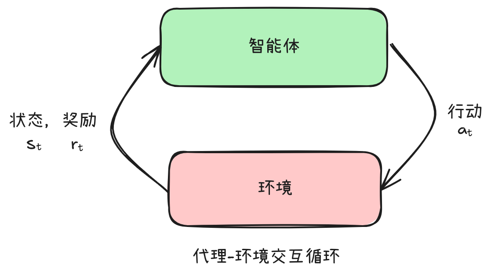
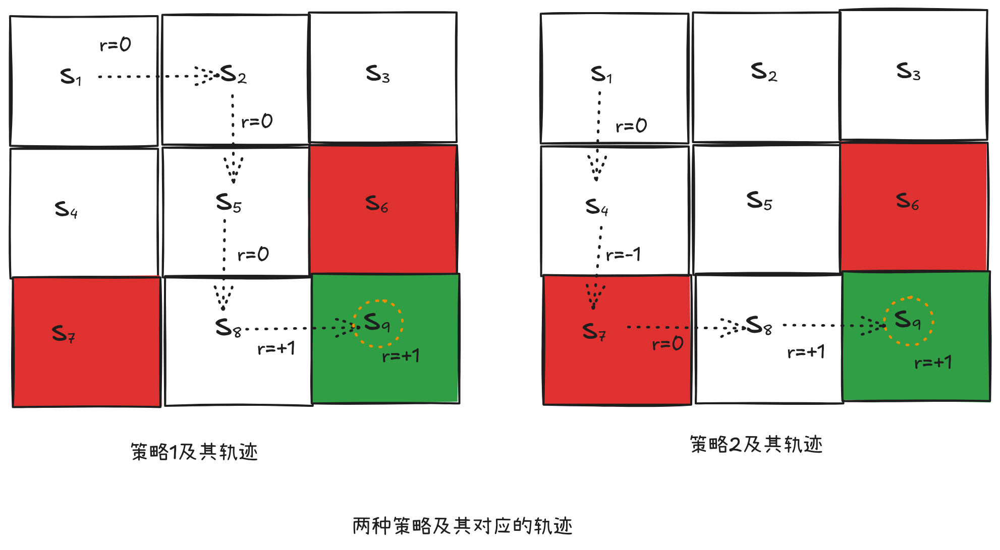

# 第一章 强化学习中的关键概念

> [!NOTE]
> 术语表
> - Reinforcement Learning: 强化学习
> - Agent: 智能体
> - Environment: 环境
> - State: 状态
> - Action: 动作
> - Policy: 策略
> - Advantage: 优势
> - Reward: 奖励
> - Return: 回报
> - Observation: 观察
> - RLHF: Reinforcement Learning From Human Feedback, 基于人类反馈的强化学习

**强化学习** 是研究智能体及其如何通过反复试验进行学习的学科。强化学习从数学的角度阐述了这样一种观点：对智能体的行为进行奖励或惩罚，会增加智能体在未来重复或放弃该行为的可能性。

## 强化学习的应用

**AlphaGo**

下棋的程序是 **智能体** 。在训练下棋的程序时，对下的一步好棋进行奖励，对下的一步臭棋进行惩罚，最终训练出一个超越人类的AI棋手。

**基于人类反馈的强化学习（RLHF）**

大语言模型作为 **智能体** 。对大语言模型输出的好的回答进行奖励，对大语言模型输出的不好的回答进行惩罚。进而改变大语言模型的参数（也就是“微调”），来让大语言模型的输出能够对齐到人类的偏好。

所谓对齐到人类的偏好，就是按照人类喜欢的方式输出回答。

## 强化学习中的关键概念和术语




强化学习的主要角色是 **智能体** 和 **环境** 。环境是智能体生存并与之交互的世界。在交互的每一步，智能体都会观察环境的状态，然后决定采取的行动。环境会随着智能体的行动而变化，但环境也可能自行变化。

智能体可能能够观察到当前环境的完整状态，例如如果下棋的AI程序是智能体的话，那么这个智能体可以获取到当前环境（也就是棋盘）的所有信息。

智能体也可能无法观察到当前环境的完整状态，人作为生活在自然环境中的智能体，是无法获取整个自然环境的完整信息的，只能部分的获取环境的信息。

智能体还会感知来自环境的 **奖励** 信号，这是一个数值，用来告诉智能体当前环境的状态的好坏。智能体的目标是最大化智能体获得的累积奖励，也就是 **回报** 。强化学习方法是智能体学习行为以实现其目标的方法。

我们大概知道了强化学习主要做的事情是什么，接下来，我们分别讨论一些概念和术语。

## 状态和观察

状态 $s$ 是对环境的状态的完整描述。状态中不存在任何隐藏于环境之外的信息。观察 $o$ 是对状态的部分描述，可能会遗漏一些环境的信息。

- 对于棋类，下棋的AI程序或者人类作为智能体，可以获取环境状态的完整描述，因为棋盘没有任何隐藏信息。
- 对于超级玛丽游戏，玩家作为智能体只能看到当前超级玛丽所处的画面，无法获取其它的游戏画面（例如无法看到其它关卡的游戏画面）。由于无法获取游戏环境的所有信息，所以只能叫做“观察”。

如果将深度学习技术和强化学习技术结合使用，则称为 **深度强化学习** 。号称人工智能中，最具有吸引力的话题。也被认为是通往 AGI 的唯一的一条路。

> 具体如何结合起来，后面我们会看到。

在深度强化学习中，我们几乎总是用向量、矩阵或张量来表示状态和观察到的值。例如，视觉观察到的值可以用传感器采集到的图像的像素值的 `RGB` 矩阵表示；机器人的状态可以用其关节角度和速度表示。

当智能体能够观察到环境的完整状态时，我们称该环境是 **完全可观察的** 。当智能体只能看到部分观察结果时，我们称该环境是 **部分可观察的** 。

## 动作空间(Action Space)

不同的环境允许不同类型的动作。给定环境中所有有效动作的集合通常称为动作空间 。某些环境，例如象棋，具有 **离散的动作空间** ，其中智能体针对某个棋子只能使用有限的动作（走法），例如马走日，象走田等等。其他环境，例如智能体在物理世界中控制机器人的环境，具有 **连续的动作空间** 。在连续空间中，动作是向量、矩阵或者张量。

- 离散动作空间：超级玛丽中玩家只有“起跳”，“蹲下”等有限的几个动作。
- 连续动作空间：自动驾驶，方向盘旋转1度，1.1度，1.2度，......，有无限多种动作。

这种区别对深度强化学习的方法有着相当深远的影响。一些算法只能在一种情况下直接应用，而对于另一种情况则需要进行大量的重新设计。

## 策略(Policy)

**策略** 会告诉智能体在每一个状态应该采取什么样的动作。

> 日常生活中有什么例子？
>
> 我是一个智能体，我的策略是：当环境处于没有老师的情况下，采取打游戏的动作，当环境处于有老师的情况下，采取写代码的动作。

在数学上，策略可以通过条件概率来描述。我们常用 $\pi(a|s)$ 来表示在状态 $s$ 采取动作 $a$ 的概率（注意这里的 $\pi$ 不是圆周率）。这个概率对每一个状态和每一个动作都有定义。

也就是在环境处于某个状态时，智能体采取某个动作的概率是多少。


因为策略本质上是智能体的大脑，所以用“策略”一词代替“智能体”并不罕见，例如说“策略试图最大化奖励”，意思是“智能体试图最大化奖励”。

策略本质上是一个函数，接收状态作为输入，输出各种动作的概率。所以策略函数当然可以是一个深度学习模型。

如果我们将 DeepSeek 大模型看作一个智能体或者策略的话，那么状态是：用户输入的提示词（可能还有之前的上下文）。由于大模型的算法是接收用户的输入，并预测下一个词（predict next token, pnt）。所以动作其实就是大模型根据提示词预测出来的下一个词的概率分布。然后根据温度值的不同，可能选择不同的词作为下一个词。

由于深度学习模型有很多很多的参数，所以我们需要将深度学习的参数也放到公式里面。

所以公式就变成了：

$$
\pi_\theta(a|s)
$$

这里的 $\theta$ 表示深度学习模型中的那些权重和偏置。

> 强化学习中的数学符号很多，不要被迷惑，要理解本质！

下面举一个完整的例子，把之前的概念穿起来，理解一下。

下图展示了一个网格世界的例子。其中有一个智能体在网格中移动。在每个时刻，智能体只能占据一个单元格。白色单元格代表可以进入的区域，红色单元格代表禁止进入的区域，绿色单元格代表目标区域。智能体的任务是从一个初始区域出发，最终到达目标区域。


如果智能体知道网格世界的地图，那么规划一条能到达目标单元格的路径其实并不难。然而，如果智能体事先不知道有关环境的任何信息，这个任务就变得有挑战性了。此时，智能体需要和环境交互，通过获取经验来找到一个好的策略。

**状态和动作**

在网格世界中，状态对应了智能体所在单元格的位置。网格世界有 9 个单元格，所以也对应了 9 个状态，表示为 $s_1, s_2, ..., s_9$ 。所有状态的集合被称为状态空间，表示为 $\mathcal{S} = \left\{s_1, s_2, ..., s_9\right\}$ 。

在网格世界中，智能体在每一个状态有 5 个可选的动作：向上移动、向右移动、向下移动、向左移动、保持不动。这 5 个动作分别表示为： $a_1, a_2, ..., a_5$ 。所有动作的集合被称为动作空间，表示为 $\mathcal{A} = \left\{ a_1, a_2, ..., a_5 \right\}$ 。


**状态转移**

当执行一个动作时，智能体可能从一个状态转移到了另一个状态，这样的过程被称为状态转移。例如，如果智能体当前时刻处在状态 $s_1$ 并且执行动作 $a_2$ （即向右移动），那么智能体会在下一个时刻移动到状态 $s_2$ ，这个过程可以表示为：

$$
s_1 \xrightarrow{a_2} s_2
$$

在数学上，状态转移的过程可以用条件概率来描述。例如，状态 $s_1$ 和动作 $a_2$ 对应的状态转移可以用如下条件概率来描述：

$$
\begin{split}
p(s_1|s_1,a_2) &= 0 \\
p(s_2|s_1,a_2) &= 1 \\
p(s_3|s_1,a_2) &= 0 \\
p(s_4|s_1,a_2) &= 0 \\
p(s_5|s_1,a_2) &= 0 \\
\end{split}
$$

上面的条件概率告诉我们：当在状态 $s_1$ 采取动作 $a_2$ 时，智能体转移到状态 $s_2$ 的概率是 1 ，而转移到其他任意状态的概率是 0 。因此，在 $s_1$ 采取 $a_2$ 时，一定会导致智能体转移到 $s_2$ 。

策略会告诉智能体在每一个状态应该采取什么样的动作。

从直观上，策略可以通过箭头来描述。如果智能体执行某一个策略，那么它会从初始状态生成一条轨迹。


在数学上，策略可以通过条件概率来描述。我们常用 $\pi(a|s)$ 来表示在状态 $s$ 采取动作 $a$ 的概率。在上面的图中，状态 $s_1$ 对应的策略是：

$$
\begin{split}
\pi(a_1|s_1) &= 0 \\
\pi(a_2|s_1) &= 1 \\
\pi(a_3|s_1) &= 0 \\
\pi(a_4|s_1) &= 0 \\
\pi(a_5|s_1) &= 0 \\
\end{split}
$$

上面的条件概率表示在状态 $s_1$ 采取动作 $a_2$ 的概率为 1 ，而采取其他任意动作的概率都为 0 。其他的状态也可以用类似的条件概率来描述对应的策略。

上面的例子中的策略是确定性的。策略也可能是随机性的。例如下图，给出了一个随机策略：在状态 $s_1$ ，智能体有 0.5 的概率采取向右的动作，有 0.5 的概率采取向下的动作。此时在状态 $s_1$ 的策略是：

$$
\begin{split}
\pi(a_1|s_1) &= 0 \\
\pi(a_2|s_1) &= 0.5 \\
\pi(a_3|s_1) &= 0.5 \\
\pi(a_4|s_1) &= 0 \\
\pi(a_5|s_1) &= 0 \\
\end{split}
$$


## 奖励

奖励是强化学习中最独特的概念之一。

在一个状态执行一个动作后，智能体会获得奖励 $r$ 。 $r$ 是一个实数，它是状态 $s$ 和动作 $a$ 的函数，可以写成 $r(s,a)$ 。其值可以是正数、负数或者零。不同的奖励值对智能体最终学习到的策略有不同的影响。一般来说，正的奖励表示我们鼓励智能体采取相应的动作：负的奖励表示我们不鼓励智能体采取该动作。另外，如果 $r$ 是负数，此时称之为“惩罚”更为合适，不过我们一般不加区分的统一称之为“奖励”。

在网格世界的例子中，我们可以设置如下奖励：

- 如果智能体试图越过四周边界，设 $r_{boundary} = -1$
- 如果智能体试图进入禁止区域，设 $r_{forbidden} = -1$
- 如果智能体到达了目标区域，设 $r_{target} = +1$
- 在其他情况下，智能体获得的奖励为 $r_{other} = 0$

要注意的是，当智能体到达目标状态 $s_9$ 之后，它也许会持续执行策略，进而持续获得奖励。例如，如果智能体在 $s_9$ 采取动作 $a_5$ （保持不动），下一个状态依然是 $s_0$ ，此时会继续获取奖励 $r_{target} = +1$ 。如果智能体在 $s_9$ 执行动作 $a_2$ （向右移动），会试图越过右侧边界，因此会被反弹回来，此时下一个状态也是 $s_9$ ，但奖励是 $r_{boundary} = -1$ 。

奖励实际上是人机交互的一个重要手段：我们可以设置合适的奖励来引导智能体按照我们的预期来运动。例如，通过上述奖励设置，智能体会尽可能避免越过边界、避免进入禁止区域、力争进入目标区域。设计合适的奖励来实现我们的意图是强化学习中的一个重要环节。然而对于复杂的任务，这一环节可能并不简单，它需要用户能很好地理解所给定的任务。尽管如此，奖励的设计可能仍然比使用其他专业工具来设计策略更容易，这也是强化学习受众比较广的原因之一。

当智能体位于一个状态，并采取一个动作时，就可以获得对应的奖励。

如果我们每次处于一个状态时，都采取最大奖励的动作，那么最后能到达目标区域吗？或者说，能找到最好的策略吗？答案是否定的。

因为每次处于一个状态，并采取一个动作时，获取的奖励叫做“即时奖励”。也就是采取动作后立即获得的奖励。

如果要找到一个好的策略，必须考虑更加长远的“总奖励”。每次都选择奖励最大的动作，不一定能带来最大的总奖励。

> 大家可以结合人生来理解一下这个问题。人们并不总是会考虑长远利益，更容易被短期利益冲昏头脑。
> 在深度学习中，“梯度下降”算法只会找到局部最小值，因为深度学习解决的问题是“凹优化”，而非“凸优化”。是同样的道理，所以需要引入各种防止过拟合的方法，例如Dropout等等。

为了描述一般化的奖励过程，我们可以使用条件概率： $p(r|s,a)$ 来表示在状态 $s$ 采取动作 $a$ 后得到奖励 $r$ 的概率。例如，上面的例子里面，对于状态 $s_1$ ，有：

$$
p(r=-1|s_1,a_1) = 1 \\ p(r\neq-1|s_1,a_1) = 0
$$

上面的条件概率，其实描述的是“确定性奖励”，当然就有“随机性奖励”。

例如学生考试，如果努力学习，则会获得正的奖励，但得到的分数可能是随机的，90分，91分，... 因为影响分数的因素太多了。

## 轨迹、回报、回合

一条轨迹（trajectory）指的是一个“状态-动作-奖励”的链条。例如之前例子中的策略，智能体从 $s_1$ 出发会得到如下轨迹：

$$
s_1 \xrightarrow[r=0]{a_2} s_2 \xrightarrow[r=0]{a_3} s_5 \xrightarrow[r=0]{a_3} s_8 \xrightarrow[r=1]{a_2} s_9
$$

沿着一条轨迹，智能体会得到一系列的即时奖励，这些即时奖励之和被称为回报（return）。例如，上面的轨迹对应的回报是：

$$
return = 0+0+0+1=1
$$

回报由即时奖励和未来奖励组成。这里，即时奖励实在初始状态执行动作后立刻获得的奖励：未来奖励指的是离开初始状态后获得的奖励之和。例如，上述轨迹对应的即时奖励是 0 ，但是未来奖励是 1 ，因此总奖励是 1 。另外，回报也称为“总奖励”，或者“累积奖励”。



回报可以用于评价一个策略的好坏。例如，上面图中两个策略，可以分别计算两条轨迹对应的回报，进而判断哪个策略更好。具体来说，左边的策略的回报为 1 。右边策略的回报为 0 。所以我们知道左边的策略更好，这符合我们的直觉。因为右边的策略经过了禁止区域。

刚刚我们提到的轨迹都是有限长的。而轨迹也可以是无限长的。如果上图左边的策略到达状态 $s_9$ 之后，并没有停止，而是继续执行策略。那么如果策略是停在 $s_9$ 不动。那么智能体会不断的获得 “+1” 奖励。所对应的轨迹也是无限长的。

$$
s_1 \xrightarrow[r=0]{a_2} s_2 \xrightarrow[r=0]{a_3} s_5 \xrightarrow[r=0]{a_3} s_8 \xrightarrow[r=1]{a_2} s_9 \xrightarrow[r=1]{a_5} s_9 \xrightarrow[r=1]{a_5} s_9 \xrightarrow[r=1]{a_5} s_9 \xrightarrow[r=1]{a_5} s_9 \ldots
$$

此时，如果我们直接把这条轨迹上所有的奖励求和，来计算回报。那么得到的是：

$$
return = 0 + 0 + 0 + 1 + 1 + 1 + 1 + \cdots = \infty
$$

这里因为轨迹是无限长的，所以计算的回报会发散到无穷。此时，我们需要引入折扣回报的概念。令 $\gamma \in (0,1)$ 为折扣因子。折扣回报是所有折扣奖励的综合，即为不同时刻得到的奖励添加相应的折扣再求和：

$$
\begin{split}
\text{discounted return} &= 0 + \gamma 0 + \gamma^2 0 + \gamma^3 1 + \gamma^4 1 + \gamma^5 1 + \ldots \\
&= \gamma^3(1+\gamma+\gamma^2+\gamma^3+\ldots) \\
&= \gamma^3(\frac{1}{1-\gamma})
\end{split}
$$

由于 $\gamma \in (0, 1)$ ，所以折扣回报的值就不再是无穷的了。而是一个有限值。

折扣因子的引入具有以下用途。第一，它允许考虑无限长的轨迹，而不用担心回报会发散到无穷；第二，折扣因子可以用来调整对近期或远期奖励的重视程度。具体来说，如果 $\gamma$ 接近 0 ，则智能体会更加重视近期奖励，最后所得到的策略也会比较短视。如果 $\gamma$ 接近 1 ，则智能体会更加重视远期奖励，最后所得到的策略也会更具有远见，例如敢于冒险在近期获得负面奖励来获得更大的未来奖励。

当执行一个策略进而与环境交互时，智能体从初始状态开始到终止状态(terminal state)停止的过程被称为一个回合(episode)或尝试(trial)。这里的Episode有多种翻译，例如回合、情节、集、轮等，其中“回合”能比较好地描述其内涵。不过，它应该与神经网络训练过程中的回合(epoch)加以区分。

回合和轨迹在概念上非常类似：回合通常被认为是一条有限长的轨迹。如果一个任务最多有有限步，那么这样的任务称为回合制任务(episodic task)。如果一个任务没有终止状态，则意味着智能体与环境的交互永不停止，这种任务被称为持续性任务(continuing task)。为了在数学上可以不加区分地对待这两种任务，我们可以把回合制任务转换为持续性任务。为此，我们只需要合理定义智能体在到达终止状态后的状态和动作等元素即可。具体来说，在回合制任务中到达终止状态后，我们有如下两种方式将其转换为持续性任务。

第一，我们可以将终止状态视为一个特殊状态，即专门设计其动作空间或状态转移，从而使智能体永远停留在此状态，这样的状态被称为吸收状态(absorbing state)，即一旦达到这样的状态就会一直停留在该状态。例如，对于目标状态 $s_9$ ，我们可以指定其动作空间为 $A(s_9) = \{a_5\}$ ，即到达这个状态后唯一可执行的动作就是原地不动。

第二，我们可以将终止状态视为一个普通状态，即将其与其他状态一视同仁，此时智能体可能会离开该状态并再次回来。由于每次到达 $s_9$ 都可以获得 $r=1$ 的正奖励，可以预期的是智能体最终会学会永远停留在 $s_9$ 以获得更多的奖励。值得注意的是，将回合制任务转换为持续性任务需要使用折扣因子，以避免回报趋于无穷。

## 马尔可夫决策过程

前面几节通过例子直观地介绍了强化学习中的基本概念。本节将在马尔可夫决策过程（Markov decision process, MDP）的框架下以更加正式的方式介绍这些概念。

马尔可夫决策过程是描述随机动态系统的一般框架，它并不局限于强化学习，而是强化学习需要依赖于这个框架。马尔可夫决策过程涉及以下关键要素。

- 集合：
    - 状态空间：所有状态的集合，记为 $S$ 。
    - 动作空间：与每个状态 $s\in S$ 相关联的所有动作的集合，记为 $A(s)$ 。
    - 奖励集合：与 $(s,a)$ 相关联的所有奖励的集合，记为 $R(s,a)$ 。

- 模型：
    - 状态转移概率：在状态 $s$ 采取动作 $a$ 时，智能体转移到状态 $s{'}$ 的概率为 $p(s'|s,a')$ 。对于任意 $(s,a)$ ，都有 $\sum_{s'\in S} p(s'|s,a)=1$ 。
    - 奖励概率：在状态 $s$ 采取动作 $a$ 时，智能体获得奖励 $r$ 的概率是 $p(r|s,a)$ 。对于任意 $(s,a)$ ，都有 $\sum_{r\in{R(s,a)}}p(r|s,a)=1$ 成立。

- 策略：在状态 $s$ ，智能体采取动作 $a$ 的概率是 $\pi(a|s)$ 。对于任意 $s\in S$，都有 $\sum_{a\in{A(s)}}\pi(a|s)=1$ 。

- 马尔可夫性质：马尔可夫性质（Markov Property）指的是随机过程中的无记忆性质，它在数学上表示为：

$$
p(s_{t+1}|s_t,a_t,s_{t-1},a_{a-1},\ldots,s_0,a_0) = p(s_{t+1}|s_t,a_t) \\
p(r_{t+1}|s_t,a_t,s_{t-1},a_{a-1},\ldots,s_0,a_0) = p(r_{t+1}|s_t,a_t)
$$

其中 $t$ 表示当前时刻，$t+1$ 表示下一个时刻。上面的式子表示下一个状态和奖励仅依赖于当前时刻的状态和动作，而与之前时刻的状态和动作无关。

强化学习的过程涉及智能体与环境的交互，智能体之外的一切都被视为环境(environment)。第一，智能体是一个感知者，例如具有眼睛能够感知并理解当前的状态;第二，智能体是一个决策者，例如具有大脑能够做出决策，知道在什么状态应该采取什么行动;第三，智能体是一个执行者，例如具有操作机构来执行策略所指示的动作，从而改变状态并得到奖励。

## 价值函数

强化学习（Reinforcement Learning, RL）中的**价值函数**是核心概念之一，它用来衡量在某个状态或状态-动作对下，智能体（Agent）未来能够获得的期望回报。价值函数帮助智能体评估当前策略的好坏，从而指导策略的改进。

### 1. 价值函数的定义

#### 状态价值函数（State-Value Function）

状态价值函数记作 $V^\pi(s)$，表示在策略 $\pi$ 下，从状态 $s$ 出发，智能体能获得的**期望累计回报**：

$$
V^\pi(s) = \mathbb{E}_\pi \left[ \sum_{t=0}^\infty \gamma^t R_{t+1} \mid S_0 = s \right]
$$

- $s$：当前状态
- $\pi$：策略，定义为在某状态下采取某动作的概率分布
- $\gamma \in [0,1]$：折扣因子，权衡未来奖励的重要性
- $R_{t+1}$：在时间步 $t$ 采取动作后获得的即时奖励

#### 状态-动作价值函数（Action-Value Function）

状态-动作价值函数记作 $Q^\pi(s,a)$，表示在策略 $\pi$ 下，从状态 $s$ 采取动作 $a$ 后，智能体能获得的期望累计回报：

\[
Q^\pi(s,a) = \mathbb{E}_\pi \left[ \sum_{t=0}^\infty \gamma^t R_{t+1} \mid S_0 = s, A_0 = a \right]
\]

### 2. 价值函数的作用

- **评价策略**：价值函数反映了在当前策略下，某状态或状态-动作对的“好坏”，即未来能获得多少奖励。
- **指导决策**：通过比较不同动作的价值，智能体可以选择价值更高的动作，从而优化策略。
- **算法基础**：许多强化学习算法（如动态规划、蒙特卡洛方法、时序差分学习）都基于估计和更新价值函数。

### 3. 最优价值函数

最优状态价值函数 $V^*(s)$ 和最优状态-动作价值函数 $Q^*(s,a)$ 定义为在所有可能策略中能获得的最大期望回报：

\[
V^*(s) = \max_\pi V^\pi(s), \quad Q^*(s,a) = \max_\pi Q^\pi(s,a)
\]

### 4. 直观理解

- **价值函数告诉你“现在的状态值多少钱”**，即如果你从这里开始，按照某种策略行动，预计能获得多少奖励。
- **状态-动作价值函数告诉你“做某个动作值多少钱”**，帮助你判断当前动作是否值得。

## 优势函数

优势函数（Advantage Function）是强化学习中用于衡量某个动作相对于当前状态下平均水平的“优势”程度的函数。它在策略优化和价值函数估计中起到关键作用，尤其是在策略梯度方法和演员-评论家（Actor-Critic）算法中。

---

## 优势函数的定义

优势函数记作 $A^\pi(s, a)$，定义为在策略 $\pi$ 下，状态 $s$ 采取动作 $a$ 的状态-动作价值函数与该状态的状态价值函数之差：

\[
A^\pi(s, a) = Q^\pi(s, a) - V^\pi(s)
\]

- $Q^\pi(s, a)$ 是状态-动作价值函数，表示从状态 $s$ 采取动作 $a$ 后的期望累计回报。
- $V^\pi(s)$ 是状态价值函数，表示从状态 $s$ 开始按照策略 $\pi$ 行动的期望累计回报。

### 直观理解

- 优势函数衡量了某个动作比当前状态下平均水平（即状态价值）好多少。
- 如果 $A^\pi(s, a) > 0$，说明在状态 $s$ 采取动作 $a$ 比平均策略表现更好，有“优势”。
- 如果 $A^\pi(s, a) < 0$，说明动作表现不如平均水平。

### 优势函数的作用

- **减少方差**：在策略梯度算法中，直接用 $Q^\pi(s,a)$ 估计梯度可能方差较大。用优势函数代替可以减小方差，提高学习稳定性。
- **策略改进**：优势函数帮助智能体判断哪些动作值得增加概率，哪些动作应减少概率。
- **演员-评论家结构**：演员（Actor）用策略选择动作，评论家（Critic）估计价值函数，优势函数作为两者之间的桥梁，指导策略更新。

## 强化学习问题

我们再来讨论一下前面的概念。首先轨迹的数学符号是 $\tau$ 。是 “状态” 和 “动作” 的序列。可以表示为以下公式：

$$
\tau = (s_0,a_0,s_1,a_1,\ldots)
$$

那么轨迹的最开始的状态 $s_0$ 是怎么来的呢？是从 “开始状态的分布” 随机采样的来的。开始状态的分布有时候会表示为：

$$
s_0 \sim \rho_0(\cdot)
$$

当环境处于状态 $s_t$ ，并且智能体采取动作 $a_t$ 的情况下，环境会跳转到状态 $s_{t+1}$ 。

当然 $s_{t+1}$ 是不确定的，也就是说智能体采取了某个行动，环境跳转到的状态可能是确定的，也可能是不确定的。统一表示为：

$$
s_{t+1} \sim P(\cdot|s_t, a_t)
$$

动作来自于智能体采取的策略。

轨迹（trajectories）经常被称作“回合”（episodes）或者“抛出”（rollouts）。

我们再来讨论一下“奖励和回报”。

奖励函数 $R$ 在强化学习中至关重要。它取决于环境的当前状态、刚刚采取的行动以及环境的下一个状态：

$$
r_t = R(s_t, a_t, s_{t+1})
$$

尽管这通常被简化为仅依赖于当前状态 $r_t = R(s_t)$ 或“状态-动作对” $r_t = R(s_t,a_t)$ 。

智能体的目标是最大化轨迹上的累积奖励，但这实际上可能意味着几件事。我们将用 $R(\tau)$ 来表示所有这些情况，这样一来，上下文就能清楚地表明我们指的是哪种情况，或者这无关紧要（因为相同的方程式适用于所有情况）。

一种回报是“有限期限的没有折扣的回报” ，它只是在固定步骤窗口内获得的奖励的总和：

$$
R(\tau) = \sum_{t=0}^T r_t
$$

另一种回报是“无限期的有折扣的回报” ，它是智能体曾经获得的所有奖励的总和，但会根据未来获得奖励的时间进行折现。此奖励公式包含一个折扣因子 $\gamma \in (0,1)$ ：

$$
R(\tau) = \sum_{t=0}^{\infty} \gamma^t r_t
$$

但我们为什么要用折扣因子呢？难道我们不是只想获得所有奖励吗？我们当然想，但折扣因子既直观又数学上方便。直观上来说：现在的现金比以后的现金更好。数学上来说：无限期的奖励总和可能不会收敛到一个有限值，而且很难用方程式来处理。但是，有了折扣因子，并且在合理的条件下，无限期的奖励总和就会收敛。

无论选择何种回报衡量标准（无论是无限期折扣还是有限期不折扣），也无论选择何种策略，RL 中的目标都是选择一种策略，当智能体按照该策略行事时，该策略可以最大化 **预期回报** 。

要谈论预期回报，我们首先必须谈论轨迹的概率分布。

假设环境转换和策略都是随机的。在这种情况下， $T$ 步轨迹的概率为：

$$
P(\tau|\pi) = \rho_0 (s_0) \prod_{t=0}^{T-1} P(s_{t+1} | s_t, a_t) \pi(a_t | s_t)
$$

预期回报（无论采用哪种衡量标准）用 $J(\pi)$ 表示，即：

$$
J(\pi) = \int_{\tau} P(\tau|\pi) R(\tau) = \underset{\tau\sim \pi}E[{R(\tau)}]
$$

强化学习中的核心优化问题可以表示为

$$
\pi^* = \arg \max_{\pi} J(\pi)
$$

其中 $\pi^*$ 为最优策略 。

# 第二章 策略梯度法

本章我们开始学习 **基于策略的方法** 。其中通过神经网络等方法将策略模型化，并使用梯度来优化策略的方法叫作策略梯度法(policy gradient method) 。

研究者们提出了各种基于策略梯度法的算法。本章首先介绍最简单的策略梯度法。然后，在改进这个简单的梯度法的过程中，我们推导出了被称为 “REINFORCE” 的算法。接下来，在进一步改进 “REINFORCE” 的过程中， 我们又推导出了带基线的 REINFORCE 方法和 Actor-Critic 方法。

## 最简单的策略梯度法

策略梯度法是使用梯度来更新策略的方法的总称。策略梯度法的算法有很多，这里推导最简单的策略梯度法。从下一节开始，我们会在这里学到的方法的基础上进行改进，同时介绍新的方法。

### 策略梯度法的推导

随机性策略用数学式可以表示为 $\pi(a|s)$ 。$\pi(a|s)$ 是在状态 $s$ 下采取行动 $a$ 的概率。这里采用神经网络对策略进行建模。此时用符号 $\theta$ 来汇总表示神经网络的所有权重参数（ $\theta$ 是将所有参数的元素排成一列的向量）。另外，可以将基于神经网络的策略表示为 $\pi_{\theta}(a|s)$ 。

接下来使用策略 $\pi_{\theta}$ 来设置目标函数。设置了目标函数之后，就要找到使目标函数值最大的参数 $\theta$ 。这个过程叫作“最优化”，是一个常见的神经网络训练过程。

> [!NOTE]
> 对于最优化问题，这里设置的是目标函数，而不是常用的损失函数。对于损失函数的情况，我们通过梯度下降法寻找最小值；对于目标函数的情况，则通过梯度上升法寻找最大值。梯度下降法会沿着梯度的反方向更新参数，梯度上升法则会沿着梯度的方向更新参数。不过，只要将目标函数乘以负数，就可以作为损失函数来处理（反之亦然），所以损失函数和目标函数本质上作用相同。

下面使用策略 $\pi_{\theta}$ 设置目标函数。首先明确问题的设定。这里考虑的是回合制任务，并基于策略 $\pi_{\theta}$ 选择行动的情况。在这种情况下，假定得到了以下由“状态、行动、奖励”构成的时间序列数据。

$$
\tau = (S_0, A_0, R_0, S_1, A_1, R_1, \cdots, S_{T+1})
$$

这个 $\tau$ 也叫作轨迹（trajectory） 。此时可以使用折扣因子 $\gamma$ 对收益（return）作如下定义。

$$
G(\tau) = R_0 + \gamma R_1 + \gamma^2 R_2 + \cdots + \gamma^T R_T
$$

为了表明收益可以由 $\tau$ 计算出来，上面的式子将其表示为了 $G(\tau)$ 。此时，目标函数 $J(\theta)$ 可以表示为以下式子。

$$
J(\theta) = E_{\tau\sim\pi_{\theta}}[G(\tau)]
$$

收益 $G(\tau)$ 是随机变动的，所以它的期望值是目标函数。上式中期望值 $E$ 的下标为 $\tau\sim\pi_{\theta}$ ，这个下标表示 $\tau$ 是基于 $\pi_{\theta}$ 生成的。

> [!NOTE]
> $\tau$ 的生成过程除了与智能代理的策略有关，还与环境 $p(s'|s,a)$ 和 $r(s,a,s')$ 有关。不过我们能够控制的只有智能代理的策略，因此在 $E_{\tau\sim\pi_{\theta}}$ 中只将下标表示为 $\tau\sim\pi_{\theta}$ 。

确定了目标函数后，下一步是计算它的梯度。这里将参数 $\theta$ 的梯度表示为 $\nabla_{\theta}$ 。我们的目标是求 $\nabla_{\theta}J(\theta)$ 。本章省略了它的推导过程，只给出了作为结果的数学表达式。

$$
\begin{split}
\nabla_{\theta}J(\theta) &= \nabla_{\theta}E_{\tau\sim\pi_{\theta}}[G(\tau)] \\
                         &= E_{\tau\sim\pi_{\theta}}[\sum_{t=0}^TG(\tau)\nabla_{\theta}\log\pi_{\theta}(A_t|S_t)]
\end{split}
$$

上面的式子中值得注意的是，$\nabla_{\theta}$ 在 $E$ 中（梯度计算的部分是 $\nabla_{\theta}\log\pi_{\theta}(A_t|S_t)$ ）。后面会对此做详细介绍。求出 $\nabla_{\theta}J(\theta)$ 之后，接下来更新神经网络的参数。最优化方法多种多样，下面的式子表示的是一种简单的方法。

$$
\theta \leftarrow \theta + \alpha\nabla_{\theta}J(\theta)
$$

上面的式子朝着梯度的方向更新参数 $\theta$ 。更新的值与 $\alpha$ 相关。这里的 $\alpha$ 表示学习率。这是属于梯度上升法的算法。

### 策略梯度法的算法

如式所示，$\nabla_{\theta}J(\theta)$ 表示期望值。接下来我们来计算期望值。这里，我们令策略 $\pi_{\theta}$ 的智能代理实际采取行动，得到 $n$ 个轨迹 $\tau$ 。此时，通过对每个 $\tau$ 计算式子的期望值内部的式子 （$\sum_{t=0}^TG(\tau)\nabla_{\theta}\log\pi_{\theta}(A_t|S_t)$），并求出其平均值，从而近似得到 $\nabla_{\theta}J(\theta)$ 。数学式如下所示。

$$
\text{采样}: \tau^{(i)}\sim\pi_{\theta}\;\;\;\;(i=1,2,\cdots,n) \\
x^{(i)} = \sum_{t=0}^TG(\tau^{(i)})\nabla_{\theta}\log\pi_{\theta}(A_t^{(i)}|S_t^{(i)}) \\
\nabla_{\theta}J(\theta) \approx \frac{x^{(1)}+x^{(2)}+\cdots+x^{(n)}}{n}
$$

上面式子中的 $\tau^{(i)}$ ，表示在第 $i$ 回合得到的轨迹，$A_t^{(i)}$ 表示在第 $i$ 回合的时刻 $t$ 的行动，$S_t^{(i)}$ 表示在第 $i$ 回合的时刻 $t$ 的状态。

另外，再思考一下蒙特卡洛方法的样本数为 $1$ ，即上式中 $n=1$ 的情况。在这种情况下，数学式可以简化为如下形式。

$$
\text{采样}: \tau\sim\pi_{\theta} \\
\nabla_{\theta}J(\theta) \approx \sum_{t=0}^TG(\tau)\nabla_{\theta}\log\pi_{\theta}(A_t|S_t)
$$

为了简单起见，本章将使用以上面的式子为对象的策略梯度法。上面的式子的计算就是对所有时刻（$t=0\sim T$）求 $\nabla_{\theta}\log\pi_{\theta}(A_t|S_t)$ ，然后将各梯度乘以作为权重的收益 $G(\tau)$ ，最后求它们的和。这个计算过程如下图所示。


下面来思考一下图中所做的计算的意义。首先，根据 $\log$ 的微分，有以下式子成立。

$$
\nabla_{\theta}\log{\pi_{\theta}}(A_t|S_t)=\frac{\nabla_{\theta}\pi_{\theta}(A_t|S_t)}{\pi_{\theta}(A_t|S_t)}
$$

如上式所示，$\nabla_{\theta}\log{\pi_{\theta}}(A_t|S_t)$ 是梯度 $\nabla_{\theta}\pi_{\theta}(A_t|S_t)$ 的 $\frac{1}{\pi_{\theta}(A_t|S_t)}$ 倍。所以 $\nabla_{\theta}\log{\pi_{\theta}}(A_t|S_t)$ 和 $\nabla_{\theta}\pi_{\theta}(A_t|S_t)$ 会指向相同的方向。也就是说，$\nabla_{\theta}\log{\pi_{\theta}}(A_t|S_t)$ 和 $\nabla_{\theta}\pi_{\theta}(A_t|S_t)$ 都指向在状态 $S_t$ 下采取行动 $A_t$ 的概率增加的最快的方向。根据 $G(\tau)\nabla_{\theta}\log\pi_{\theta}(A_t|S_t)$ ，需要在该方向上乘以权重 $G(\tau)$ 。

假设智能代理获得的收益 $G(\tau)$ 是 $100$ 。那么，在这种情况下，在这期间采取的行动将更容易被选择，权重会被增强 $100$ 倍。也就是说，在顺利的情况下，在此之前采取的行动会相应地增强。反之，在不顺利的情况下，在这期间采取的行动会相应地减弱。

### 策略梯度法的实现

下面让我们将话题转到最简单的策略梯度法的实现。首先是 `import` 语句和表示策略的神经网络的代码。

```py
import numpy as np
import gym
import torch
import torch.nn as nn
import torch.nn.functional as F
import torch.optim as optim
from torch.distributions import Categorical


class Policy(nn.Module):
    def __init__(self, action_size):
        super().__init__()
        self.l1 = nn.Linear(4, 128)
        self.l2 = nn.Linear(128, action_size)

    def forward(self, x):
        x = F.relu(self.l1(x))
        x = F.softmax(self.l2(x), dim=1)
        return x
```

这里实现的神经网络模型由两层全连接层构成。最终输出的元素数是行动的数量（ `action_size` ）。由于这个最终输出是 `Softmax` 函数的输出，因此可以得到每个行动的概率。

> [!NOTE]
> 如果将具有 $n$ 个元素的向量输入到 `Softmax` 函数中，那么输出的同样是具有 $n$ 个元素的向量。此时，第 $i$ 个输出 $y_i$ 的式子如下所示。
> $$
> y_i = \frac{\mathrm{e}^{x_i}}{\sum_{k=1}^n\mathrm{e}^{x_k}}
> $$
> 这里的 $\mathrm{e}$ 是自然常数(值为 $2.718 28...$ 的无限小数)。`Softmax` 函数的输出值全部为 $0$ 以上 $1$ 以下的实数，它们的合计值为 $1$（$\sum_{i=1}^ny_i=1$）。因此，`Softmax` 函数的输出可以作为概率使用。

下面是 `Agent` 类的代码。首先显示初始化和 `get_action` 方法。

```py
class Agent:
    def __init__(self):
        self.gamma = 0.98
        self.lr = 0.0002
        self.action_size = 2

        self.memory = []
        self.pi = Policy(self.action_size)
        self.optimizer = optim.Adam(self.pi.parameters(), lr=self.lr)

    def get_action(self, state):
        state = torch.tensor(state[np.newaxis, :])
        probs = self.pi(state)
        probs = probs[0]
        m = Categorical(probs)
        action = m.sample().item()
        return action, probs[action]
```

`get_action` 方法决定了在 `state` 状态下采取的行动。为此，可以通过 `self.pi(state)` 进行神经网络的前向传播，得到概率分布 `probs` 。然后，基于该概率分布，进行一次行动的采样。该方法还返回了所选行动的概率（上面代码中的 `probs[action]` ）。

下面来试用一下 `get_action` 方法。代码如下所示。

```py
env = gym.make('CartPole-v1')
state, _ = env.reset()
agent = Agent()

action, prob = agent.get_action(state)
print('action: ', action)
print('prob: ', prob)

G = 100.0 # 虚拟权重
J = G * prob.log()
print('J: ', J)

# 求梯度
J.backward()
```

输出结果

```
action:  1
prob:  tensor(0.4186, grad_fn=<SelectBackward0>)
J:  tensor(-87.0858, grad_fn=<MulBackward0>)
```

上面的代码取出了初始状态下的行动及其概率。另外，它还显示了使用虚拟的权重来计算由下式表示的梯度的代码（这是从式子取出的 $t = 0$ 的相关项的式子）。

$$
G(\tau)\nabla_{\theta}\log\pi_{\theta}(A_0|S_0)
$$

作为参考，下面对照列出了上面的代码中出现的变量与相应的数学式。

- `prob` ： $\pi_{\theta}(A_0|S_0)$
- `G` ： $G(\tau)$
- `J` ： $G(\tau)\log\pi_{\theta}(A_0|S_0)$

求出 `J` 之后，通过 `J.backward()` 求 $G(\tau)\nabla_{\theta}\log\pi_{\theta}(A_0|S_0)$ 。下面是 `Agent` 类剩下的代码。

```py
class Agent:
    ...

    def add(self, reward, prob):
        data = (reward, prob)
        self.memory.append(data)

    def update(self):
        G, loss = 0, 0
        for reward, prob in reversed(self.memory):
            G = reward + self.gamma * G

        for reward, prob in self.memory:
            loss += - prob.log() * G

        self.optimizer.zero_grad()
        loss.backward()
        self.optimizer.step()
        self.memory = [] # 重置内存
```

`add` 方法是智能代理每次采取行动并获得奖励时被调用的方法。该方法将奖励（ `reward` ）和智能代理采取的行动的概率（ `prob` ）存储在内存（ `self.memory` ）中。`update` 方法是智能代理到达目标时被调用的方法。该方法首先会求收益 `G` 。收益可以通过反向计算获得的奖励的做法来髙效地计算。然后该方法会计算损失函数。具体做法是对每个时刻求 `-prob.log()` ，再将其乘以作为权重的 `G` ，之后求它们的和。剩下的就是一直以来的神经网络的训练代码。

在训练神经网络时，通常要设置损失函数。对于这个例子，我们可以将目标函数 $J(\theta)$ 乘以 $-1$ 所得到的 $-J(\theta)$ 作为损失函数，此时可以通过梯度下降法的最优化方法(SGD、Adam等)更新参数。

最后在倒立摆环境中运行智能代理。代码如下所示。

```py
env = gym.make('CartPole-v1')
agent = Agent()
reward_history = []

for episode in range(3000):
    state = env.reset()
    done = False
    total_reward = 0

    while not done:
        action, prob = agent.get_action(state)
        next_state, reward, done, info = env.step(action)

        agent.add(reward, prob)
        state = next_state
        total_reward += reward

    agent.update()

    reward_history.append(total_reward)
    if episode % 100 == 0:
        print("episode :{}, total reward : {:.1f}".format(episode, total_reward))
```

# 第四章 PPO（近端策略优化）

# 第五章 DPO（直接策略优化）

# 第六章 KTO

# 第七章 GRPO