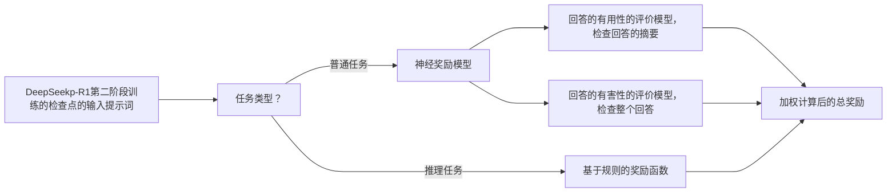

```mermaid
graph LR
    A["DeepSeekp-R1第二阶段训练的检查点的输入提示词"] ---> B["任务类型？"] -- 普通任务 ---> C["神经奖励模型"]
    B -- 推理任务 ---> G["基于规则的奖励函数"]
    C ---> D["回答的有用性的评价模型，检查回答的摘要"]
    C ---> F["回答的有害性的评价模型，检查整个回答"]
    D ---> H["加权计算后的总奖励"]
    F ---> H
    G ---> H
```