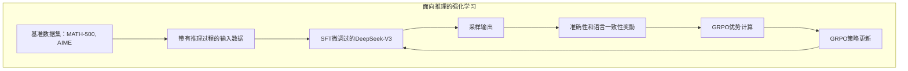

```mermaid
graph TB
    subgraph subA["面向推理的强化学习"]
    A["基准数据集：MATH-500, AIME"] ---> B["带有推理过程的输入数据"] ---> C["SFT微调过的DeepSeek-V3"] ---> D["采样输出"] ---> E["准确性和语言一致性奖励"]
    E ---> F["GRPO优势计算"] ---> G["GRPO策略更新"] ---> C
    end
```