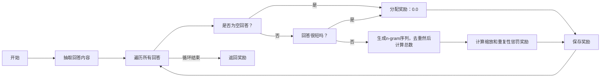

```mermaid
graph LR
    A["开始"] ---> B["抽取回答内容"] ---> C["遍历所有回答"] ---> D["是否为空回答？"] -- 是 ---> E["分配奖励：0.0"] ---> F["保存奖励"] ---> C
    D -- 否 ---> G["回答很短吗？"] -- 是 ---> E
    G -- 否 ---> H["生成n-gram序列，去重然后计算总数"] ---> I["计算缩放和重复性惩罚奖励"] ---> F
    C -- 循环结束 ---> J["返回奖励"]
```